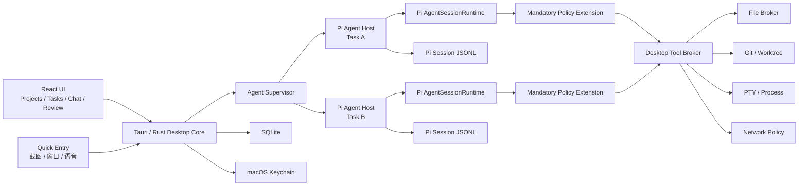
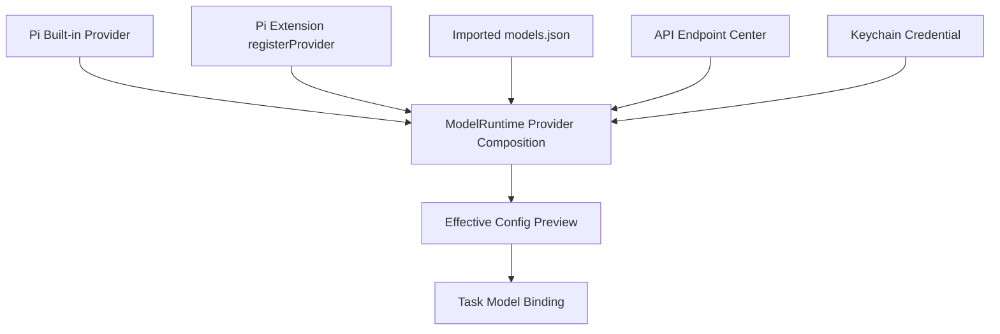

# Pi Desktop：基于 Pi-Agent 的独立 macOS Agent 改造与产品设计方案

> 文档状态：设计基线 v2  
> 更新日期：2026-07-30  
> 当前代码基线：`improvement-v4`  
> 目标产品：完全独立的 macOS Agent 应用，不依赖 VS Code、Cursor、Xcode 或其他 IDE  
> Agent 内核：`@earendil-works/pi-coding-agent`，当前本机核验版本 `0.82.1`

---

## 1. 执行摘要

当前项目本质上是一个以 VS Code Extension Host、Webview、VS Code Terminal、SecretStorage 和 Diff Editor 为运行环境的扩展。它不能通过简单增加一个 macOS 窗口或打包壳变成真正独立的桌面 Agent。

本方案的最终决策是：

1. 删除此前方案中的全部 VS Code Bridge、VS Code 扩展兼容和 IDE 未保存内容读取设计。
2. 保留当前 Git 历史，把现有扩展实现作为迁移期参考，但不让它进入桌面版运行时依赖图。
3. 新产品暂称 **Pi Desktop**，采用：
   - Tauri 2 + React 构建独立桌面应用；
   - Rust 负责 macOS 系统集成、进程监管、权限、Git、PTY、文件与安全边界；
   - 随 App 打包的 `pi-agent-host` Sidecar 直接嵌入 Pi-Agent SDK；
   - 每个运行中的任务对应独立的 `AgentSessionRuntime` 和 Sidecar；
   - 每个编码任务默认使用独立 Git worktree。
4. 用户机器不需要安装 VS Code、`pi` CLI、Node.js 或 Bun。
5. Pi-Agent 是唯一 Agent 内核。桌面版不重新实现第二套模型循环、会话树、工具调用协议或上下文压缩逻辑。
6. 1.0 必须包含两个易用的图形化管理中心：
   - **API 端点中心**：添加、编辑、测试和选择自定义模型 API；
   - **Pi 扩展中心**：安装、启停、更新、回滚和管理 Pi Extensions、Skills、Prompts、Themes。
7. Pi 官方明确说明自身没有系统级沙箱，因此桌面版必须额外提供工具 Broker、权限审批、worktree 隔离和可验证的 OS 隔离策略。

这是一项宿主架构重建，不是普通 UI 重构。

---

## 2. 范围与非目标

### 2.1 1.0 范围

- 完全独立的 `.app` 和签名、公证后的 DMG。
- 本地 Projects、Tasks、Threads 管理。
- Pi-Agent 流式聊天、Thinking、Tool Calls、Session Tree、Compaction、Fork/Clone。
- 模型、Provider、Thinking Level 选择。
- 自定义 API 端点图形化管理。
- Pi 扩展、Skills、Prompts、Themes 图形化管理。
- 权限审批、工具执行时间线和审计日志。
- Git worktree、多文件 Diff、hunk 级审查与安全应用。
- 多任务并行、Sidecar 崩溃恢复。
- 内置文件浏览、代码查看、Diff Review 和 PTY 终端。
- Quick Entry、截图与窗口捕获；语音听写可以在 Beta 阶段完成。
- macOS Keychain 凭据管理。
- 自动更新、版本回退、数据迁移。

### 2.2 明确非目标

- 不安装或依赖 VS Code Extension。
- 不读取 VS Code、Cursor、Xcode 等 IDE 的未保存缓冲区。
- 不通过 IDE API 修改编辑器文件。
- 不提供 VS Code 专用命令、URI、协议或状态同步。
- 不把 Pi-Agent 的 Agent Loop 改写成 Rust。
- 1.0 不做完整 IDE，不提供编译器、语言服务器或调试器替代品。
- 1.0 不默认开放无人值守 Automations；必须等可靠隔离通过后再启用。
- 1.0 不默认允许第三方扩展安装脚本或任意本地代码静默运行。

### 2.3 独立性的准确含义

Pi Desktop 不需要任何 IDE，但 Agent 执行项目任务时仍可能使用用户系统中已有的：

- Git；
- Shell；
- 项目编译器和包管理器；
- 测试工具；
- 本地模型服务；
- 网络模型 API。

这些属于项目工具链依赖，不属于 IDE 依赖。

---

## 3. 当前项目再次审核

### 3.1 Git 与工作区状态

审核时状态：

- 分支：`improvement-v4`
- 相对远端：ahead 7
- 现有未跟踪文件：`docs/macos-migration-plan.md`
- 审核开始时该文件为 0 字节
- 其他项目文件无未提交修改

### 3.2 当前构建与测试

| 检查项 | 结果 | 说明 |
|---|---|---|
| TypeScript 编译 | 通过 | `tsc --noEmit` |
| Production Build | 通过 | Extension 61.8 KiB，Webview 249 KiB |
| 单元测试 | 184 项通过 | 大量依赖 VS Code Mock |
| 模拟 RPC 集成测试 | 48 项通过 | 使用 Mock RPC Server，并非真实 Pi-Agent E2E |
| Prettier | 通过 | 当前源码格式一致 |
| ESLint | 失败 | ESLint 10 下缺少 `eslint.config.*` |
| Runtime Audit | 0 漏洞 | `npm audit --omit=dev` |
| 全量 Audit | 6 个高危 | 均位于开发依赖链 |
| E2E | 未实现 | 仅打印 20 条 TODO 后 `exit 0` |

### 3.3 VS Code 耦合

- 42 个源码文件中有 22 个直接包含 VS Code 相关引用。
- `package.json` 声明：
  - VS Code Engine；
  - Extension Main；
  - Activity Bar；
  - Webview；
  - Tree View；
  - VS Code Commands、Menus、Keybindings。
- UI 通过 `acquireVsCodeApi()` 通信。
- Session、Auth、Settings、Diff、Terminal、Context、Git Status 都依赖 VS Code API。

### 3.4 当前必须废弃或重写的问题

#### A. 权限判断层级错误

`ChatProvider.dispatch()` 对用户自然语言 `msg.text` 做命令风险分类，而不是在模型真正触发 Bash、Write、Edit 时审批。

后果：

- 用户输入可能很安全，但模型生成危险命令；
- 用户输入可能包含 `rm` 文字但只是讨论；
- readonly/plan 当前会阻止所有 Prompt，而不是只阻止写工具；
- 权限模式不能成为真实安全边界。

#### B. UI 与 Host 协议断裂

UI 发送 `selectSession` 和 `newSession` 并强制 `as any`，但 Host 协议白名单没有这两个消息种类。

#### C. 子进程重启计数错误

每次启动都把 `restartCount` 归零，连续失败可能无法达到最大重启次数。

#### D. 附件和权限状态是假状态

Composer 中的 mode、effort、附件、选区数量主要保存在 React 本地状态；拖入文件只保留名称和展示大小，没有形成可靠的附件载荷、宿主状态和持久化记录。

#### E. Session CWD 不可靠

`SessionManager` 可以记录 workspaceRoot，但 `PiSession` 创建 RPC 进程时仍使用全局 `config.cwd()`。

#### F. Terminal 输出路径危险

Agent 的 Bash 输出通过 `terminal.sendText()` 写回交互终端，可能把输出当作用户命令输入。

#### G. DiffController 只能维护一个全局 Current Diff

无法满足多文件、多任务、多 Agent 和异步审查。

### 3.5 审核结论

当前代码可作为以下内容的参考：

- React 组件视觉原型；
- Pi JSONL 分帧思路；
- Request Queue；
- 消息 Reducer；
- Unified Diff Hunk 解析；
- 日志脱敏与命令风险解释。

不可继续沿用：

- VS Code Extension Host；
- ChatProvider；
- WebviewMessenger；
- VS Code Auth/Settings；
- PiSession/SessionManager 宿主实现；
- DiffController；
- PiTerminal；
- 当前权限模式；
- 当前 E2E 测试。

---

## 4. 产品定位与参考产品取舍

### 4.1 产品定位

> Pi Desktop 是一款以 Pi-Agent 为内核、以本地项目为工作空间、支持多任务并行、权限审批、API 端点管理、Pi 扩展管理和代码审查的独立 macOS Agent 工作台。

### 4.2 借鉴 Claude Desktop

采用：

- 全局 Quick Entry；
- 低干扰浮动面板；
- 截图和应用窗口捕获；
- 语音听写；
- 连接器/扩展目录；
- 安装扩展前展示来源和权限。

不采用：

- 通过 IDE API 获取编辑器未保存内容；
- 将当前 App 的内部 UI 状态作为隐式上下文。

### 4.3 借鉴 ChatGPT/Codex Desktop

采用：

- Projects → Tasks/Threads 信息结构；
- 多 Agent 并行；
- 独立 worktree；
- Agent 工具执行时间线；
- 对话内 Diff Review；
- Skills；
- Review Queue；
- 默认受限、按需授权；
- 后台长任务状态管理。

不采用：

- 把“Open in VS Code”作为主要流程；
- 将桌面 App 设计成 IDE 附属面板。

### 4.4 Pi-Agent 的优势

- Provider 和模型相对开放；
- 支持 OpenAI、Anthropic、Google 及自定义兼容 API；
- Session 使用追加式 JSONL 和树结构；
- 支持 Fork、Clone、Tree Navigation；
- 支持 Extensions、Skills、Prompts、Themes 和 Pi Packages；
- Tool Call 可在执行前拦截；
- SDK 明确支持自定义桌面 UI；
- AgentSessionRuntime 可以替换和恢复 Session。

---

## 5. 推荐系统架构

### 5.1 技术选择

| 方案 | 优点 | 缺点 | 决策 |
|---|---|---|---|
| Electron + Pi SDK | Pi SDK 可直接运行于 Node，开发快 | 安装体积和内存较大；Agent/UI 隔离较弱 | 备用 |
| Tauri 2 + React + Pi Sidecar | 可复用部分 React；原生集成较好；Sidecar 独立恢复 | 需要维护 Rust/TS IPC | 推荐 |
| SwiftUI + Pi Sidecar | 原生体验最佳 | UI 几乎全部重写，成本最高 | 暂缓 |

### 5.2 进程结构



### 5.3 核心约束

1. 每个运行 Task 一个独立 `pi-agent-host`。
2. 每个 Host 内部持有一个 `AgentSessionRuntime`。
3. Pi-Agent 负责：
   - 模型请求；
   - 消息和上下文；
   - Tool Call 生成；
   - Session；
   - Compaction；
   - Fork/Clone/Tree；
   - Skills、Extensions 和 Provider 注册。
4. Rust Desktop Core 负责：
   - App 生命周期；
   - Sidecar 生命周期；
   - 文件与进程 Broker；
   - Git/worktree；
   - Keychain；
   - SQLite；
   - macOS 权限；
   - Quick Entry；
   - 更新、签名和崩溃恢复。
5. React 不直接接触文件系统、Shell、Keychain 或扩展安装命令。

### 5.4 Sidecar 分发

首选：

- Bun 编译为架构对应的单文件 Sidecar；
- 随 Tauri App 一起签名和分发；
- 固定 Pi-Agent 精确版本。

必须技术验证：

- Pi 动态 Extensions；
- `jiti`；
- 图片 WASM；
- 可选 native dependencies；
- arm64/x86_64；
- Nested Code Signing；
- Notarization；
- Session 恢复。

失败回退：

- App 内私有打包 Node 22 Runtime；
- JS Host 保持不变；
- 用户仍不需要安装 Node；
- Electron 仅在 Tauri + 私有 Runtime 也无法稳定时使用。

---

## 6. 主窗口与交互设计

### 6.1 主窗口布局

#### 左侧：Projects 与 Tasks

- 项目列表；
- 最近打开；
- Pin；
- Task/Thread 列表；
- Running、Waiting Approval、Review、Completed、Failed 状态；
- 新建、Fork、Archive；
- 并发数量和资源状态。

#### 中央：Agent Timeline

- User Message；
- Assistant Message；
- Thinking 折叠区；
- Tool Call 卡片；
- Permission Card；
- Plan Card；
- Compaction；
- Retry；
- Terminal Output；
- Extension UI Request；
- Follow-up 与 Steering Queue；
- Composer。

#### 右侧：Inspector

Tab：

- Changes；
- Files；
- Context；
- Plan；
- Task；
- Session Tree；
- API；
- Extensions；
- Diagnostics。

#### 底部：Terminal Drawer

- 真正 PTY；
- 显示 cwd 和 worktree；
- Agent 工具输出默认是只读流；
- 用户主动打开交互终端后才接受键盘输入；
- 不把 Agent 输出重新注入输入缓冲。

### 6.2 Composer

- 文本；
- 文件附件；
- 目录引用；
- 图片；
- 截图；
- 窗口图像；
- Model；
- Thinking；
- Permission Mode；
- Steer/Follow-up；
- Stop；
- Context Token 和成本提示。

所有状态来自 Task Runtime Snapshot，而非 React 本地伪状态。

### 6.3 Quick Entry

默认快捷键：

- `Option + Space`

可选：

- 双击 Option；
- 用户自定义快捷键。

功能：

- 选择目标 Project/Task；
- 新建临时 Task；
- 截图；
- 选择窗口；
- 剪贴板附件；
- 语音听写；
- 后台提交。

权限采用延迟申请：

- 首次使用窗口捕获时请求 Screen Recording；
- 首次使用双击 Option 时请求 Accessibility；
- 首次语音输入时请求 Speech Recognition/Microphone。

拒绝任何一项权限都不能影响主窗口 Agent 功能。

---

## 7. API 端点中心

### 7.1 定位

API 端点中心必须让用户无需编辑 JSON，就能：

- 添加兼容 OpenAI、Anthropic、Google 或本地模型的 Endpoint；
- 覆盖内置 Provider 的 Base URL；
- 添加代理、网关和自定义 Header；
- 自动发现或手工添加模型；
- 保存 API Key；
- 测试连接、流式输出和工具调用；
- 在任务创建或运行时切换 Provider/Model；
- 导入已有 Pi 配置；
- 查看 Endpoint 健康状态和错误。

### 7.2 Endpoint 类型

#### A. 内置 Provider

例如：

- Anthropic；
- OpenAI；
- Google；
- OpenRouter；
- DeepSeek；
- 其他 Pi 内置 Provider。

用户可以：

- 使用默认官方地址；
- 覆盖 Base URL；
- 增加 Headers；
- 配置 Credential；
- 选择模型。

#### B. 自定义兼容 Endpoint

支持 Pi 已有四种 API：

- `openai-completions`
- `openai-responses`
- `anthropic-messages`
- `google-generative-ai`

预设模板：

- OpenAI Compatible；
- OpenAI Responses；
- Anthropic Compatible；
- Google AI；
- Ollama；
- LM Studio；
- vLLM；
- SGLang；
- Localhost Custom；
- Corporate Gateway；
- 自定义代理。

#### C. Extension 提供的 Provider

Pi Extension 可通过 `pi.registerProvider()` 注册：

- 自定义 Streaming API；
- OAuth/SSO；
- 动态模型列表；
- 企业内部 Provider。

这类 Provider 在 API 中显示来源徽标：

- `Built-in`
- `User`
- `Extension: package-name`

Extension 提供的 Provider 由对应扩展管理；除非扩展提供 Settings Schema，否则不直接修改它的内部实现。

### 7.3 添加 Endpoint 向导

#### Step 1：选择类型

- 覆盖现有 Provider；
- 新建兼容 Provider；
- 本地模型服务；
- 从 Pi 配置导入；
- 由 Extension 提供。

#### Step 2：基础信息

- Display Name；
- Provider ID；
- Base URL；
- API Protocol；
- 是否为本地服务；
- 是否覆盖内置 Provider。

约束：

- Provider ID 创建后不可随意更改；
- ID 冲突时展示合并和优先级预览；
- 远程地址必须是 HTTPS；
- HTTP 默认只允许 `localhost`、`127.0.0.1` 和用户明确确认的局域网地址。

#### Step 3：认证

支持：

- API Key；
- Bearer Token；
- Custom Header；
- 多个 Secret Headers；
- No Auth，仅本地服务默认允许；
- OAuth，由 Extension Provider 实现；
- 从现有 Pi Auth 导入；
- 从环境变量引用，高级模式。

密钥始终存入 Keychain。

普通 UI 不允许直接输入 Pi `!command` Credential Resolver。导入现有 `models.json` 时如果发现：

- `!command`
- `$ENV_VAR`
- `${ENV_VAR}`

必须显示来源和风险：

- `$ENV_VAR` 可作为高级引用保留；
- `!command` 默认禁用；
- 只有用户单独批准“允许该 Credential Helper 执行”后才能启用；
- Helper 运行也必须经过 Process Broker。

#### Step 4：模型

支持：

- 自动发现；
- 手工添加；
- 批量粘贴 ID；
- 从 Endpoint 返回的模型列表勾选。

每个模型字段：

- ID；
- Display Name；
- API Override；
- Text/Image 输入；
- Reasoning；
- Thinking Level Map；
- Context Window；
- Max Output Tokens；
- Input/Output/Cache Cost；
- Custom Headers；
- Compatibility Advanced Settings。

Basic UI 只显示常用项；Compatibility 放在 Advanced 折叠区域。

#### Step 5：连接测试

测试不是简单 `GET /models`，应分层显示：

1. URL 解析；
2. DNS；
3. TLS；
4. HTTP 连接；
5. Credential；
6. 模型列表；
7. 最小流式文本；
8. Abort；
9. 可选 Tool Call Round-trip；
10. 可选图片输入。

输出：

- 成功阶段；
- 失败阶段；
- HTTP 状态；
- 脱敏后的响应摘要；
- 延迟；
- 模型数量；
- Compatibility 建议。

测试请求不写入会话，不进入 Agent 上下文。

#### Step 6：保存与使用

- 保存并设为默认；
- 保存但不启用；
- 仅本项目；
- 全局；
- 立即用于当前 Task；
- 从下一个 Turn 起使用。

### 7.4 Endpoint 列表界面

每张卡片显示：

- 名称；
- Provider ID；
- 协议；
- Base URL Host；
- Local/Remote；
- Credential 状态；
- 模型数量；
- 最后测试时间；
- 延迟；
- Healthy/Warning/Error；
- 来源；
- 默认模型；
- 被多少 Task 使用。

快捷操作：

- Test；
- Edit；
- Duplicate；
- Disable；
- Export；
- Delete；
- Set Default。

### 7.5 Runtime 集成

App 数据库是 GUI 配置的权威来源，不能把明文 Credential 写入 `models.json`。

Host 启动时：

1. Rust 从 SQLite 读取非敏感 Provider 配置；
2. 从 Keychain 读取 Credential；
3. 通过受控 IPC 传给该 Task 的 Host；
4. Host 调用：
   - `ModelRuntime.registerProvider()`；
   - `ModelRuntime.setRuntimeApiKey()`；
   - 或扩展注册的 Native Provider；
5. Model 列表通过 Runtime Snapshot 返回 UI。

修改规则：

- 新增 Provider 可即时注册；
- 删除 Provider 可即时 unregister，但被活动 Task 使用时必须先切换模型；
- 修改当前活动模型的 Base URL 或 Credential 时，不得影响正在流式执行的 Turn；
- 修改保存为 `configRevision`；
- 当前 Turn 完成后提示应用新 Revision；
- 每个 Task 记录使用的 `providerProfileId + modelId + configRevision`。

### 7.6 配置优先级

推荐明确显示：

1. User GUI Override；
2. User `models.json` Import；
3. Extension Provider；
4. Pi Built-in Provider。

任何同 ID 合并都必须提供“最终生效配置预览”，但隐藏 Secret。

### 7.7 数据表

#### `provider_profiles`

| 字段 | 说明 |
|---|---|
| id | UUID |
| provider_id | Pi Provider ID |
| display_name | UI 名称 |
| source_type | builtin/user/imported/extension |
| source_ref | 扩展或导入来源 |
| api_type | Pi API 类型 |
| base_url | 非敏感 URL |
| auth_type | api_key/bearer/header/oauth/none/env/helper |
| credential_ref | Keychain Item ID |
| headers_json | 非 Secret Header 和 Secret 引用 |
| compat_json | Provider Compatibility |
| scope | global/project |
| project_id | 可空 |
| enabled | 是否启用 |
| revision | 配置版本 |
| created_at | 创建时间 |
| updated_at | 更新时间 |

#### `provider_models`

| 字段 | 说明 |
|---|---|
| id | UUID |
| profile_id | Endpoint |
| model_id | 实际模型 ID |
| display_name | UI 名称 |
| api_override | 可空 |
| reasoning | 是否支持 |
| input_json | text/image |
| thinking_map_json | Thinking 映射 |
| context_window | Context |
| max_tokens | 最大输出 |
| cost_json | 成本 |
| compat_json | 模型兼容项 |
| enabled | 是否显示 |

#### `endpoint_health`

- profile_id；
- checked_at；
- stage；
- status；
- latency_ms；
- model_count；
- sanitized_error；
- endpoint_revision。

### 7.8 导入与导出

导入：

- App 管理的配置；
- `~/.pi/agent/models.json`；
- `~/.pi/agent/auth.json`，必须二次确认；
- 单个 Provider JSON；
- 环境变量名称。

导出：

- 默认只导出脱敏配置；
- 可导出 Pi-compatible `models.json`；
- Secret 用环境变量占位符；
- 不默认导出 Keychain 内容；
- 明文导出必须再次认证并显示风险。

### 7.9 API 端点验收

- 3 分钟内通过向导添加 OpenAI Compatible Endpoint。
- 支持 Ollama/LM Studio 本地服务。
- 支持覆盖内置 Anthropic/OpenAI Base URL 而保留内置模型。
- API Key 不出现在 SQLite、日志、崩溃报告、Session JSONL 或命令行。
- Connection Test 能区分 DNS、TLS、Auth、Model 和 Streaming 错误。
- 修改活动 Endpoint 不破坏正在执行的 Turn。
- Extension Provider 能在来源可见的情况下出现在模型选择器。
- 删除正在被使用的 Endpoint 会被阻止并提供迁移模型流程。
- 导出默认不含 Secret。

---

## 8. Pi 扩展中心

### 8.1 管理对象

Pi Package 可以包含：

- Extensions；
- Skills；
- Prompt Templates；
- Themes。

扩展中心必须区分这些资源，不能把所有内容统称为“插件”。

### 8.2 支持来源

- npm：
  - `npm:@scope/package@version`
  - `npm:package`
- Git：
  - HTTPS；
  - SSH；
  - Git shorthand；
  - Tag/Commit/Branch Ref。
- Local：
  - `.ts` / `.js` 文件；
  - Extension 目录；
  - Pi Package 目录。
- 官方或社区 Gallery。

### 8.3 作用域

- Global：所有项目可用；
- Project：只在指定项目启用；
- Temporary：仅当前 Task 临时试用。

项目级安装会修改 `.pi/settings.json` 或 App 的项目覆盖配置。任何写入项目前必须展示具体文件和变更。

### 8.4 扩展中心首页

Tab：

- Discover；
- Installed；
- Updates；
- Project；
- Local；
- Diagnostics。

Installed 卡片显示：

- Package Name；
- Source；
- Scope；
- Installed Version；
- Pinned Version/Ref/Commit；
- Integrity Hash；
- Resources 数量；
- 是否包含可执行 Extension；
- 是否包含 install scripts；
- 当前状态；
- Update；
- Load Errors；
- Provider/Tools/Commands 注册数量；
- 使用它的 Task 数量。

### 8.5 安装流程

#### Step 1：输入来源

- 搜索 Gallery；
- 粘贴 npm spec；
- 粘贴 Git URL；
- 选择本地文件或目录。

#### Step 2：隔离下载

先下载到 App 的 Quarantine 目录，不立即写 Settings 或加载代码。

npm：

- 获取 Registry Metadata；
- 下载 Tarball；
- 验证 Registry Integrity；
- 不运行生命周期脚本。

Git：

- Clone 到临时目录；
- 禁用 Git Hooks；
- 默认不递归拉取 Submodules；
- 解析并固定 Commit SHA；
- 不加载 Extension。

Local：

- 解析真实路径；
- 记录 hash；
- 展示它位于 App 管理目录之外；
- 路径变化时标记 Dirty。

#### Step 3：静态检查

展示：

- `package.json`；
- Pi Manifest；
- Extensions、Skills、Prompts、Themes；
- dependencies；
- scripts；
- native dependencies；
- 网络域名线索；
- `child_process`、`fs`、`net`、`fetch` 等高风险能力线索；
- Provider 注册；
- Tools 注册；
- Commands；
- 修改内置工具的可能性；
- 文件数量和体积。

静态检查只作为风险提示，不能宣称是安全证明。

#### Step 4：授权

权限级别：

1. Instruction Only  
   仅 Skills/Prompts，不执行 Extension 代码。

2. UI/Theme Only  
   只启用 Theme 等非执行资源。

3. Sandboxed Extension  
   在隔离环境中加载可执行扩展。

4. Full Local Extension  
   扩展拥有与 Agent Host 相同的本地代码权限，必须醒目确认。

资源可分别启停：

- Extensions；
- Skills；
- Prompts；
- Themes；
- 具体文件。

#### Step 5：依赖安装

默认：

- `npm install --ignore-scripts`；
- 不允许 lifecycle scripts；
- 不继承完整用户环境；
- 安装输出脱敏。

如果扩展依赖 native build 或 install script：

- 显示脚本内容；
- 显示将使用的命令、cwd、网络和文件范围；
- 需要独立批准；
- 优先在隔离环境运行；
- 记录输出和结果；
- 失败时删除临时安装，不影响已安装版本。

Pi 当前 DefaultPackageManager 会运行普通 `npm install`，因此桌面版不能直接无条件调用它完成第三方包安装。应使用 `DesktopPackageInstaller` 做安全预检和依赖安装，再使用 Pi PackageManager 完成资源解析、去重和 Settings 持久化。

#### Step 6：激活

- 写入 App 或 Project Settings；
- 解析最终资源；
- 展示冲突；
- 等待活动 Agent 进入 Idle；
- Reload ResourceLoader 或重启受影响 Sidecar；
- 运行扩展健康检查；
- 若加载失败，自动回退到安装前资源快照。

### 8.6 启用与禁用

可以按以下粒度启停：

- 整个 Package；
- Extensions；
- Skills；
- Prompts；
- Themes；
- 单一资源文件；
- Global；
- Project Override。

修改时：

- 不影响正在执行的 Turn；
- 等待 Task Idle；
- 提示重启受影响 Task；
- 如果 Extension 注册了当前正在使用的 Provider 或 Tool，必须先切换；
- 禁用不等于删除，保留配置和版本。

### 8.7 更新

默认不静默自动更新可执行 Extension。

更新前显示：

- 当前版本和新版本；
- npm Version 或 Git Commit；
- Manifest Diff；
- 新增/删除资源；
- 新增 Dependencies；
- 新增 Scripts；
- 权限变化；
- Provider/Tool/Command 变化；
- Integrity Hash；
- Changelog。

策略：

- Pinned npm version 不自动移动；
- Pinned Git ref/commit 不自动移动；
- 非固定版本可以检查更新；
- Skills/Prompts 可允许低风险自动更新；
- 可执行 Extensions 默认手工确认。

### 8.8 回滚

每次安装和更新保存：

- Source；
- Version/Ref/Commit；
- Integrity；
- Settings Snapshot；
- Resource Manifest；
- 安装目录快照或可重建信息。

更新失败：

- 停止加载新版本；
- 恢复旧 Settings；
- 恢复旧安装版本；
- 重启受影响 Sidecar；
- 保留失败诊断。

UI 提供：

- Roll Back to Previous；
- Pin Current Version；
- Disable；
- Remove。

### 8.9 删除

删除前检查：

- 活动 Task 是否使用它的 Tool；
- 当前模型是否来自该扩展 Provider；
- Session 是否依赖 Custom Message Renderer；
- Project 是否继承 Global Package。

流程：

1. 禁用；
2. 等待 Task Idle；
3. 切换受影响模型；
4. 重启 Host；
5. 从 Settings 移除；
6. 删除 App 管理目录；
7. Local Path 只删除引用，不删除用户源文件。

### 8.10 Extension Diagnostics

需要展示：

- Package Resolve Errors；
- Extension Load Errors；
- `extension_error`；
- Provider Composition Errors；
- Tool 名称冲突；
- Resource Collision；
- Project Trust；
- 当前生效来源；
- Reload 状态；
- Sidecar Crash 是否与扩展相关；
- 安装/更新日志。

提供“安全启动”：

- 禁用全部第三方 Extensions；
- 保留 Sessions；
- 只加载 Mandatory Policy Extension；
- 用户可逐个恢复扩展。

### 8.11 数据表

#### `extension_packages`

| 字段 | 说明 |
|---|---|
| id | UUID |
| identity | npm/git/local 规范化身份 |
| source | 原始来源 |
| source_type | npm/git/local/gallery |
| scope | global/project/temporary |
| project_id | 可空 |
| installed_version | npm version |
| git_ref | 可空 |
| git_commit | 可空 |
| integrity | hash/integrity |
| install_path | App 管理路径 |
| enabled | 整包状态 |
| trust_level | instruction/ui/sandbox/full |
| manifest_json | 解析后的 Pi Manifest |
| permissions_json | 风险与授权 |
| installed_at | 时间 |
| updated_at | 时间 |
| previous_version_json | 回滚信息 |

#### `extension_resources`

- package_id；
- resource_type；
- relative_path；
- enabled；
- scope；
- hash；
- load_status；
- diagnostic。

#### `extension_updates`

- package_id；
- available_version/ref；
- checked_at；
- manifest_diff；
- permission_diff；
- status。

### 8.12 Pi SDK 集成

优先复用：

- `DefaultPackageManager.resolve()`；
- `listConfiguredPackages()`；
- `checkForAvailableUpdates()`；
- Package Identity 与 Scope Dedup；
- ResourceLoader；
- SettingsManager Package Filters；
- Extension Load Diagnostics。

桌面层新增：

- `DesktopPackageInstaller`；
- Quarantine；
- Integrity；
- `--ignore-scripts` 默认策略；
- Permission Manifest；
- 版本快照；
- UI 进度；
- 安全回滚。

### 8.13 扩展中心验收

- 可通过 GUI 安装 npm、Git、本地 Pi Package。
- 可选择 Global、Project、Temporary。
- 安装前能看到包含哪些 Extensions、Skills、Prompts、Themes。
- 可独立启停每类资源。
- 默认不执行 npm lifecycle scripts。
- Extension 明确提示“可执行任意本地代码”。
- 安装失败不会污染当前启用版本。
- 活动 Task 不会在半个 Turn 中热切换 Extension。
- 更新前可查看权限和 Manifest 变化。
- 可一键回滚上一版本。
- Safe Mode 可在扩展导致崩溃时启动。
- Local Package 删除时不删除用户源文件。
- 扩展注册的 Provider 能出现在 API 端点中心并显示来源。

---

## 9. API 端点与扩展的联动

### 9.1 Provider 来源图



### 9.2 冲突处理

如果 Extension 和用户配置注册同一 Provider ID：

- UI 显示全部来源；
- 显示最终合并结果；
- Secret 始终隐藏；
- 用户可以禁用某一来源；
- 不允许静默覆盖；
- 当前 Task 固定 Revision。

### 9.3 Extension Settings Schema

为改善体验，桌面版可定义可选的扩展 Settings Schema：

```json
{
  "piDesktop": {
    "settingsSchema": "./settings.schema.json",
    "capabilities": [
      "provider",
      "network",
      "filesystem:project"
    ]
  }
}
```

这是 Pi Desktop 的增强字段，不改变 Pi 原有 Package Manifest。没有该字段的扩展仍可安装，但只能使用通用风险提示和原始配置编辑器。

### 9.4 动态 Provider

Extension 可异步获取模型列表。桌面 UI 应展示：

- Provider 正在初始化；
- 模型刷新进度；
- 来源 Extension；
- 上次成功列表；
- 当前错误；
- Reload/Retry；
- 是否使用缓存。

---

## 10. 权限与安全

### 10.1 Pi 的安全事实

Pi：

- 没有内置系统沙箱；
- Built-in Tools 以用户权限运行；
- Extensions 是同权限 TypeScript 代码；
- Project Trust 只决定是否加载项目资源，不限制模型调用工具后的行为；
- Pi Package 可以运行任意代码；
- `models.json` Credential 支持执行 `!command`。

所以 Project Trust、Command Classifier 和静态扫描都不能被描述成系统沙箱。

### 10.2 Permission Mode

| 模式 | 真实工具行为 |
|---|---|
| Read Only | 只注册 Broker Read/Grep/Find/Ls；无 Bash/Write/Edit |
| Plan | Read Only + Git Status/Diff；不允许修改 |
| Ask Before Changes | 每次 Write/Edit/Bash/Network/越界都确认；默认 |
| Auto in Worktree | 只在 Task Worktree 自动编辑；危险命令和网络仍审批 |
| Full Access | 单 Task 临时启用；醒目标识；不持久为默认 |

### 10.3 Mandatory Policy Extension

所有 Task 必须加载，且用户不能禁用：

- 监听真实 `tool_call`；
- 规范化路径；
- 判断 Tool Scope；
- 向 Rust 发送 Permission Request；
- 等待 Allow/Deny；
- 记录 Tool Call ID、参数摘要、授权规则和结果；
- 异常时 Fail Closed。

### 10.4 Desktop Tool Broker

关闭 Pi 默认 Built-in Tools，注册同名 Desktop Tool Adapter：

- read；
- write；
- edit；
- grep；
- find；
- ls；
- bash。

Adapter 通过 IPC 请求 Rust Broker 执行，避免 Node Sidecar直接获得无边界工具能力。

注意：

- 被完全信任的第三方 Extension 仍可能直接 import `fs` 或 `child_process` 绕过 Broker；
- 因此第三方可执行 Extension 必须进入隔离环境，或明确标记 Full Local Code；
- 只有 Skills/Prompts 不代表绝对安全，它们仍可能诱导模型调用工具。

### 10.5 OS 隔离验收

技术 Spike 需要比较：

- App Sandbox + Security Scoped Bookmarks；
- Apple Virtualization.framework；
- Gondolin/轻量 VM；
- Container Backend；
- 仅受监控的 Local Backend。

必须用实际攻击测试验收：

- 读取 `~/.ssh`；
- 写入工作区外；
- symlink escape；
- 调用 Keychain；
- 访问本地端口；
- 访问公网；
- 读取其他项目；
- 执行安装脚本。

如果没有可靠隔离：

- 默认 Ask；
- Auto 不允许任意 Bash；
- 扩展 install scripts 默认禁用；
- Full Local Extension 必须显式确认；
- Automations 不进入 1.0。

### 10.6 Secret

- Keychain 存 Secret；
- SQLite 只存 Keychain Ref；
- 不出现在日志、Session、URL Query、命令行；
- Header 和错误信息脱敏；
- Connection Test 保存脱敏结果；
- Extension 无权直接读取所有 Endpoint Credential；
- Extension Provider 只获取其绑定 Provider 的 Credential；
- 导出默认无 Secret。

---

## 11. Git、Diff 与回滚

### 11.1 Git 项目

- 每个编码 Task 一个独立 Worktree；
- Worktree 基于创建 Task 时的 `base_sha`；
- Agent 不直接编辑主工作区；
- 多任务不共享 cwd；
- Review 使用真实 Git Diff；
- 可以按文件或 hunk 应用；
- 使用三方 Patch；
- 冲突进入 Review UI；
- 不静默覆盖用户修改。

### 11.2 非 Git 项目

- 首版只允许单写任务；
- 写入前保存 Snapshot 和 Hash；
- 整文件回滚；
- 不承诺并行 hunk 合并；
- UI 建议用户初始化 Git。

### 11.3 Extension 与 Endpoint 配置回滚

- Endpoint 每次保存产生 Revision；
- Task 固定 Revision；
- 可以恢复上一 Revision；
- Extension 安装/更新保存版本快照；
- Settings Migration 必须 additive；
- App 更新前备份 SQLite；
- Pi Session JSONL 为会话权威数据，可重建 UI 索引。

---

## 12. 数据与目录设计

建议：

```text
~/Library/Application Support/Pi Desktop/
  app.sqlite
  settings/
    app.json
  pi/
    sessions/
    managed-settings/
    models/
  packages/
    npm/
    git/
    local-links/
    quarantine/
    snapshots/
  worktrees/
    <project-hash>/
      <task-id>/
  attachments/
  logs/
  crash/
  updates/
```

Keychain：

```text
service: com.pi-desktop.credentials
account: provider-profile/<uuid>
account: oauth/<provider-id>
account: extension/<package-id>/<credential-name>
```

约束：

- `0700` App Support 根目录；
- Session/Attachments 不参与 Spotlight；
- Logs 有容量、时间和敏感信息清理；
- Quarantine 定期清理；
- Worktree 删除必须确认 Task 已完成且无未应用修改；
- 卸载 App 不默认删除用户 Project 和现有 `~/.pi/agent`。

---

## 13. 目标仓库结构

```text
apps/
  desktop/
    src/
      app/
      features/
        projects/
        tasks/
        chat/
        review/
        terminal/
        api-endpoints/
        extensions/
        quick-entry/
        settings/
      platform/tauri/

    src-tauri/
      src/
        agent/
          supervisor.rs
          task_runtime.rs
          protocol.rs
        broker/
          files.rs
          process.rs
          network.rs
          permissions.rs
        providers/
          config.rs
          health.rs
          keychain.rs
        extensions/
          installer.rs
          quarantine.rs
          integrity.rs
          permissions.rs
          rollback.rs
        git/
          worktrees.rs
          diff.rs
          apply.rs
        storage/
          database.rs
          migrations.rs
        native/
          quick_entry.rs
          capture.rs
          speech.rs
        updater/

packages/
  pi-agent-host/
    src/
      main.ts
      runtime/
        session-runtime.ts
        resource-loader.ts
        policy-extension.ts
        desktop-tools.ts
        model-runtime.ts
        package-runtime.ts
      transport/
        jsonl.ts

  protocol/
    schema/
    src/generated/
    rust/generated/

  ui/
    src/components/
    src/tokens/

legacy/
  vscode-extension/
```

迁移期 `legacy/vscode-extension` 不参与 Desktop App 构建。

---

## 14. 共享协议

### 14.1 UI → Rust

- `project.open`
- `project.close`
- `task.create`
- `task.resume`
- `task.abort`
- `task.archive`
- `task.applyChanges`
- `chat.prompt`
- `chat.steer`
- `chat.followUp`
- `session.new`
- `session.switch`
- `session.fork`
- `session.clone`
- `model.select`
- `thinking.set`
- `permission.decide`
- `provider.create`
- `provider.update`
- `provider.delete`
- `provider.test`
- `provider.import`
- `provider.export`
- `extension.inspect`
- `extension.install`
- `extension.enable`
- `extension.disable`
- `extension.update`
- `extension.rollback`
- `extension.remove`

### 14.2 Rust → Pi Host

- Task Runtime Commands；
- Provider Profile Snapshot；
- Credential Handle/Value；
- Permission Decision；
- Broker Response；
- Package Resource Snapshot；
- Reload；
- Shutdown。

### 14.3 Pi Host → Rust/UI Events

- Pi AgentSession Events；
- Runtime Snapshot；
- Permission Request；
- Broker Request；
- Provider Registered/Removed；
- Model List Changed；
- Endpoint Error；
- Extension UI Request；
- Extension Error；
- Resource Collision；
- Package Diagnostics；
- Task Idle/Settled；
- Crash/Recovery。

### 14.4 协议约束

- JSONL；
- `schemaVersion`；
- `requestId`；
- `taskId`；
- `sequence`；
- 幂等写命令；
- 最大消息长度；
- 非法消息拒绝；
- Secret 字段不得进入普通 Event；
- 断线后使用 Session Entry ID/Cursor 重建状态。

---

## 15. 现有代码迁移映射

| 当前文件/模块 | 新处理 |
|---|---|
| `src/ui/AppState.ts` | 保留 Reducer 思路，改为 Task-scoped Store 和 Pi Entry ID |
| `Message.tsx` | 迁移为 Agent Timeline 组件 |
| `InputArea.tsx` | 仅保留视觉参考，重写附件、Mode、Model 状态 |
| `HeaderBar/Toolbar` | 改造成原生 Desktop Toolbar |
| `ModesMenu` | 绑定真实后端 Permission Policy |
| `MentionsAutocomplete` | 改为 Rust File Index |
| `src/ui/hooks.ts` | 删除，改为 Tauri Adapter |
| `rpc/lineReader.ts` | 可迁移至 Sidecar Transport |
| `rpc/requestQueue.ts` | 可迁移并增加重放/幂等 |
| `rpc/types.ts` | 删除手工类型，改为 Schema 生成 |
| `PiRpcClient.ts` | 重写为 Agent Supervisor + Pi Host |
| `PiSession.ts` | 重写为 Task Runtime |
| `SessionManager.ts` | 重写，Pi Session 交给 AgentSessionRuntime |
| `ChatProvider.ts` | 删除 |
| `WebviewMessenger.ts` | 删除 |
| `DiffController.ts` | 重写为 Git Diff/Apply Service |
| `PiTerminal.ts` | 重写为 PTY |
| `commandClassifier.ts` | 仅作风险说明，不作授权 |
| `auditLog.ts` | 迁移至结构化 SQLite/日志 |
| `test/__mocks__/vscode.js` | 删除 |
| 当前 E2E Skeleton | 替换为真实 Desktop E2E |

预计：

- React 展示层可复用 25%–35%；
- 纯工具代码可复用 10%–15%；
- 宿主后端复用低于 10%。

---

## 16. 实施任务

估算前提：

- 2 名高级工程师：
  - 1 名 Rust/macOS；
  - 1 名 TypeScript/React/Pi SDK；
- 0.5 名设计；
- 0.5 名 QA；
- 1 人日按一个有效开发日计算。

### Phase A：架构与安全门

| ID | 工作 | 依赖 | 估算 | 验收 |
|---|---|---:|---:|---|
| A0 | 固化 VS Code 基线、迁移分支和文件清单 | 无 | 1 | 旧版可构建，迁移不覆盖用户工作树 |
| A1 | Tauri + Pi SDK Sidecar Spike | A0 | 4 | 无 Node/Pi PATH 启动、Prompt、Tool Event、Resume |
| A2 | Bun/私有 Node 与签名 Spike | A1 | 3 | arm64/x64 Sidecar 可签名、公证 |
| A3 | OS Sandbox/VM Spike | A1 | 6 | 越界读写和未授权网络实际失败 |
| A4 | Provider/Extension SDK Contract Spike | A1 | 4 | 运行时注册 Provider、安装解析 Package、Reload |

### Phase B：基础平台

| ID | 工作 | 依赖 | 估算 | 验收 |
|---|---|---:|---:|---|
| B1 | npm/Cargo Workspace 与 CI | A1/A2 | 4 | UI/Rust/Host 一键构建 |
| B2 | JSONL Schema 与 TS/Rust 生成 | B1 | 5 | 类型一致、非法消息拒绝 |
| B3 | Tauri App Shell 与原生菜单 | B1 | 6 | 独立 `.app` 启停 |
| B4 | Agent Supervisor | B2/B3 | 7 | 每 Task Sidecar、限流、崩溃检测 |
| B5 | Pi Agent Host | B2/A4 | 9 | AgentSessionRuntime 全生命周期 |
| B6 | SQLite、Migration、App Support | B3 | 6 | 重启恢复项目、Task、配置 |
| B7 | Keychain Credential Broker | B3/B5 | 6 | Secret 不落普通文件 |

### Phase C：核心 Agent 与 API

| ID | 工作 | 依赖 | 估算 | 验收 |
|---|---|---:|---:|---|
| C1 | Projects/Tasks/Threads | B4/B6 | 8 | 多项目、多 Task 状态 |
| C2 | Chat Timeline/Composer | B5/C1 | 10 | 文本、图片、Streaming、Tool Cards |
| C3 | Session/Model/Thinking/Tree | B5/C2 | 7 | 状态来自 Pi Runtime |
| C4 | Mandatory Policy Extension | B5/A3 | 7 | 真实 tool_call 前阻断 |
| C5 | Desktop Tool Broker | C4/A3 | 10 | 文件、Shell、网络受控 |
| C6 | API Endpoint Center 基础 UI/CRUD | B6/B7/C3 | 9 | GUI 新增、编辑、禁用 Endpoint |
| C7 | Provider Runtime Composition | A4/C6/B5 | 8 | register/unregister/revision 生效 |
| C8 | Endpoint Connection Tester | C6/C7 | 6 | DNS/TLS/Auth/Stream/Tool 分阶段测试 |
| C9 | Pi models/auth Import/Export | C6/B7 | 5 | 默认脱敏，`!command` 默认禁用 |

### Phase D：Coding Workflow

| ID | 工作 | 依赖 | 估算 | 验收 |
|---|---|---:|---:|---|
| D1 | Git Worktree Manager | C1/C5 | 8 | 同仓库多 Task 隔离 |
| D2 | Multi-file Diff Model | D1/C2 | 7 | 真实 Git Diff |
| D3 | Hunk Review 与 Apply | D2 | 8 | 局部采纳、三方合并、冲突 UI |
| D4 | PTY Terminal | C5/D1 | 6 | 输出不回注，Abort 可靠 |
| D5 | Parallel Tasks 与 Recovery | B4/D1/C2 | 8 | 4 Task 无串线，崩溃可恢复 |

### Phase E：扩展中心与 macOS 体验

| ID | 工作 | 依赖 | 估算 | 验收 |
|---|---|---:|---:|---|
| E1 | Extension Center UI 与资源列表 | A4/B6 | 8 | npm/Git/Local 来源可见 |
| E2 | Quarantine/Inspect/Integrity | E1 | 8 | 安装前检查且不执行代码 |
| E3 | Secure Dependency Installer | E2/A3 | 7 | 默认 `--ignore-scripts` |
| E4 | Enable/Disable/Reload/Diagnostics | E1/B5 | 7 | Idle 边界刷新、冲突和错误可见 |
| E5 | Update/Pin/Rollback/Remove | E2/E3/E4 | 7 | 更新失败自动恢复 |
| E6 | Provider 与 Extension 联动 | C7/E4 | 4 | Extension Provider 来源清晰 |
| E7 | Quick Entry | B3/C2 | 6 | Option+Space 后台提交 |
| E8 | Screenshot/Window/Speech | E7 | 6 | 延迟权限、拒绝可降级 |

### Phase F：质量与发布

| ID | 工作 | 依赖 | 估算 | 验收 |
|---|---|---:|---:|---|
| F1 | Unit/Contract/Integration Test | 全部 | 8 | 确定性 Fake Provider 覆盖 |
| F2 | Desktop E2E | 全部 | 8 | 至少 25 个真实场景 |
| F3 | Security Test | C5/E3 | 8 | 越界、Secret、恶意 Package |
| F4 | Performance/Accessibility | UI 完成 | 5 | 启动、内存、VoiceOver、Reduce Motion |
| F5 | Signing/Notarization/DMG | A2/F2 | 6 | 干净 Mac 安装运行 |
| F6 | Updater/DB Rollback/Beta | F5 | 5 | 升级和回退可验证 |

总量约 170–185 人日。两名工程师并行并考虑集成损耗，建议 16–18 周；单人预计 30–36 周。

---

## 17. 建议日历

### 第 1–2 周：Go/No-Go

- A0–A4；
- Sidecar 打包；
- Provider 动态注册；
- Package 解析；
- Tool Approval；
- Sandbox；
- 签名。

必须在此阶段决定：

- Bun 还是私有 Node；
- Local Backend 还是 VM/Sandbox；
- Extension install scripts 是否只允许隔离执行。

### 第 3–4 周：Desktop Foundation

- B1–B7；
- 独立 App；
- Supervisor；
- Pi Host；
- SQLite；
- Keychain。

### 第 5–7 周：Single Agent + API Endpoint

- C1–C9；
- 单 Task 可用；
- Endpoint Center；
- Model Runtime；
- Connection Test；
- 权限 Broker。

### 第 8–10 周：Coding Workflow

- D1–D5；
- Worktree；
- Diff；
- Review；
- PTY；
- Parallel Recovery。

### 第 11–13 周：Extension Center + Quick Entry

- E1–E8；
- 安装/更新/回滚；
- Provider 联动；
- Quick Entry；
- Capture/Speech。

### 第 14–18 周：Hardening 与 Beta

- F1–F6；
- E2E；
- Security；
- Accessibility；
- Signing；
- Notarization；
- Clean-machine Beta。

Automations 在可靠 OS 隔离通过后作为 1.1。

---

## 18. 测试方案

### 18.1 Unit

- Provider 配置验证；
- URL 规范化；
- Secret Redaction；
- Model Merge；
- Revision；
- Package Source Parse；
- Package Identity；
- Manifest Filter；
- Permission Decision；
- Path/Symlink；
- Diff/Hunk；
- Reducer；
- Protocol Decode。

### 18.2 Pi SDK Contract

使用确定性 Fake Provider：

- Streaming；
- Thinking；
- Tool Call；
- Tool Result；
- Abort；
- Retry；
- Compaction；
- Session Resume；
- Fork/Clone；
- Provider Register/Unregister；
- Extension Reload；
- Extension Error。

### 18.3 Endpoint Integration

Fixture Server：

- OpenAI Completions；
- OpenAI Responses；
- Anthropic Messages；
- Google；
- 401；
- 403；
- 404；
- 429；
- 500/503；
- TLS Error；
- Slow Stream；
- Broken JSON；
- Tool Call；
- Context Overflow；
- Abort。

### 18.4 Extension Integration

Fixtures：

- Skills only；
- Theme only；
- Safe Extension；
- Extension Load Error；
- Provider Extension；
- Tool Override；
- Package with lifecycle scripts；
- Package with native dependency；
- Git Package；
- Pinned npm；
- Malicious path；
- Dependency conflict；
- Update permission change；
- Rollback。

### 18.5 Security

- API Key 不进入日志、SQLite、Session、Crash；
- Header 脱敏；
- `!command` 默认禁用；
- 恶意 Extension 读取 Home；
- 安装脚本；
- Symlink escape；
- Path traversal；
- Shell injection；
- URL SSRF；
- Localhost/LAN 规则；
- 未授权网络；
- Package Tar traversal；
- Git Hook；
- Submodule；
- Extension Safe Mode。

### 18.6 Desktop E2E

至少：

1. 干净机器无 VS Code/Pi/Node 启动；
2. 添加项目；
3. 添加 OpenAI Compatible Endpoint；
4. 添加 Ollama；
5. Endpoint 401 错误定位；
6. Endpoint Streaming；
7. Endpoint Tool Call；
8. 修改 Endpoint 后 Task Revision；
9. 导入 models.json；
10. 安装 npm Pi Package；
11. 安装 Git Package；
12. 本地 Extension；
13. 禁止 install script；
14. Extension Provider 出现在 API；
15. Extension 更新权限变化；
16. Extension 回滚；
17. Extension 导致崩溃后 Safe Mode；
18. Read Only；
19. Ask Permission；
20. Auto Worktree；
21. 两 Task 并行；
22. Diff 局部采纳；
23. 用户修改冲突；
24. Sidecar Crash Resume；
25. Quick Entry；
26. Screenshot；
27. 权限拒绝降级；
28. App 更新和 DB 回退。

---

## 19. 性能目标

目标需在 Beta 实测校准：

- Apple Silicon 冷启动主窗口 p95 < 2.5 秒；
- 主壳 Idle 内存 < 180 MB；
- 单个 Idle Pi Host < 120 MB；
- Agent Event 到 UI 更新 p95 < 100 ms；
- 10 万文件项目扫描不阻塞 UI；
- Endpoint Test 可取消；
- Package 下载/安装可取消；
- 4 个并行 Task 不发生 UI 消息串线；
- 长输出虚拟化；
- Log、Session 和 Attachments 有容量策略。

---

## 20. 1.0 发布门槛

以下条件必须全部满足：

- 无 VS Code、无 `pi`、无 Node 的干净 Mac 可运行。
- Pi-Agent SDK 是唯一 Agent Runtime。
- 自定义 Endpoint 可通过 GUI 完成。
- Endpoint Credential 存 Keychain。
- Connection Test 能准确区分错误阶段。
- Pi Package 可通过 GUI 安装、启停、更新和回滚。
- 默认不运行第三方 npm lifecycle scripts。
- Extension Provider 可在 API 中识别来源。
- 权限发生在真实 Tool Call。
- 默认不能静默写出 Worktree。
- 两个并行 Task 使用不同 Worktree。
- Sidecar Crash 可恢复。
- Diff Apply 不静默覆盖用户修改。
- Extension Safe Mode 可用。
- E2E 不是 Skeleton。
- 签名、公证、Gatekeeper、DMG、Updater 全部通过。
- 如果 OS 隔离未达标，不发布任意 Bash Auto 和 Automations。

---

## 21. 风险与应对

| 风险 | 应对 |
|---|---|
| Bun 无法打包动态 Extension/WASM | 私有 Node 22 Runtime |
| Sidecar 签名失败 | 第 1 周提前做 Nested Signing Spike |
| Pi SDK 升级破坏接口 | 精确锁版本；所有调用集中在 Host Adapter |
| Extension 任意代码 | Quarantine、权限、Safe Mode、隔离或 Full Local Warning |
| Pi PackageManager 运行 npm scripts | Desktop Secure Installer 默认 `--ignore-scripts` |
| Endpoint Secret 泄露 | Keychain、Credential Broker、全链路脱敏 |
| `!command` Credential 执行任意命令 | 导入后默认禁用，单独审批 |
| Provider ID 冲突 | Effective Config Preview 和来源优先级 |
| 活动 Turn 中修改 Endpoint | Task 固定 Revision，Idle 后切换 |
| Extension 热重载破坏状态 | Idle 边界、Sidecar 重启、版本快照 |
| Worktree Apply 冲突 | Hash、三方 Patch、冲突 Review |
| 沙箱无法兼容项目工具链 | 默认 Ask；禁用任意 Bash Auto/Automation |
| macOS 权限影响体验 | 延迟申请、可降级 |
| App 更新破坏数据 | Additive Migration、升级前备份、旧 DMG 回退 |

---

## 22. 回滚策略

### 22.1 代码

- 保留当前 VS Code 版本 Git Tag/Branch；
- Desktop 开发不覆盖旧发布产物；
- Legacy 代码不参与 Desktop Build；
- 每阶段均可独立回退。

### 22.2 数据

- SQLite Migration 只做 additive；
- 升级前自动备份；
- Pi Session JSONL 不做破坏性就地转换；
- UI 索引可从 JSONL 重建；
- Endpoint 保存 Revision；
- Extension 保存版本与 Settings Snapshot。

### 22.3 用户项目

- 默认 Worktree；
- 不自动 reset 主工作区；
- 删除 Worktree 前检查未应用修改；
- Local Extension 删除只移除引用；
- 不修改或删除用户现有 `~/.pi/agent`；
- 导入 Pi CLI 配置后使用 App 独立副本。

### 22.4 发布

- 保留至少两个已签名历史 DMG；
- Updater 失败可以手工安装旧版本；
- DB Schema 声明最小兼容版本；
- Extension 更新失败自动恢复旧版本。

---

## 23. 第一阶段必须交付的架构验证

在大规模 UI 开发前，先交付一个内部 Prototype：

1. Tauri 主窗口。
2. 随 App 打包的 Pi Host。
3. 无外部 Node/Pi 运行。
4. Fake Provider 和一个真实 Provider。
5. 一个 Task 的 Prompt/Stream/Abort/Resume。
6. 一个真实 Tool Call。
7. Tool Call 前 Permission。
8. Worktree 内写文件。
9. Worktree 外写入失败。
10. GUI 添加 OpenAI Compatible Endpoint。
11. API Key 进入 Keychain。
12. Connection Test。
13. Quarantine 安装一个 Pi Package。
14. 默认不运行 install scripts。
15. 安装 Extension 后注册一个自定义 Tool 或 Provider。
16. Extension Reload。
17. Sidecar Crash Resume。
18. Sidecar Code Signing。

只有以上验证通过，才进入完整 16–18 周实施。

---

## 24. 参考资料

### Pi-Agent 本机文档

- `docs/sdk.md`
- `docs/rpc.md`
- `docs/extensions.md`
- `docs/models.md`
- `docs/custom-provider.md`
- `docs/packages.md`
- `docs/providers.md`
- `docs/settings.md`
- `docs/security.md`
- `docs/sessions.md`
- `docs/session-format.md`

本机位置：

`/Users/neilkizz/.local/lib/node_modules/@earendil-works/pi-coding-agent/`

### 产品参考

- Claude Desktop Quick Entry：  
  https://support.claude.com/en/articles/12626668-use-quick-entry-with-claude-desktop-on-mac
- Claude Connectors：  
  https://support.claude.com/en/articles/11176164-use-connectors-to-extend-claude-s-capabilities
- Codex App：  
  https://openai.com/index/introducing-the-codex-app/
- ChatGPT Work with Apps：  
  https://help.openai.com/en/articles/10119604-work-with-apps-on-macos

### Tauri 与 Apple

- Tauri Sidecar：  
  https://v2.tauri.app/develop/sidecar/
- Tauri Global Shortcut：  
  https://v2.tauri.app/plugin/global-shortcut/
- Tauri Updater：  
  https://v2.tauri.app/plugin/updater/
- Tauri macOS Signing：  
  https://v2.tauri.app/distribute/sign/macos/
- Apple Notarization：  
  https://developer.apple.com/documentation/security/notarizing-macos-software-before-distribution

---

## 25. 最终决策摘要

Pi Desktop 1.0 应具备四个不可拆分的核心：

1. **Pi-Agent Runtime**  
   真正嵌入 Pi SDK，而不是重新实现或依赖外部 CLI。

2. **Independent Desktop Workspace**  
   项目、任务、Worktree、Diff、Terminal 全部在独立 App 内完成。

3. **Endpoint Center**  
   自定义 API、代理、本地模型、Credential、模型发现和测试均可视化。

4. **Extension Center**  
   Pi Extensions、Skills、Prompts、Themes 可以安装、检查、授权、启停、更新和回滚。

任何缺少真实 Tool Permission、Secret 安全、Package 安装隔离或 Worktree 回滚的实现，都不能被视为可发布的独立 Agent 产品。

---

## 26. 实施记录

### 2026-07-30：Phase A0 / A1 第一批骨架

本批次已经落盘：

1. 新建独立桌面应用目录 `apps/desktop`，采用 Tauri 2 + React + TypeScript。
2. 新建共享协议包 `packages/protocol`，定义 Desktop、Host、Task 与 Pi 事件消息。
3. 新建 `packages/pi-agent-host`，直接嵌入 Pi SDK 0.82.1。
4. Host 已具备 JSONL stdin/stdout 传输，以及 bootstrap、create、prompt、abort、resume 命令面。
5. Host 已使用 `ModelRuntime`、`SessionManager`、`SettingsManager`、`DefaultResourceLoader` 和 `createAgentSession`。
6. Tauri Rust 壳已具备应用数据目录解析与 `desktop_bootstrap` 命令。
7. 旧 VS Code Extension 代码和构建入口保持不变。

本批次已验证：

- `apps/desktop` TypeScript 检查和 Vite production build 通过。
- `packages/pi-agent-host` TypeScript strict check 通过。
- Tauri Rust `cargo check` 通过。
- Pi Host JSONL bootstrap smoke test 通过，实际返回 Pi SDK `0.82.1`。
- JSON 配置解析、Rust 格式检查和 `git diff --check` 通过。

当前边界：

- Tauri 尚未拉起和监管 Pi Host sidecar；当前 Host smoke test 是独立进程验证。
- 尚未实现 Host 事件到 React UI 的持续推送。
- 尚未实现 Endpoint Center、Keychain、连接测试与模型发现。
- 尚未实现 Extension Center、Package Quarantine、权限审查和热重载。
- 尚未实现真实 Task/Worktree、Tool Permission、Diff 和 Terminal。
- 该阶段曾复用 128 × 128 纯蓝占位图；2026-07-30 已由独立的 `π` 品牌图标替换，
  并提供 512/1024 px RGBA 资源，由 Tauri 打包为 Bundle `.icns`。

下一批次按以下顺序实施：

1. 将 Pi Host 构建为 App 内置 sidecar，不依赖用户安装 Node 或 Pi CLI。
2. Rust `AgentSupervisor` 实现启动、握手、事件转发、退出和崩溃重启。
3. React 建立 Host 状态订阅与单 Task Prompt/Stream/Abort 最小界面。
4. 在单 Task 链路稳定后，落地 Endpoint Profile 数据模型和 GUI。

### 2026-07-30：Phase A1 Runtime Bridge

在第一批骨架之后，Runtime Bridge 已完成以下实现：

1. `packages/pi-agent-host` 可编译为普通 Node ESM 运行时，不依赖 Pi CLI。
2. Rust `AgentSupervisor` 已管理 Host 子进程、stdin/stdout/stderr、PID、关闭与退出事件。
3. Rust 通过 `agent-host-message`、`agent-host-lifecycle`、`agent-host-log` 向 React 持续推送事件。
4. 已开放 `agent_host_start`、`agent_host_send`、`agent_host_stop` 三个受控 Tauri Command。
5. React 已能自动启动 Host、创建单 Task、提交 Prompt、接收流式文本、展示 Tool Activity、Abort 与 Restart。
6. `stage-runtime.mjs` 可将当前 macOS Node、编译后的 Host 及其运行依赖装入 Tauri Resource；release 配置从 App Resource 解析内置运行时。
7. JSONL 命令处理已串行化，避免 bootstrap、Endpoint 与 Extension 配置并发时发生顺序竞争。

本阶段验证：

- Pi Host bootstrap smoke test 通过。
- React production build、Host TypeScript strict check、Protocol TypeScript check 和 Rust check 通过。
- `tauri:dev` 已实际启动桌面二进制，并验证 Host starting、ready 与 bootstrap 响应。

当前边界：

- 已实现进程退出监控，但自动崩溃重启、退避和恢复仍待实现。
- release Resource 已具备打包路径，但正式 `.app` / `.dmg`、签名、公证和跨机器验证尚未完成。
- 当前只有单 Task UI；多 Task、Worktree、Diff、Terminal 和 Tool Permission 仍在后续阶段。

### 2026-07-30：Phase A1 Endpoint Center

Endpoint Center 第一批已经落盘：

1. Rust 建立版本化 `endpoints.json`，使用原子替换和 `0600` 权限保存非敏感配置。
2. API Key 不进入 React 状态快照或 JSON 文件；配置文件只存 Credential Reference，真实值进入 macOS Keychain。
3. 支持 OpenAI Compatible、Anthropic Compatible 与 Ollama 三类端点。
4. 支持新增、编辑、删除确认、默认端点、启停、清除 Key、连接测试和 `/models` 模型发现。
5. URL 校验拒绝内嵌用户名/密码，仅允许 `http` / `https`。
6. Rust 将启用端点和临时读取的 Key 直接经本地 Host Pipe 注入，不回传前端。
7. Pi Host 使用 `ModelRuntime.registerProvider()` 和 Runtime API Key 注册自定义 Provider。
8. 删除或禁用端点后，Host 会移除对应 Runtime Provider。

本阶段验证：

- Endpoint 模型响应解析、模型去重、URL Credential 拒绝和 `0600` 存储测试通过。
- 存储测试确认 JSON 不含 `apiKey` 与 `clearApiKey` 字段。
- Host smoke test确认 `host.configureEndpoints` 能在 bootstrap 后完成。
- React production build、Host / Protocol TypeScript check 和 Rust tests 通过。

当前边界：

- 为避免写入真实长期 Credential，本批次没有使用用户真实 API Key 做外部端点测试。
- 尚未实现端点导入/导出、健康度历史、Failover、限流策略和按 Task 覆盖。

### 2026-07-30：Phase A1 / A2 Extension Center 第一批

Extension Center 的本地扩展注册链路已经完成：

1. 新增版本化 `extensions.json`，采用原子替换和 `0600` 权限。
2. UI 支持通过 macOS 原生对话框选择单个 Extension 文件或目录，也允许直接输入路径。
3. 原生选择器由受控 Rust Command 调用，未向 WebView 开放通用文件系统权限。
4. 静态扫描最多检查 200 个 JS、TS、JSON 或 Markdown 文件，总计不超过 2 MiB，并跳过 `node_modules`、`.git`、`dist` 与 `coverage`。
5. 扫描识别进程执行、文件写入、网络访问、环境变量、Keychain 访问、安装生命周期脚本和符号链接等能力模式。
6. Warning / Critical Finding 必须由用户显式确认后才能启用。
7. 授权与 SHA-256 内容哈希绑定；旧扫描结果不能授权已变化的源码。
8. Host 启动和 Runtime 同步前会重新扫描已启用扩展；内容变化时拒绝启动并要求重新审查，同时停止已拉起的 Host，避免残留子进程。
9. 删除操作只删除注册记录，不删除用户源文件。
10. Rust 将通过校验的路径经 `host.configureExtensions` 注入 Pi Host；新 Task 的 `DefaultResourceLoader.additionalExtensionPaths` 会加载这些扩展。
11. UI 已具备扫描结果、风险级别、文件/字节/哈希摘要、授权、启停、复核和二次确认移除。

本阶段验证：

- Rust 共 6 项测试通过，其中 Extension 测试覆盖高风险能力识别、安装脚本识别、哈希授权门禁、源码变更拒绝、Runtime Path 和 `0600` 权限。
- Host smoke test覆盖 bootstrap、Endpoint 配置和 Extension 配置，全部通过。
- React production build、Protocol / Host TypeScript check、`cargo check`、`cargo fmt --check` 和 `git diff --check` 通过。
- `tauri:dev` 已编译并运行新增 Dialog Plugin 的桌面二进制；本轮自动化环境未复核需要人工点击的原生文件选择交互。

当前边界：

- 当前注册的是用户原始本地路径；Package Quarantine、受控复制、npm 安装、禁用 install scripts、依赖锁定和回滚尚未实现。
- 扩展只对新建 Task 生效；已有 Task 的热重载和重启提示尚未实现。
- 静态扫描是风险提示层，不等同于完整的 JavaScript 沙箱；发布前仍需配合 Quarantine、最小权限与运行时授权。
- Skills、Prompts 与 Themes 尚未拆分为独立资源管理界面。

下一批次按以下顺序实施：

1. 建立 Package Quarantine：复制到 App Data 隔离目录、来源元数据、内容哈希、版本目录和可回滚激活指针。
2. 增加本地 npm Package 安装流程，默认 `--ignore-scripts`，保存安装日志和 lockfile 摘要。
3. 将 Extension、Skill、Prompt、Theme 统一为 Resource Profile，并显示 Pi ResourceLoader 的真实加载诊断。
4. 为 Extension 变更增加“新 Task 生效 / 重启现有 Task”的明确状态。
5. 在扩展供应链稳定后进入 Tool Permission、Task 持久化和崩溃恢复。

### 2026-07-30：Phase A2 Package Quarantine 与 Claude 风格工作区

本批次完成了 Extension 隔离快照，并基于 Claude Desktop 当前产品结构重构主工作区。前一节记录的“直接使用用户原始路径”是当时状态，现已由以下机制替代。

#### Package Quarantine

1. App Data 新增 `packages/extensions/<extension-id>/<content-hash>/source` 版本目录；Pi Host 只接收该隔离路径，不再直接加载用户源目录。
2. 保存扩展时先静态扫描，再复制受支持的 JS、TS、JSON 和 Markdown 文件到临时 staging 目录；符号链接、`node_modules`、`.git`、`dist` 与 `coverage` 不进入快照。
3. staging 复制完成后重新计算内容哈希，只有与用户批准的哈希一致才通过原子重命名激活。
4. 每个版本保存 `quarantine.json`，记录扩展 ID、来源路径、内容哈希、安装时间，并明确 `installScriptsExecuted: false`。
5. 隔离目录权限为 `0700`，源码文件、清单和版本化 `extensions.json` 为 `0600`。
6. Extension Profile 保存 `activeVersion`、`installPath` 与版本历史；设置页可查看旧版本并回滚到任一仍获批准且哈希完整的快照。
7. Runtime 同步前重新校验隔离快照；若文件被篡改或旧记录尚未迁移为隔离安装，则拒绝加载并要求重新保存。
8. 重复保存同一内容时复用已验证的不可变版本；新内容保留旧版本，不覆盖既有快照。

当前 Package Quarantine 边界：

- 本批只复制受扫描规则支持的源码与配置，没有运行 `npm install`，也没有执行任何 `package.json` lifecycle script。
- 依赖安装、lockfile 摘要、包来源校验和软件物料清单仍属于下一批供应链工作。
- 静态扫描和不可变快照降低了供应链漂移风险，但并不构成 JavaScript 运行时沙箱；工具权限和 OS 级能力边界仍需继续建设。

#### Claude Desktop 风格 UI / UX

本轮参考 [Claude Code Desktop 官方界面说明](https://code.claude.com/docs/en/desktop) 与 [Claude Desktop Extensions 说明](https://support.claude.com/en/articles/10065433-install-claude-desktop)，吸收其信息架构，而不复制品牌资产：

1. 左侧使用暖色、低对比度的固定导航，首要内容为 Workspace 与 Sessions；Endpoints、Extensions 作为 Configure 区域的次级入口。
2. 主工作区改为会话优先结构：顶部显示当前任务与本地环境，中部为 Prompt / Response，工具调用收纳在可折叠 Activity 中。
3. 空状态将“选择项目目录 + 下达任务”放在视觉中心；项目目录既可粘贴，也可通过受控 Rust Command 打开原生 macOS 文件夹选择器。
4. Prompt Dock 固定在工作流底部；Enter 发送、Shift+Enter 换行，并处理中文输入法 composition，运行期间主动作切换为 Stop。
5. 设置页采用统一的 Settings 标题、配置表单和状态卡；Endpoint 与 Extension 不挤占会话主界面。
6. 视觉采用暖灰画布、炭黑正文和克制的珊瑚色强调；毛玻璃仅用于侧栏等功能性 chrome，不覆盖内容阅读区。
7. 已提供系统深色模式、Reduced Transparency 与 Reduced Motion 回退。

本阶段验证：

- 在 `1280 × 720` 浏览器视口完成 Current Task、Endpoints 与 Extensions 三个页面的 DOM 和视觉检查；未发现水平或垂直溢出。
- React production build、Protocol / Host TypeScript strict check、Host smoke test、`cargo check`、`cargo fmt --check` 与 Rust tests 全部通过。
- Rust 共 7 项测试，新增覆盖隔离目录权限、源目录变更不影响运行快照、快照篡改拒绝、保留多版本与旧版本回滚。
- 调试版 `Pi Desktop.app` 与 `Pi Desktop_0.1.0_aarch64.dmg` 已生成；App 为 arm64 Mach-O，Bundle Identifier 为 `com.piagent.desktop`，内置 Node 与 Pi Host Resource 完整，DMG 通过 `hdiutil verify` 校验。

当前交互边界：

- Sessions 目前只展示单 Task，新增会话按钮保持禁用，避免伪装为已完成的多会话功能。
- Prompt Dock 中的 Local / Manual 目前是状态展示；模型选择、权限模式和按 Task Endpoint 覆盖尚未接通。
- 浏览器预览无法提供 Tauri IPC，因此检查时的 Runtime / Endpoint / Extension invoke 错误只属于非 Tauri 预览环境；真实功能验证以 Rust、Host 测试和 Tauri 构建为准。
- 当前产物是未签名、未公证的开发验证包；自动化沙箱内运行 Tauri 默认 DMG 脚本时无法访问磁盘映像设备，本轮使用脚本自带的 `--sandbox-safe --skip-jenkins` 并在受控授权下完成封装。正式发布仍需独立的签名、公证与 CI 打包流程。

下一批次调整为：

1. 将模型、Endpoint 与权限模式接入 Prompt Dock，形成真实的 Task Runtime Profile。
2. 实现多 Task 持久化、侧栏会话切换、归档和恢复，并保持 Task 与项目目录的明确绑定。
3. 增加 npm Package 隔离安装，强制 `--ignore-scripts`，保存 lockfile 摘要、来源和安装日志。
4. 展示 Pi ResourceLoader 的实际加载诊断，并把 Extension、Skill、Prompt、Theme 纳入统一 Resource Profile。
5. 继续实现 Tool Permission、Diff / Terminal 按需面板、崩溃恢复和 `.app` / `.dmg` 发布链路。

### 2026-07-30：Phase A2 Runtime Profile、Tool Approval 与运行时一致性

本轮继续审查真实 Tauri 运行链路后，修复了两个会阻断 Agent 日常使用的结构性问题：

1. Host 的 JSONL Transport 原本串行等待整个 `session.prompt()` 完成，导致运行中的 `task.abort` 只能排队，界面上的 Stop 无法及时中止。
2. Restart Host 后 React 仍保留旧 Task，但新 Host 内没有对应 Session，用户下一次 Prompt 必然得到 `Unknown task`。

当前实现：

1. `TaskRunController` 将 Prompt 改为“快速确认接收 + 后台运行”；JSONL 顺序仍保证 bootstrap、Endpoint 和 Extension 配置先后关系，但 Prompt 不再占住命令队列。
2. Stop 可以在模型流式输出或等待工具批准期间进入 Host；Abort 通过 generation 隔离旧 Promise，避免中止后的迟到异常把 Task 从 Idle 覆盖为 Failed。
3. Host Restart 会清空仅存在于旧进程内的 Task、Prompt 输出和待审批请求；重新连接项目后才创建新 Session。
4. Rust Supervisor 先向 Pi Host 发送 `SIGTERM`，给 Session `dispose()` 最多 1 秒完成清理；仅在超时后使用强制结束。
5. Prompt Dock 中的 Endpoint、Model 和 Permission 不再是静态标签，而是 Task 创建时固化的 `TaskRuntimeProfile`。
6. Endpoint 选择使用 Endpoint Profile 的稳定 `providerId`；Model 必须属于该 Provider，Host 在创建 Session 前再次校验并将真实 Pi Model 传给 `createAgentSession()`。
7. 未选择自定义 Endpoint 时继续使用 Pi Runtime 默认模型；禁用或没有 Model 的 Endpoint 不进入 Task 选择器。

#### Tool Approval 语义

Pi SDK 明确不提供内置沙箱或权限弹窗，因此本实现使用其官方 `tool_call` 可阻断 Hook 注入隐藏的 Desktop Permission Gate：

- `Ask before changes` 为默认模式。
- `read`、`grep`、`find`、`ls` 视为只读工具，直接执行。
- `bash`、`edit`、`write` 以及未知的 Extension / Custom Tool 在执行前暂停。
- Desktop 收到 `task.permission.request` 后显示工具名和参数，可选择 `Deny` 或 `Allow once`。
- Deny 返回可解释的阻断结果；Allow 只批准本次 Tool Call，不扩大后续权限。
- Stop、Host 退出或 Abort Signal 会 fail closed，取消所有等待中的 Tool Call。
- `Allow tools` 模式不弹出批准卡，仅适用于用户明确选择的可信项目；它不是 OS 沙箱。

当前没有提供“本会话始终允许某工具”，避免在缺少可审计权限记录时形成隐式长期授权。

#### 安全加固

1. Tauri WebView 从 `csp: null` 改为仅允许 App 本地资源与 `ipc: http://ipc.localhost`，不允许前端直接连接任意远程 Endpoint。
2. Endpoint 连接测试仍由 Rust 发起，模型发现响应最多读取 2 MiB，避免异常或恶意 Endpoint 返回无限响应体。
3. Keychain 读取错误不再静默转换成“没有 Key”；Runtime 同步会显示真实失败，避免配置看似正常但模型认证持续失败。
4. Endpoint 重新配置、清除 Key 或删除 Provider 时，Host 会先移除旧 Runtime API Key，避免进程内残留旧凭据。

本阶段验证：

- Pi Host 共 7 项测试通过：bootstrap、Manual Read 放行、Edit 审批、Deny、Cancel、Auto、已 Abort fail closed、Prompt 非阻塞与迟到错误隔离。
- Rust 7 项测试、React production build、Protocol / Host strict TypeScript、`cargo check` 和 `cargo fmt --check` 全部通过。
- 在真实 `tauri://localhost` 窗口确认 Endpoint 与 Permission 原生 Select 可访问、Prompt Dock 无溢出；Host Restart PID 从 `62031` 切换到 `62135` 并恢复 Ready。
- 启用 CSP 后再次启动真实 App，IPC 与 Pi Host 正常进入 Ready；新调试版 `Pi Desktop.app` 已内置更新后的 Pi Host。
- 最新 `Pi Desktop_0.1.0_aarch64.dmg` 已重新封装并通过 `hdiutil verify`（CRC32 `$4E6E9372`）；上一版保留为 `.dmg.previous`，两份失败构建遗留的约 461 MiB 临时读写映像已清理。

当前边界：

- Task Runtime Profile 在创建后保持不可变；模型热切换需要显式 Session API 与会话记录，后续单独实现。
- Task 和 Transcript 尚未由 Rust 持久化；Restart 当前采用安全清空策略，不伪装恢复。
- Permission Gate 是进程内审批层，不是 OS 隔离；不可信仓库和无人值守任务仍需后续的容器、VM 或 macOS Sandbox Runner。
- 只读工具仍继承 Pi 进程的用户级读取权限；按项目根目录限制读取路径属于后续 Policy Engine。

下一批次：

1. 建立版本化 `tasks.json` 和 Session 索引，恢复项目目录、Runtime Profile、标题与最后状态。
2. 将固定 `task-zero` 替换为 UUID，多会话侧栏支持新建、切换、归档和安全恢复。
3. 加入审批审计日志与危险命令分级，并设计工作区读写路径 Policy。
4. 实现 ResourceLoader 诊断面板和 Extension / Skill / Prompt / Theme 统一资源状态。
5. 继续 npm Package 隔离安装、Diff / Terminal 按需面板和签名公证流程。

### 2026-07-30：Phase A3 持久化多会话、真实恢复与历史回放

本轮将上一阶段的单 Task 运行原型升级为可长期使用的本地多会话骨架。持久化 Task 元数据与 Pi JSONL 会话内容继续分层保存：Desktop 管理标题、项目路径和 Runtime Profile，Pi SDK 仍是对话上下文的唯一权威来源。

#### 1. 版本化 Task Registry

App Data 新增 `tasks.json`，当前 Store Version 为 `1`。每条记录包含：

- `id`：由 Rust 生成并验证的 UUID。
- `title`：默认取项目目录名，后续允许重命名。
- `cwd`：保存前必须存在且为目录，并写入 canonical path。
- `profile`：创建时固化的 Provider、Model 与 Permission Mode。
- `archived`：仅控制 Desktop 列表可见性，不删除 Pi Session。
- `createdAt`、`updatedAt`、`lastOpenedAt`：用于稳定排序、迁移和后续清理策略。

持久化约束：

1. `tasks.json` 使用临时文件、`sync_all()` 和原子重命名更新。
2. 临时文件和正式文件权限固定为 `0600`。
3. 高于当前支持版本的 Store 会拒绝打开，避免新版本数据被旧应用静默覆盖。
4. 默认列表不返回 Archived Task；归档记录仍可通过 `includeArchived` 读取，为后续 Archive 页面和恢复功能保留入口。
5. 归档不会删除 `sessions/<task-id>`，也不会删除项目文件。
6. 保存已有 Task 时保留 `createdAt`，打开 Task 只更新 `lastOpenedAt`。

Rust Command：

- `task_list(includeArchived)`
- `task_save(draft)`
- `task_touch(id)`
- `task_archive(id, archived)`

#### 2. Pi Session 生命周期

固定的 `task-zero` 已移除。Desktop 先将 Task 保存到 Rust Registry，取得 UUID 后再创建 Pi Session：

```text
New Session
  -> task_save
  -> tasks.json (UUID + canonical cwd + runtime profile)
  -> task.create(resume=false)
  -> SessionManager.create(cwd, sessions/<UUID>)
```

切回已有 Task：

```text
Sidebar selection / App restart
  -> task_touch
  -> task.create(resume=true)
  -> SessionManager.continueRecent(cwd, sessions/<UUID>)
  -> Pi context restored
  -> task.history
  -> Desktop transcript replay
```

关键语义：

1. 每个 Task 使用独立的 `sessions/<UUID>` 目录，因此 `continueRecent()` 只会在该 Task 内选择最近 JSONL，不会与相同 cwd 的其他 Desktop Task 串话。
2. `task.create` 对已加载 Task 幂等：返回当前 Runtime State，避免快速重复点击创建第二个 AgentSession。
3. `task.close` 会 Abort 运行、取消所有待审批、取消事件订阅、Dispose AgentSession 并移出 Host 内存，但不删除 JSONL。
4. Host Restart 后 Runtime Task 清空；Desktop Registry 与 Transcript View 保留。新 Host Ready 后只自动恢复当前选中的 Task，其他 Task 在用户点击时惰性加载。
5. 后台 Task Event、Activity 和 Permission Request 全部按 `taskId` 路由；切换侧栏不会把另一个会话的输出写进当前对话。

#### 3. Transcript 回放

仅恢复模型上下文而不恢复用户可见 Transcript 会造成明显的桌面体验断层，因此本阶段同步完成历史回放：

1. Host 从 `SessionManager.buildSessionContext().messages` 读取当前活动分支，而不是遍历已放弃的分支。
2. 只输出 `user` 与 `assistant` 的可见 `text` 内容。
3. Tool Result、Tool Call、System/Custom Message、Thinking Block 不进入聊天正文；Tool 执行仍由 Activity 展示。
4. 单条消息最多 50,000 字符，单次恢复最多 200 条、总计最多 1,000,000 字符，避免异常 JSONL 阻塞 IPC 或 WebView。
5. 新 Prompt 以独立 User / Assistant Message 追加，不再覆盖上一轮；流式 Delta 只更新当前 Task 的当前 Assistant Message。

当前 Transcript 边界：

- 本阶段回放当前活动分支，不提供树状分支选择器。
- Compaction 后以 Pi SDK 解析出的有效上下文为准；尚未设计“原始完整记录”和“当前模型上下文”双视图。
- 图片、文件引用、Tool Result 富文本和 Markdown 专用渲染器属于后续消息模型阶段。

#### 4. Claude Desktop 风格多会话交互

1. 左侧 Sessions 从占位项改为真实持久化列表，按 `lastOpenedAt` 倒序。
2. `+` 进入干净的新会话状态，不影响已经加载或运行完成的历史会话。
3. 点击历史会话立即切换其 cwd、Runtime Profile、Transcript、Activity 与 Permission Card。
4. 未加载的历史会话显示 Saved；加载中显示 Connecting；Pi Runtime State 到达后显示 Idle / Running / Waiting / Completed / Failed。
5. Archive 使用二次点击确认，运行中的 Task 禁止归档；提示明确说明仅归档元数据、Pi History 保留。
6. 会话列表独立滚动，底部 Runtime Status 与 Restart 控件保持可见。
7. Restart Runtime 后自动恢复当前选中 Session，不再要求用户重新选择项目，也不再触发 `Unknown task`。

#### 5. 文件级实现索引

- `apps/desktop/src-tauri/src/storage/tasks.rs`
  - Task Store、校验、排序、归档、原子持久化和单元测试。
- `apps/desktop/src-tauri/src/storage/app_paths.rs`
  - 新增 `tasks_file`。
- `apps/desktop/src-tauri/src/lib.rs`
  - 注册 Task Registry Commands。
- `packages/protocol/src/messages.ts`
  - 新增 Persisted Task、Transcript Message、`task.create.resume`、`task.close` 和 `task.history`。
- `packages/pi-agent-host/src/runtime/desktop-host.ts`
  - UUID 多 Session、`continueRecent()`、关闭释放和有边界的历史抽取。
- `packages/pi-agent-host/test/host-smoke.test.mjs`
  - 覆盖 Create、Close、Resume、单 JSONL 复用和历史回放。
- `apps/desktop/src/platform/tauri/bridge.ts`
  - Task Registry IPC Bridge。
- `apps/desktop/src/App.tsx`
  - 真实多会话状态、按 Task 路由、惰性恢复、新建、切换、归档和多轮 Transcript。
- `apps/desktop/src/styles.css`
  - 可滚动 Session List、Saved / Connecting 状态和两步 Archive 控件。

#### 6. 本阶段验收

- Rust 11 项测试通过，其中 Task Store 新增 4 项，覆盖 canonical path、UUID、`0600`、最近使用排序、Archive Filter、更新时间保留、文件路径拒绝和 Runtime Profile 配对校验。
- Pi Host 7 项测试通过；Smoke Test 真实创建 Session、关闭、以 `continueRecent()` 恢复，并验证未产生第二份 JSONL，同时回放持久化的 User / Assistant 消息。
- Protocol 与 Host strict TypeScript 检查通过。
- React production build 通过。
- `cargo fmt --check` 与 debug `cargo test` 通过。

#### 7. Release Runtime 修正与最终产物

真实 release `.app` 启动检查发现，原 `stage-runtime.mjs` 直接复制 Homebrew `process.execPath`。该 Node 二进制通过 `@rpath/libnode.141.dylib` 和多条 `/opt/homebrew/opt/*` 动态库路径依赖当前开发机，放入 `.app` 后无法独立启动。

修正方案：

1. 默认从 Node.js 官方发布目录取得固定的 `node-v25.6.1-darwin-arm64.tar.xz`。
2. 下载内容必须匹配官方 `SHASUMS256.txt` 中的 SHA-256：
   `d5c37f04d4006741574730871148839f254f3b3940f5afd70f7d1e70970c90e3`。
3. 校验通过后才原子写入 `.runtime-cache`；该缓存不进入 Git。
4. staging 前通过 `otool -L` 拒绝任何引用 `/opt/homebrew` 或 `/usr/local` 的 Node Binary。
5. 高级构建仍可用 `PI_DESKTOP_NODE_RUNTIME_DIR` 或 `PI_DESKTOP_NODE_BINARY` 覆盖，但同样必须通过 Portable Dependency Gate。
6. 最终 Bundle 内 Node 只依赖 macOS 系统 Framework、`libc++` 与 `libSystem`。

最终验证：

- release `.app` 在 `tauri://localhost` 真实启动，多会话 Sidebar、New Session、Endpoint / Permission Selector 可访问。
- Bundle 内 Node 返回 `v25.6.1`，Pi Host 进入 `Ready`，当前 SDK 版本 `0.83.0`。
- release 应用主程序与内置 Node 均为 arm64；Pi Host `dist/main.js` 存在。
- 当前 `.app` 已补充内置 npm，以支持 Pi-Agent 和官方扩展更新；同时只打包
  Pi-Agent、Desktop Protocol 和 TypeBox 三个生产依赖。
- `codesign --verify --deep --strict` 对当前 ad-hoc `.app` 通过。
- 当前受控运行环境无法使用 DiskManagement framework，因此未重新生成当前代码的
  DMG；历史 DMG 不能作为本轮代码的发布产物。
- 产物：
  - `apps/desktop/src-tauri/target/release/bundle/macos/Pi Desktop.app`
  - `apps/desktop/scripts/package-dmg.mjs`，待在可用 DiskManagement 的普通 macOS
    环境执行
- 任何旧的 `.dmg` 或 `.dmg.previous` 仅用于问题追踪，不得作为当前版本发布。

#### 8. 下一批次

1. 为归档会话增加 Archive 管理页、恢复、重命名和安全删除；删除必须区分“只删 Registry”与“连同 Pi JSONL 删除”，后者需要明确确认和可恢复备份。
2. 增加 Session 分支树、Compaction 标记、Token / Cost 元数据和 Markdown / Code / Attachment 消息渲染。
3. 建立 Tool Approval 审计日志、命令危险分级、工作区读写路径 Policy 与 Diff 审批面板。
4. 展示 ResourceLoader 实际诊断，并统一 Extension、Skill、Prompt 与 Theme 的 Profile。
5. 完成 npm Package 隔离安装、`--ignore-scripts`、lockfile / SBOM 摘要和来源验证。
6. 建立签名、公证、Sparkle 或等价更新机制以及可重复的 arm64 / universal 发布 CI。

### 2026-07-30 批次：自动模型发现、官方市场与自动更新

#### 1. Endpoint 自动模型发现

- Endpoint Draft 新增独立 Discovery Contract；
- URL 和 Key 有效后 700 ms 自动请求模型列表；
- 支持 OpenAI Compatible 与 Ollama 常见响应结构；
- 自动去重、选择默认模型，同时保留手动覆盖；
- 已保存 Endpoint 可以刷新并自动持久化模型列表；
- Secret 继续只进入 Keychain，不写普通配置文件。

#### 2. 官方扩展市场

- 直接读取 `pi.dev` 官方 Package Catalog；
- 支持搜索、排序、分页和目录卡片；
- 使用精确 npm 版本安装；
- 安装使用 App 私有 Cache，绕开用户损坏或权限异常的 `~/.npm`；
- 始终设置 `--ignore-scripts --omit=dev`；
- 安装后进行有界源码扫描和完整目录 SHA-256；
- 快照不可变，Warning/Critical 必须按当前 Hash 重新批准；
- 支持单个更新、全部更新和启动时自动更新；
- 信息级扫描可保持启用，高风险变化自动停用。

#### 3. Pi-Agent Core 更新

- Update Center 显示 Bundle、Active 和 Latest 版本；
- 可手动检查与安装；
- 支持启动前自动更新；
- Staging Runtime 必须完成 npm 精确版本校验和 Protocol v2 Preflight；
- 通过后只读化并原子激活；
- 版本选择使用 SemVer，防止旧托管 Runtime 覆盖较新的 Bundle；
- 当前 Host 不被手动更新强制终止，更新在下次启动生效。

#### 4. 本批次验证

- Protocol：4/4；
- Pi Host：15/15；
- Rust：44/44，另有官方目录 live test 通过；
- 真实应用内官方市场：63 页；
- 真实 npm 精确版本安装：通过；
- Bundle Runtime Smoke：Protocol 2、SDK 0.83.0、Ready；
- 当前 arm64 `.app`：约 344 MiB，ad-hoc 深度签名验证通过。

完整当前状态和后续任务见
[`pi-desktop-implementation-status.md`](./pi-desktop-implementation-status.md)。
