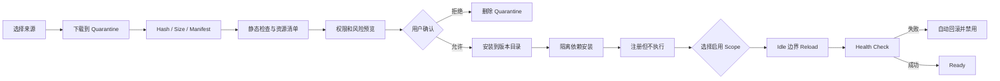
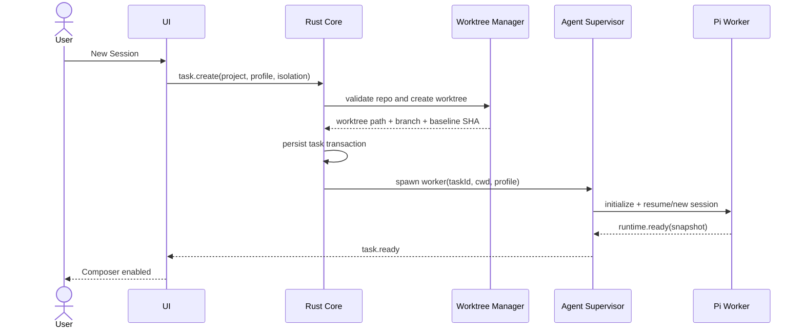
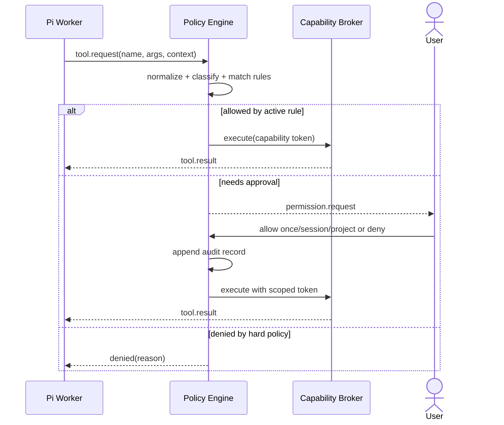
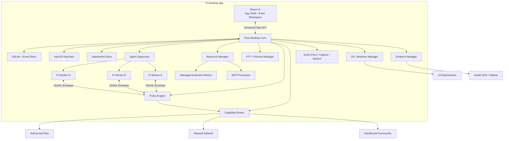

# Pi Desktop V2：Claude Desktop 对标版产品、UI/UX 与工程设计方案

> **历史文档说明：** 本文保留为 Claude 对标阶段的设计记录。2026-07-30 起，正式交付、ChatGPT/Claude 双基准和领先性实施统一以 [`pi-desktop-formal-delivery-plan-v3.md`](./pi-desktop-formal-delivery-plan-v3.md) 为准。

> 文档状态：历史实施基线（已由 V3 替代）
>
> 更新日期：2026-07-30
>
> 适用代码基线：`improvement-v4`
>
> 产品形态：完全独立的 macOS 桌面 Agent，不依赖 VS Code、Cursor 或其他 IDE
>
> Agent 内核：Pi-Agent；桌面端不得实现第二套 Agent Loop
>
> 配套文档：[`macos-migration-plan.md`](./macos-migration-plan.md) 记录迁移决策；[`pi-desktop-implementation-status.md`](./pi-desktop-implementation-status.md) 记录当前代码、验证证据和后续任务

---

## 0. 文档用途

本文档不是一份视觉风格备忘录，而是 Pi Desktop 后续产品设计、技术设计、任务拆分和发布验收的共同基线。它回答五个问题：

1. “对标 Claude Desktop”具体要对标哪些能力；
2. Pi Desktop 的主窗口、页面、状态和交互应如何设计；
3. Pi-Agent、Tauri、Rust Broker、自定义 API 端点和 Pi 扩展应如何协作；
4. 如何在保持开放性的同时建立可信的权限与隔离边界；
5. 当前 Alpha 应按什么顺序演进为可公开发布的 macOS 产品。

本文档采用“能力对标，不复制品牌”的原则：

- 借鉴 Claude Desktop 的任务组织、低干扰界面、工作区 Pane、权限表达和 macOS 交互；
- 不复制 Claude 的名称、Logo、图标、插画、文案和精确颜色；
- 以 Pi 的多 Provider、开放端点、Pi Resources 和本地可控性形成明确差异。

---

## 1. 最终产品定义

### 1.1 一句话定位

> Pi Desktop 是一款以 Pi-Agent 为唯一内核、以本地项目和任务为中心、支持并行隔离开发、可视化审查、安全工具执行、自定义模型端点与可管理扩展生态的独立 macOS Agent 工作台。

### 1.2 产品不是

- 不是 VS Code 插件的桌面壳；
- 不是带聊天框的简化编辑器；
- 不是只支持单一模型厂商的客户端；
- 不是把 Shell 完全开放给模型的自动化脚本；
- 不是重新实现 Pi-Agent 会话、上下文和模型循环的另一套 Agent；
- 不是 Claude Desktop 的像素级仿制品。

### 1.3 不可妥协的产品约束

1. **完全独立**：用户无需安装 VS Code、Pi CLI、Node.js 或 Bun。
2. **Pi 唯一内核**：模型调用、Agent Loop、Tool Call、Session、Compaction 和 Pi Resources 均由 Pi-Agent 提供或驱动。
3. **运行状态真实**：UI 中的模型、权限、附件、任务状态、Context 用量和 Tool 状态必须来自 Runtime Snapshot，不允许仅用 React 本地假状态。
4. **默认安全**：写文件、执行命令、访问网络、调用扩展和控制其他 App 都必须经过统一 Capability Broker。
5. **任务隔离**：Git 项目中的并行任务默认使用独立 worktree；无隔离时必须明确提示。
6. **端点一等公民**：用户可完全通过 GUI 添加、测试、切换、分组和诊断自定义 API。
7. **扩展一等公民**：Pi Extensions、Skills、Prompts、Themes、Packages 与 MCP Connector 均有可理解、可回滚的管理体验。
8. **本地优先**：会话索引、任务状态、审计日志和配置默认保存在本机；Secret 只进入 macOS Keychain。
9. **可恢复**：App、WebView、Pi Worker 或工具进程崩溃后，不得破坏项目文件，且任务可恢复。
10. **可发布**：Universal Binary、签名、公证、自动更新和数据迁移不是收尾选项，而是产品完成定义的一部分。

### 1.4 核心用户

| 用户 | 主要目标 | 典型痛点 | Pi Desktop 应提供 |
|---|---|---|---|
| 独立开发者 | 同时完成多个编码任务 | 终端会话分散、改动难审查 | 并行 Task、worktree、Diff、Terminal、Preview |
| AI 工具高级用户 | 自由切换模型和代理 | 官方客户端端点封闭 | Endpoint Center、路由组、模型能力探测 |
| Pi 生态用户 | 管理 Extensions/Skills | 依赖文件和命令行配置 | Extension Center、诊断、升级、回滚 |
| 团队技术负责人 | 控制 Agent 风险 | 自动执行不可追踪 | Policy、审计、权限模板、项目 Trust |
| 研究/本地模型用户 | 使用 Ollama 或兼容 API | 模型配置复杂、错误难定位 | 向导式配置、健康检查、流式与工具兼容测试 |

### 1.5 关键使用场景

1. 打开一个 Git 项目，创建两个互不干扰的任务并行工作。
2. 让 Agent 修改代码、运行测试，在同一窗口审查 Diff 和终端输出。
3. 从任意 App 双击 Option，截图并向指定项目发起新任务。
4. 添加一个 OpenAI Compatible 或 Anthropic Compatible 自定义端点，自动发现模型并验证工具调用。
5. 安装一个 Pi Skill 或 Extension，在安装前查看来源、资源、权限和风险。
6. 在 Ask、Accept Edits、Plan、Auto 之间切换，而不丢失会话。
7. Pi Worker 异常退出后恢复到同一会话、cwd、分支和未处理审批。
8. 创建一个本地定时任务，每天在隔离 worktree 中进行依赖审计。

---

## 2. Claude 对标范围与当前差距

### 2.1 对标基线

截至本文档更新日，Claude 官方桌面文档公开的关键体验包括：

- 并行 Session 与 Git worktree 隔离；
- Chat、Diff、Preview、Terminal、File、Plan、Tasks、Subagent 等可重排 Pane；
- 集成终端、文件查看/编辑、多文件可视化 Diff 与行内评论；
- Side Chat、后台任务、Context 用量与多种时间线显示密度；
- Quick Entry、截图、窗口分享、语音听写；
- Ask、Accept Edits、Plan、Auto 等权限模式；
- Connectors、Plugins、Skills、本地 MCP 桌面扩展；
- 本地、SSH、Cloud 环境；
- Scheduled Tasks、Computer Use、PR/CI 监控和 App Preview。

这些能力用于定义体验上限，不意味着所有能力都必须进入首个 1.0 安装包。本文将产品发布拆成：

- **1.0 Core Parity**：完成独立任务工作台、并行隔离、核心 Pane、审查、安全、端点和扩展；
- **1.1 Workflow Parity**：补齐 Quick Entry、Routines、MCP、Git/PR 工作流和 Preview 验证；
- **1.2 Full Parity**：补齐受控 Computer Use、SSH 环境和更完整的远程任务能力。

### 2.2 当前实现量化快照

2026-07-30 的最新实现证据见
[`pi-desktop-implementation-status.md`](./pi-desktop-implementation-status.md)。仍沿用 40
项内部能力清单，计分规则为：

- 完整实现：1 分；
- 部分实现：0.5 分；
- 未实现：0 分。

当前结果为 14 项完整、15 项部分、11 项未实现，约为
`21.5 / 40 = 53.75%`。这不是代码完成度或发布质量百分比，只表示用户可感知能力覆盖。

| # | 能力 | 当前 | V2 目标 | 目标版本 |
|---:|---|---|---|---|
| 1 | 独立 macOS `.app` | 部分 | Universal、签名、公证 | 1.0 |
| 2 | 内置 Pi-Agent 与私有 Node | 完整 | 可重复、可校验打包 | 1.0 |
| 3 | 多 Session 持久化 | 部分 | 搜索、分组、恢复、删除策略 | 1.0 |
| 4 | 流式响应与 Abort | 完整 | 断线续接、序列校验 | 1.0 |
| 5 | 自定义 Endpoint GUI | 完整 | 自动发现已完成；继续做能力矩阵和路由组 | 1.0 |
| 6 | 扩展发现、市场、启停、升级、回滚 | 完整 | 扩展到 Skill/Prompt/Theme | 1.0 |
| 7 | Session 重命名/筛选/归档 | 部分 | 完整生命周期与批量操作 | 1.0 |
| 8 | Session Tree、Fork、Clone | 部分 | 可视化分支树与分叉点 | 1.1 |
| 9 | 多任务并行执行 | 完整 | 并发预算与后台 UI | 1.0 |
| 10 | Git worktree 隔离 | 完整 | 管理页面、Patch 导出 | 1.0 |
| 11 | Worker 崩溃恢复 | 完整 | Safe Mode 与恢复历史 | 1.0 |
| 12 | Side Chat | 未实现 | 继承上下文、不污染主线 | 1.1 |
| 13 | Compaction 与 Context 用量 | 部分 | 可视化、手动触发、历史标记 | 1.0 |
| 14 | Normal/Verbose/Summary 视图 | 未实现 | 三档时间线密度 | 1.0 |
| 15 | Markdown/Code 富文本 | 部分 | GFM、代码块、复制、路径跳转 | 1.0 |
| 16 | `@` 文件/目录引用 | 部分 | 搜索、Token 估算、失效提示 | 1.0 |
| 17 | 图片/PDF/文件附件 | 部分 | PDF 解码、目录 Handle 与预览 | 1.0 |
| 18 | Quick Entry | 未实现 | 全局快捷入口 | 1.1 |
| 19 | 截图/窗口捕获 | 未实现 | 延迟权限与附件流 | 1.1 |
| 20 | 语音听写 | 未实现 | 实时转写、可编辑后发送 | 1.1 |
| 21 | Tool Timeline | 部分 | 结构化输入、输出、耗时、状态 | 1.0 |
| 22 | Permission Mode | 完整 | Ask/Accept Edits/Plan；Auto 保持 fail-closed | 1.0 |
| 23 | 路径/进程/网络隔离 | 完整 | Broker 已完成；继续做更强 OS Sandbox | 1.0 |
| 24 | 审批审计与撤销 | 部分 | Scope、过期、检索、撤销 | 1.0 |
| 25 | Plan Mode | 完整 | 后端只读策略；继续做 Plan Pane | 1.0 |
| 26 | Background Tasks/Subagents | 部分 | 独立 Task Worker 已有；继续做 Tasks Pane | 1.1 |
| 27 | Files Tree/Editor | 部分 | 变更列表与只读 Viewer；继续做搜索/编辑 | 1.0 |
| 28 | 多文件 Diff/Hunk Review | 部分 | 只读 Diff；继续做评论、采纳、丢弃、冲突 | 1.0 |
| 29 | 真正 PTY Terminal | 完整 | 多 Tab、历史与命令链接 | 1.0 |
| 30 | Preview/Browser | 未实现 | HTML/PDF/Image/Dev Server | 1.1 |
| 31 | Git Commit/PR/CI | 部分 | Repository/Worktree 已有；Commit 1.0，PR/CI 1.1 | 1.1 |
| 32 | 可拖拽 Pane Layout | 未实现 | 保存布局、聚焦、快捷切换 | 1.0 |
| 33 | Command Palette/Shortcuts | 完整 | 用户改键和全命令注册表 | 1.0 |
| 34 | 通知、Dock Badge | 未实现 | Waiting/Done/Failed 通知 | 1.0 |
| 35 | Endpoint 自动模型发现 | 完整 | 分阶段 Stream/Tool/Vision 探测 | 1.0 |
| 36 | Endpoint 路由、Fallback | 未实现 | 路由组、健康状态、手动 Failover | 1.1 |
| 37 | Extension 安装管线 | 完整 | 官方目录、Quarantine、权限、升级、回滚已完成 | 1.0 |
| 38 | MCP/Connectors | 未实现 | 本地 MCP + Connector Profile | 1.1 |
| 39 | Routines/Scheduled Tasks | 未实现 | 本地调度、历史、权限模板 | 1.1 |
| 40 | 签名、公证、更新、回退 | 部分 | Pi/Extension 更新已完成；继续做 Universal + Notary + App Updater | 1.0 |

### 2.3 优先级原则

功能优先级不按“看起来像 Claude”排序，而按以下顺序排序：

1. 文件安全和任务隔离；
2. Agent Runtime 状态真实性；
3. 完成编码任务所需的 Chat、Diff、Files、Terminal；
4. Session 管理和恢复；
5. Endpoint 与 Extension 的完整可用性；
6. macOS 快捷交互；
7. 自动化、Computer Use 和远程能力。

---

## 3. 产品体验原则

### 3.1 安静，而不是空

- 默认界面只展示当前决定所需的信息；
- Tool Call 默认折叠为一句可扫描摘要；
- Thinking、完整 stdout、环境变量和诊断按需展开；
- 重要状态通过位置、标签和层级表达，不依靠高饱和颜色。

### 3.2 Task First，而不是 Chat First

Session 不只是对话，它包含：

- 项目和工作目录；
- Git branch/worktree；
- Endpoint、Model、Thinking；
- Permission Profile；
- Pi Session ID 与分支；
- 事件时间线；
- 文件改动、终端和 Preview；
- 后台任务、审批和审计。

### 3.3 Progressive Disclosure

初次用户只需要：

1. 选择项目；
2. 选择模型；
3. 描述任务；
4. 审批必要操作。

高级用户才会看到：

- 路由组和 Header；
- Pi Resource Profile；
- 扩展能力声明；
- 命令规则；
- Session Tree；
- 调试协议和 Worker 日志。

### 3.4 Safe Autonomy

- Ask 是新项目默认模式；
- Accept Edits 可以自动接受工作区内文件修改，但仍询问一般 Shell；
- Plan 只允许读取与受限探测；
- Auto 只在通过强隔离验收的执行后端上开放；
- Bypass 不进入普通产品 UI，只允许开发构建或显式高级设置，并持续显示危险状态。

### 3.5 用户始终知道三件事

主窗口任何时刻都应能回答：

1. Agent 正在做什么；
2. 它在哪个目录和分支工作；
3. 下一步是否需要用户决策。

### 3.6 Keyboard First，Pointer Friendly

- 所有核心动作都有菜单项和快捷键；
- 快捷键在 Command Palette 中可搜索；
- Hover 不是唯一信息入口；
- Pane、审批、Session 切换均支持键盘完成。

---

## 4. 信息架构

### 4.1 顶层导航

```text
Pi Desktop
├── Home
│   ├── Continue Working
│   ├── Recent Projects
│   ├── Task Templates
│   └── Runtime / Endpoint Health
├── Projects
│   └── Project
│       ├── Active Sessions
│       ├── Review
│       ├── Completed
│       └── Archived
├── Routines
│   ├── Active
│   ├── Paused
│   └── Run History
├── Resources
│   ├── Extensions
│   ├── Skills
│   ├── Prompts
│   ├── Themes
│   └── MCP / Connectors
├── Endpoints
│   ├── Providers
│   ├── Models
│   ├── Route Groups
│   └── Diagnostics
└── Settings
    ├── General
    ├── Appearance
    ├── Agent
    ├── Permissions
    ├── Worktrees
    ├── Quick Entry
    ├── Extensions
    ├── Endpoints
    ├── Notifications
    ├── Privacy
    ├── Advanced
    └── About
```

### 4.2 主窗口结构

```text
┌──────────────────────────────────────────────────────────────────────────────┐
│ traffic lights   Project / Session Title      branch · model · usage   Views │
├──────────────────┬───────────────────────────────────────┬───────────────────┤
│ Sidebar          │ Primary Pane                          │ Secondary Pane    │
│                  │                                       │                   │
│ + New session    │ Chat / Diff / File / Preview / Plan  │ Diff / Terminal   │
│ Search           │                                       │ Files / Tasks     │
│                  │                                       │                   │
│ PROJECT A        │                                       │                   │
│ • task running   │                                       │                   │
│ • task waiting   │                                       │                   │
│ • task review    │                                       │                   │
│                  │                                       │                   │
│ PROJECT B        │                                       │                   │
│                  ├───────────────────────────────────────┴───────────────────┤
│ Routines         │ Composer: attachment · @ · mode · model · usage · send   │
│ Resources        │ Approval Shelf / Queue when needed                       │
│ Endpoints        │                                                           │
│ Settings         │                                                           │
└──────────────────┴───────────────────────────────────────────────────────────┘
```

### 4.3 尺寸与响应规则

| 区域 | 默认 | 最小 | 最大 | 行为 |
|---|---:|---:|---:|---|
| 窗口 | 1440 × 920 | 960 × 680 | 无 | 记住每个 Space 的位置与尺寸 |
| Sidebar | 260 px | 220 px | 360 px | 可折叠，折叠后 56 px 图标栏 |
| Chat Pane | 720 px | 480 px | 无 | Composer 始终固定在底部 |
| Secondary Pane | 460 px | 320 px | 70% | 可拆分、拖拽和关闭 |
| Terminal Drawer | 34% 高度 | 180 px | 75% | 可转为独立 Pane |

当窗口宽度小于 1160 px 时：

- Secondary Pane 以 Overlay 或 Tab 形式打开；
- Sidebar 可自动折叠；
- 不隐藏审批和任务状态。

### 4.4 Pane 模型

支持以下 Pane：

| Pane | 用途 | 可多开 | 1.0 |
|---|---|---:|---:|
| Chat | 主时间线和 Composer | 否 | 是 |
| Diff | 多文件变更审查 | 是 | 是 |
| File | 文件查看与轻量编辑 | 是 | 是 |
| Terminal | 用户交互 PTY | 是 | 是 |
| Plan | 计划、步骤、完成状态 | 否 | 是 |
| Tasks | Subagent、后台命令、工作流 | 否 | 1.1 |
| Preview | HTML、图片、PDF、Dev Server | 是 | 1.1 |
| Browser | 受控网页与验证状态 | 是 | 1.2 |
| Session Tree | Pi 分支、Fork、Compaction | 否 | 1.1 |
| Diagnostics | Endpoint、Extension、Worker 日志 | 是 | 是 |

布局交互：

- 从 `Views` 菜单或 Command Palette 新增 Pane；
- 拖动 Pane Header 进行左右、上下或 Tab 分组；
- 拖动边缘调整比例；
- `Cmd+\` 关闭聚焦 Pane；
- 每个 Project 记住上次布局；
- 提供 `Focus Chat`、`Review`、`Build & Preview` 三套预设；
- 错误恢复后如果 Pane 类型不可用，回退到 Chat + Diagnostics，不丢弃布局数据。

---

## 5. 核心页面设计

### 5.1 Home

#### 页面目标

让用户在 5 秒内继续上次工作或创建一个正确配置的新任务。

#### 页面结构

1. **Continue Working**
   - 最近 5 个 Session；
   - 显示项目、标题、最后活动、状态、分支和未审查文件数；
   - Waiting Approval 状态优先置顶。
2. **New Task**
   - 选择最近项目；
   - `Open Project…`；
   - 从 Task Template 创建。
3. **Runtime Health**
   - 默认 Endpoint；
   - Pi Host 状态；
   - Extension Error 数；
   - 更新状态。
4. **Recent Projects**
   - Pin、最后打开、活跃 Task 数。

#### 空状态

文案只保留一个主动作：

> 打开一个文件夹，让 Pi 帮你完成任务。

辅助动作：

- 添加 API 端点；
- 导入 Pi Resources；
- 打开示例项目。

### 5.2 New Session Sheet

新建 Session 使用 Sheet，而不是跳转到复杂设置页。

字段顺序：

1. Project/Folder；
2. Environment：Local、SSH（1.2）、Cloud（未来）；
3. Isolation：
   - New Worktree，Git 项目默认；
   - Current Checkout，需显示风险；
   - Read-only Project；
4. Endpoint/Model；
5. Permission Mode；
6. Resource Profile；
7. 可选初始 Prompt。

智能默认：

- 复用该 Project 最近一次可用 Endpoint；
- Git 项目默认 New Worktree；
- 新 Project 默认 Ask；
- 最近使用且健康的 Resource Profile 自动选中；
- 创建前只做必要的异步检查，不阻塞用户填写 Prompt。

错误必须直接落在对应字段，例如：

- “当前目录不是 Git 仓库，无法创建 worktree”；
- “该模型未验证 Tool Use，可继续聊天，但不能启动编码 Agent”；
- “资源配置包含一个已禁用 Extension”。

### 5.3 Sidebar 与 Session 列表

Session 按 Project 分组，每个 Project 内按状态分区：

- Running；
- Waiting；
- Review；
- Recent；
- Archived 仅在 Archive 页面显示。

单条 Session 信息：

- 标题，单行；
- 状态点；
- 相对更新时间；
- 运行时显示简短当前动作；
- Review 显示 `3 files`；
- Waiting 显示审批图标；
- Hover 或上下文菜单提供 Rename、Pin、Duplicate、Fork、Archive。

搜索支持：

- 标题；
- Project；
- Branch；
- 消息全文索引；
- `status:running`、`model:xxx`、`before:2026-07-01` 等过滤语法。

删除分成三个明确动作：

1. Archive：只从默认列表移出；
2. Delete Session Data：先移入应用内 Trash，保留 30 天；
3. Delete Worktree：确认没有未提交改动后执行；存在改动时必须先 Export Patch 或显式丢弃。

### 5.4 Chat Timeline

#### 消息视觉

- 使用开放式文档流，不使用连续厚重气泡；
- User Message 使用轻微暖色底；
- Assistant Message 保持页面底色；
- 正文最大阅读宽度 760 px；
- 代码、表格和 Diff 可突破正文宽度；
- 时间和 Token 信息默认隐藏在消息菜单中。

#### 事件类型

```text
UserMessage
AssistantText
AssistantThinking
ToolCall
ToolResult
PermissionRequest
Plan
TaskSpawned
TaskProgress
TaskCompleted
FileChangeSummary
GitEvent
Compaction
EndpointWarning
ExtensionWarning
RuntimeError
SystemNotice
```

每类事件必须有：

- 稳定 ID；
- Task ID；
- 顺序号；
- 开始/结束时间；
- 状态；
- 可访问名称；
- 对应 Raw Event 的诊断入口。

#### 三种显示模式

| 模式 | 默认展示 |
|---|---|
| Normal | 正文、重要 Tool 摘要、审批、文件变更、错误 |
| Verbose | 所有 Tool、读取、完整命令、stdout/stderr、子任务 |
| Summary | 最终答复、变更、测试结果、待用户动作 |

切换显示模式只改变呈现，不改变事件存储，也不改变 Agent Context。

#### Tool Card

折叠态显示：

- 动词 + 对象：`Read src/App.tsx`、`Run npm test`；
- 状态：Queued/Running/Waiting/Succeeded/Failed/Cancelled；
- 耗时；
- 结果摘要。

展开态显示：

- 规范化输入；
- 实际 cwd；
- 适用权限规则；
- stdout/stderr 分流；
- Exit Code；
- 产生的文件变更；
- `Copy`、`Open in Terminal`、`Show raw event`。

### 5.5 Composer

Composer 是任务控制台，不只是文本框。

#### 第一行：Context Chips

- 文件；
- 目录；
- 图片；
- PDF；
- 截图；
- Window Capture；
- Git Diff；
- URL；
- Skill/Prompt。

每个 Chip 显示：

- 名称和类型；
- 大小或 Token 估算；
- 是否已失效；
- 删除按钮；
- 对于目录，显示实际包含规则而不是假装整目录已上传。

#### 输入区

- 1–12 行自动增长；
- Markdown；
- `/` 命令；
- `@` 文件、目录、Session、Skill、Prompt；
- 粘贴图片自动形成附件；
- 拖拽文件有真实宿主导入流程；
- 过大文件先给出索引、截断或摘要选项。

#### 控制栏

从左到右：

1. Add Context；
2. Permission Mode；
3. Endpoint/Model；
4. Thinking/Effort；
5. Context Ring；
6. Send/Stop。

运行中输入新消息时提供：

- **Steer**：尽快注入当前 Agent Loop；
- **Follow-up**：等待本轮完成后发送；
- 队列顺序可见、可取消。

#### 键盘

- `Enter`：发送；
- `Shift+Enter`：换行；
- `Esc`：停止生成或关闭最上层浮层；
- `Cmd+Shift+M`：Permission Mode；
- `Cmd+Shift+I`：Model；
- `Cmd+Shift+E`：Effort；
- 输入法组合态不得误发送。

### 5.6 Approval Shelf

审批请求同时出现在：

- Timeline 原位置；
- Composer 上方固定的 Approval Shelf；
- Sidebar Session 状态；
- macOS 通知。

审批卡必须回答：

- Agent 想做什么；
- 对哪个文件、命令、域名或 App；
- 为什么需要；
- 风险等级；
- 允许范围和持续时间。

按钮：

- Deny；
- Allow Once；
- Allow for Session；
- Always Allow for Project；
- Edit Command（仅 Shell）；
- Open Diff（文件写入）；
- View Policy。

高风险动作不提供 Always Allow：

- 删除项目外文件；
- 修改系统设置；
- 读取 Keychain；
- 使用 `sudo`；
- 向未知域名发送本地文件；
- 控制 Terminal、Finder、System Settings。

### 5.7 Diff Pane

#### 结构

```text
Changes (6)
├── Working Tree
│   ├── M src/App.tsx       +84 -21
│   ├── A src/panes/Diff.ts +213
│   └── D old.ts            -55
├── Staged
└── Untracked
```

顶部：

- Scope：All / Unstaged / Staged / Since Task Start；
- View：Split / Unified；
- Whitespace；
- Search；
- Review Code；
- Export Patch。

文件级动作：

- Open File；
- Stage/Unstage；
- Accept Agent Change；
- Revert Agent Change；
- Add Comment；
- Copy Path。

Hunk 级动作：

- Accept；
- Revert；
- Add Review Comment；
- Ask Pi About This；
- Apply Suggested Edit。

安全约束：

- Revert 前比较当前 Blob 与生成 Diff 时的 Blob；
- 用户在外部修改后进入 Conflict 状态，不静默覆盖；
- 任何丢弃动作先写可恢复 Patch 到应用 Trash；
- 二进制文件显示元数据和 Preview，不伪造文本 Diff。

### 5.8 Files Pane

1. 文件树与 Git 状态；
2. Quick Open；
3. 项目内全文搜索；
4. 路径面包屑；
5. 只读查看为默认；
6. 用户主动编辑时进入轻量编辑模式；
7. 保存前检测磁盘版本变化；
8. 点击聊天或 Diff 中路径时在 File Pane 精确定位。

1.0 不实现：

- LSP；
- 调试器；
- IDE 级重构；
- 自动补全。

这是一个 Agent 工作台的文件检查器，不是完整 IDE。

### 5.9 Terminal Pane

Terminal 分成两条严格不同的数据流：

1. **Agent Command Stream**
   - 由 Tool Broker 执行；
   - Timeline 和 Terminal 可观察；
   - 默认只读；
   - 永不把 stdout 重新写入 PTY 输入。
2. **User PTY**
   - 用户主动创建；
   - 使用 Session worktree 作为 cwd；
   - 可输入、复制、搜索；
   - 可把选中输出附加到 Composer。

每个终端 Tab 显示：

- shell；
- cwd；
- 前台进程；
- Agent/User 来源；
- Exit 状态。

关闭含运行进程的 Tab 时提供：

- Keep Running in Background；
- Terminate；
- Cancel。

### 5.10 Preview 与 Browser

Preview 负责：

- 图片；
- PDF；
- 本地 HTML；
- Dev Server URL；
- Markdown Render；
- 用户项目生成的静态产物。

安全设计：

- Preview 使用独立 Origin/WebView；
- 不继承 Tauri Command 权限；
- 默认禁止访问本地任意路径；
- 用户明确选择的项目文件通过只读 Broker 提供；
- 外部导航显示真实域名；
- 下载、麦克风、摄像头和剪贴板均需单独授权。

1.1 提供：

- Dev Server 自动发现；
- Console/Network 错误摘要；
- 选择页面元素并回传 Context；
- 截图对比和 Agent Auto Verify。

1.2 Browser Pane 才提供通用网页自动化；Preview 不应成为绕过工具权限的隐藏浏览器。

### 5.11 Plan、Tasks 与 Subagent Pane

Plan Pane：

- Goal；
- 计划步骤；
- Pending/In Progress/Completed；
- 相关文件；
- 用户评论；
- Approve Plan / Request Changes；
- Plan Mode 中批准后再切换权限模式。

Tasks Pane：

- Subagent；
- 后台命令；
- Preview Server；
- Routines Run；
- 每项显示父任务、状态、耗时、资源和取消按钮。

Subagent 的输出默认汇总到主 Session；用户可以打开独立只读时间线检查细节。

### 5.12 Session Tree 与 Side Chat

Session Tree 显示：

- Pi Session 分支；
- Fork 点；
- Clone；
- Compaction 节点；
- 当前活动分支；
- 分支的模型和创建时间。

Side Chat：

- 读取主线到打开时的上下文快照；
- 不向主线追加消息；
- 默认不允许写工具；
- 用户可将结论“引用到主线”，而不是隐式合并；
- Side Chat 关闭后仍可在 Session Tree 中查看。

### 5.13 Archive 与 Trash

Archive 页面支持：

- 搜索；
- Restore；
- Export Transcript；
- Export Patch；
- Delete Session；
- Delete Worktree；
- Empty Trash。

删除设计：

- Session 元数据和 Pi JSONL 先移动到应用 Trash；
- 默认保留 30 天；
- Worktree 存在未提交改动时禁止直接删除；
- 清空 Trash 是显式、不可逆动作；
- Endpoint Secret 与 Extension Package 不随 Session 删除。

### 5.14 Settings

Settings 使用独立窗口或主窗口 Sheet，左侧分类、右侧内容，顶部支持搜索。

| 分类 | 核心设置 |
|---|---|
| General | 启动行为、关闭窗口行为、Launch at Login、Keep Awake、语言 |
| Appearance | Light/Dark/Auto、字体大小、代码字体、Timeline 密度、Reduce Effects |
| Agent | 默认 Endpoint/Model、Thinking、并发数、Compaction、View Mode |
| Permissions | 默认模式、持久规则、Denied Paths、Network Allowlist、撤销审批 |
| Worktrees | 默认位置、Branch Prefix、清理策略、磁盘用量 |
| Quick Entry | 快捷键、最近会话、截图、语音 |
| Endpoints | 默认 Endpoint、Health Check、导入导出 |
| Resources | 默认 Profile、更新策略、Legacy Extension 总开关 |
| Notifications | Waiting/Review/Done/Failed、声音、Dock Badge |
| Privacy | Analytics、Crash Report、日志保留、附件保留、清除本地数据 |
| Advanced | Worker 并发、诊断日志、Feature Flag、Safe Mode、Developer Tools |
| About | 版本、Pi SDK、Runtime、Update Channel、License、Check for Updates |

2026-07-30 当前实现先收敛为四个可用分类：General、Models & API、
Extensions & Updates、Runtime。`Cmd+,`、Sidebar 和 Command Palette 均进入同一个
Settings Center；旧 Endpoint/Extension 快捷命令只负责定位对应分类，不再创建平行设置页。
后续扩展分类时必须沿用这一入口，不允许重新把低频配置放回顶层导航。

设置作用域：

- Global；
- Project Override；
- Session Snapshot。

Project Override 必须显示“继承/覆盖”状态；恢复默认只删除覆盖，不改全局值。

Danger Zone 动作：

- Reset UI Layout；
- Revoke All Persistent Approvals；
- Disable All Third-party Resources；
- Clear Caches；
- Reset App Data。

最后一项必须说明会删除哪些数据、哪些不会删除，并要求二次确认；任何 Project 源码均不在 App Data Reset 范围内。

### 5.15 Command Palette 与快捷键面板

`Cmd+K` 打开 Command Palette，支持：

- New/Open/Switch/Archive Session；
- Open Pane；
- Change Model/Mode/Effort；
- Stop/Pause All；
- Run Test/Commit；
- Endpoint/Resource/Routine；
- Settings；
- Diagnostics；
- 所有菜单命令。

命令结果显示：

- 当前作用域；
- 快捷键；
- 是否可用；
- 禁用原因；
- 危险动作标签。

`Cmd+/` 打开只读快捷键总览；用户自定义快捷键时检测系统和 App 内冲突。

---

## 6. macOS 专属体验

### 6.1 Quick Entry

默认触发：

- 双击 Option；
- 备选 `Option+Space`；
- 支持自定义快捷键。

Quick Entry 浮层包含：

- 输入框；
- 最近 5 个 Session；
- New Task；
- 目标 Project/Session；
- Screenshot；
- Capture Window；
- Clipboard；
- Voice；
- Endpoint/Model 快速切换。

发送后：

- 浮层立即收起；
- 新任务在后台创建；
- Dock Badge 和通知反映 Waiting/Done；
- 用户点击通知回到对应 Session。

### 6.2 截图与窗口捕获

使用延迟授权：

1. 用户首次点击 Capture 时解释用途；
2. 再请求 Screen Recording；
3. 拒绝后保留普通文件上传和剪贴板能力；
4. Settings 显示权限状态和打开系统设置入口。

附件记录：

- 原始图像；
- 缩略图；
- 捕获来源；
- 尺寸；
- 创建时间；
- 是否允许持久保存。

默认对敏感窗口做提示，不自动抓取密码管理器、Keychain Access 和系统认证对话框。

### 6.3 语音输入

- 默认关闭全局 Voice Shortcut；
- 首次使用请求 Microphone 与 Speech Recognition；
- 实时转写仅进入 Composer Draft；
- 必须允许用户编辑后再发送；
- 音频默认不持久化；
- Settings 提供语言、自动标点和快捷键。

### 6.4 Menu Bar 与系统菜单

macOS 菜单：

- Pi Desktop；
- File；
- Edit；
- View；
- Session；
- Agent；
- Window；
- Help。

所有快捷键必须同时出现在菜单中，支持系统快捷键发现和修改。

可选 Menu Bar Item：

- Quick Entry；
- Running Tasks；
- Waiting Approval；
- Pause All Agents；
- Quit。

### 6.5 Dock 与通知

Dock Badge：

- 数字只表示等待用户处理的 Session 数；
- Running 不显示数字；
- Failed 和 Waiting 使用通知中心。

通知动作：

- Approve Once；
- Deny；
- Open Session。

高风险审批不允许从通知直接批准，必须打开 App 查看详情。

### 6.6 原生窗口行为

- 支持 Full Screen、Split View、Stage Manager；
- 恢复窗口、Pane 和聚焦 Session；
- Titlebar 与 Sidebar 可使用克制的材质效果；
- Chat、Diff、Editor 和 Terminal 不使用全屏模糊；
- Reduce Transparency 时回退到不透明色；
- Reduce Motion 时关闭 Pane 弹簧动画和流式光效。

---

## 7. 视觉设计系统

### 7.1 视觉方向

关键词：

- warm；
- calm；
- editorial；
- precise；
- trustworthy；
- native。

参考 Claude Desktop 的优点：

- 暖色中性背景；
- 清晰文字层级；
- 轻量 Sidebar；
- 低噪声控件；
- 内容优先。

Pi Desktop 的差异：

- 使用“铜色 + 苔绿”状态体系；
- Pi 自有几何图标与动效；
- 更清晰地表达 Endpoint、Runtime 和安全边界；
- 代码工作台区域保持更高的信息密度。

### 7.2 Light Tokens

| Token | 值 | 用途 |
|---|---|---|
| `--bg-canvas` | `#F7F5F0` | App 主背景 |
| `--bg-sidebar` | `#F0EEE8` | Sidebar |
| `--bg-surface` | `#FCFBF8` | Card/Popover |
| `--bg-elevated` | `#FFFFFF` | Modal/浮层 |
| `--text-primary` | `#292722` | 主文字 |
| `--text-secondary` | `#706B62` | 次文字 |
| `--text-tertiary` | `#969087` | 辅助信息 |
| `--border-subtle` | `#E4E0D7` | 分隔 |
| `--border-strong` | `#CFC9BD` | 聚焦边界 |
| `--accent` | `#B85E3C` | 主动作、Pi 品牌 |
| `--accent-hover` | `#A85133` | Hover |
| `--accent-soft` | `#F2DED3` | 选中和 User Message |
| `--success` | `#4F7659` | 成功 |
| `--warning` | `#A66A24` | 警告 |
| `--danger` | `#B94B48` | 危险 |
| `--info` | `#4F6F8E` | 信息 |

### 7.3 Dark Tokens

| Token | 值 |
|---|---|
| `--bg-canvas` | `#1E1D1A` |
| `--bg-sidebar` | `#25231F` |
| `--bg-surface` | `#2A2824` |
| `--bg-elevated` | `#302E29` |
| `--text-primary` | `#F2EFE8` |
| `--text-secondary` | `#B7B0A5` |
| `--text-tertiary` | `#8D877E` |
| `--border-subtle` | `#3B3832` |
| `--border-strong` | `#5A554C` |
| `--accent` | `#D47A55` |
| `--accent-soft` | `#4A3026` |
| `--success` | `#75A37F` |
| `--warning` | `#D19A55` |
| `--danger` | `#E07873` |
| `--info` | `#7FA3C3` |

所有语义色必须通过 WCAG 对比度校验；状态不得仅依靠颜色区分。

### 7.4 Typography

| 用途 | 字体 | 大小/行高 |
|---|---|---|
| Window/Section Title | SF Pro Display | 20/26，Semibold |
| Body | SF Pro Text | 14/21，Regular |
| Compact UI | SF Pro Text | 12/16，Medium |
| Caption | SF Pro Text | 11/15，Regular |
| Code | SF Mono | 12.5/19 |
| Large Empty State | SF Pro Display | 28/34，Medium |

正文不使用过轻字重；中文自动回退到系统苹方字体。

### 7.5 Spacing、Radius 与 Elevation

- 4 px 基础网格；
- 常用间距：4、8、12、16、20、24、32；
- Inline Control Radius：7 px；
- Card Radius：10 px；
- Sheet/Popover Radius：14 px；
- Quick Entry Radius：16 px；
- 阴影仅用于浮层和跨层拖拽，不用于每个 Message；
- Border 比 Shadow 更常用。

### 7.6 Motion

| 动作 | 时长 | 曲线 |
|---|---:|---|
| Hover/Press | 100–120 ms | ease-out |
| Popover | 160 ms | system-like |
| Pane open/close | 200–240 ms | ease-in-out |
| Streaming caret | 受 Reduce Motion 控制 | linear |
| Task complete | 180 ms | 无弹跳 |

禁止：

- 持续发光；
- 大面积渐变动画；
- Tool 执行时无限旋转导致视觉噪声；
- 对话内容位移式入场。

### 7.7 组件状态

所有交互组件至少实现：

- Default；
- Hover；
- Pressed；
- Focus Visible；
- Selected；
- Disabled；
- Loading；
- Error。

Focus Ring 使用 2 px，并在键盘导航时显示；不得用 `outline: none` 移除而无替代。

### 7.8 App Icon 与品牌标记

App 图标必须建立独立的 Pi 识别，不使用 Claude、ChatGPT、OpenAI 或其他产品的
Logo、星芒和精确品牌色。

最终方案：

- 主符号是单个小写希腊字母 `π`，粗细足以在 16 px 下保持可辨；
- `π` 右脚以克制的前向切角暗示命令执行，但不能变成箭头或拉丁字母 `P`；
- 底板采用 macOS 圆角方形，暖象牙色面、深咖啡轮廓和陶土珊瑚色主符号；
- 图标只有一个视觉焦点，不加入窗口控制点、聊天气泡、机器人、脑图或通用 AI 星芒；
- 外部四角透明，内部不透明；不针对 Light/Dark Mode 更换图形，保证 Finder、Dock、
  Spotlight 和系统权限面板中的一致识别；
- 不把 Beta、更新状态或通知数量烘焙进图标，运行状态交给 Dock Badge 和系统通知。

生产资产：

| 文件 | 用途 |
|---|---|
| `resources/app-icon-source-chroma.png` | 生成式设计源，保留可审计的纯色抠图背景 |
| `resources/icon@2x.png` | 1024 × 1024 RGBA Retina 母版 |
| `resources/icon.png` | 512 × 512 RGBA 1x 资源 |
| `apps/desktop/src-tauri/tauri.conf.json` | 同时声明 1x/2x，构建时生成 Bundle `.icns` |

验收：

1. 四角 Alpha 为 0，中心 Alpha 为 255；
2. 16、32、64、512 和 1024 px 缩放均保持 `π` 识别；
3. Release `.app` 的 `CFBundleIconFile` 指向新生成的 `.icns`；
4. Finder、Dock 和应用切换器中不出现旧的纯蓝占位图；
5. 图标源文件和生成提示随项目保存，后续迭代不得只修改构建产物。

### 7.9 语言与本地化

- 首发支持 `zh-CN` 与 `en-US`，首次启动跟随系统语言；
- 用户选择写入全局偏好并跨重启保持；
- 所有导航、设置、空状态、表单、错误、权限和更新文案必须使用稳定翻译键；
- Endpoint 名称、模型 ID、扩展包名、路径和终端原始输出不翻译；
- 中文采用系统苹方回退，布局验收同时覆盖中英文长度；
- 新增可见文案时，CI 必须检查已使用键在中英文目录中都存在。

---

## 8. Endpoint Center 详细设计

### 8.1 产品目标

Endpoint Center 应让用户在不了解 Pi 配置文件格式的情况下完成：

- 添加 Provider；
- 配置 Secret；
- 发现模型；
- 验证 Streaming 和 Tool Use；
- 选择默认模型；
- 诊断连接问题；
- 创建 Fallback/Route Group；
- 安全导入导出。

这是 Pi Desktop 相比 Claude Desktop 的核心差异能力。

### 8.2 支持类型

1. OpenAI Compatible；
2. Anthropic Compatible；
3. Ollama；
4. Google/Gemini Compatible；
5. Azure OpenAI；
6. AWS Bedrock（后续）；
7. Local Command/Unix Socket（高级）；
8. 由 Pi Extension 动态注册的 Provider。

### 8.3 列表页

每张 Endpoint Card 显示：

- 名称；
- 类型；
- Base URL 的主机部分；
- Secret 状态，不显示 Secret；
- 模型数；
- 最近测试时间；
- Latency；
- Health；
- 当前 Session 使用数；
- 来源：Built-in/User/Extension/Managed。

状态：

- Healthy；
- Degraded；
- Auth Error；
- Protocol Error；
- Offline；
- Untested；
- Disabled。

快捷动作：

- Test；
- Edit；
- Duplicate；
- Set Default；
- Disable；
- View Diagnostics；
- Delete。

### 8.4 添加向导

#### Step 1：类型与模板

模板：

- OpenAI；
- Anthropic；
- Ollama Local；
- OpenRouter；
- Azure OpenAI；
- Custom。

模板只预填字段，不锁定协议。

#### Step 2：连接

- Display Name；
- Base URL；
- API Path；
- API Version；
- Auth Type；
- API Key；
- Organization/Project Header；
- Custom Headers；
- Proxy；
- TLS Verification。

危险选项：

- 跳过 TLS 验证仅在开发模式可用；
- Secret Header 的值进入 Keychain；
- 普通 Header 明确标记是否会写入导出文件。

#### Step 3：发现与模型

- 调用模型列表；
- 允许手动添加；
- 每个模型配置：
  - Model ID；
  - Display Name；
  - Context Window；
  - Max Output；
  - Vision；
  - Tool Use；
  - Reasoning；
  - Input/Output Price；
  - tokenizer strategy。

自动发现结果只标记为“Reported”；未经实际测试的能力不显示为 Verified。

#### Step 4：兼容性测试

分阶段执行：

1. DNS；
2. TCP/TLS；
3. Authentication；
4. Models API；
5. 简短非流式 Completion；
6. Streaming；
7. Tool Call；
8. Image Input，可选；
9. Abort；
10. Usage Metadata。

每一步显示：

- 耗时；
- 请求 ID；
- HTTP 状态；
- 用户可执行的修复建议；
- 脱敏 Raw Log。

#### Step 5：默认值

- 设置为 App 默认；
- 设置为当前 Project 默认；
- 建立 Route Group；
- 选择 Resource Profile；
- 保存并新建 Session。

### 8.5 Route Group

Route Group 用于显式路由，不做不透明的自动模型替换。

配置：

- Primary Endpoint/Model；
- Ordered Fallback；
- 触发条件：
  - Connection Failure；
  - 429；
  - 5xx；
  - Timeout；
  - Context Overflow；
- 最大重试次数；
- 是否允许跨模型；
- 成本上限；
- 数据驻留限制。

运行时必须在 Timeline 中说明发生了 Failover；不同模型之间切换前检查 Tool Schema 和 Context 兼容性。

### 8.6 Secret 体验

- Keychain Service：`com.pi-desktop.endpoints`；
- Account：Endpoint UUID + Secret Field；
- UI 只接收“已设置/未设置/最后更新”；
- Reveal 需要系统认证；
- Export 默认不包含 Secret；
- 支持生成环境变量引用，但不自动读取整个 Shell 环境；
- 删除 Endpoint 时二次确认是否同时删除 Keychain 项。

### 8.7 Endpoint 诊断页

包含：

- 当前配置的脱敏快照；
- 最近 20 次 Health Check；
- Streaming 首 Token 延迟；
- 总延迟；
- 错误分类；
- 证书信息；
- 模型能力矩阵；
- 当前 Session；
- Extension 注册来源；
- Copy Diagnostic Bundle。

Diagnostic Bundle 必须自动移除：

- API Key；
- Authorization；
- Cookie；
- 本地用户名；
- 完整 Prompt；
- 个人文件路径，可选择保留末级文件名。

---

## 9. Extension & Resource Center 详细设计

### 9.1 统一管理对象

资源中心统一展示、分开执行：

| 类型 | 本质 | 默认风险 | 是否执行代码 |
|---|---|---:|---:|
| Skill | 指令、参考资料、脚本 | 中 | 可能 |
| Prompt | 模板文本 | 低 | 否 |
| Theme | UI Token/语法样式 | 低 | 否 |
| Pi Extension | Provider、Tool、Hook、UI | 高 | 是 |
| Pi Package | 上述资源的分发容器 | 取决于内容 | 可能 |
| MCP Server | 本地或远程工具服务 | 高 | 是/远程 |
| Connector | 配置化数据/工具连接 | 中至高 | 远程调用 |

资源类型不得因为都叫“扩展”而获得相同权限。

### 9.2 来源

支持：

- 本地文件；
- 本地目录；
- Git URL + Commit/Tag；
- npm Package + 精确版本；
- Pi Package；
- `.mcpb`；
- 受信任的私有 Registry；
- App 内置资源。

来源标签必须始终可见：

- Built-in；
- User Local；
- Git；
- npm；
- Extension Provided；
- Managed。

### 9.3 首页

左侧过滤：

- Installed；
- Updates；
- Disabled；
- Errors；
- Extensions；
- Skills；
- Prompts；
- Themes；
- MCP；
- Profiles。

资源卡显示：

- 名称、图标、类型；
- 版本；
- 作者和来源；
- Verified/Unverified；
- Enabled Scope；
- 权限摘要；
- 更新状态；
- 最后诊断；
- 使用中的 Session 数。

### 9.4 安装流程



#### Quarantine

- 下载和解包永远发生在 App 私有 Quarantine；
- 限制压缩包大小、文件数和展开后总大小；
- 拒绝绝对路径、`..` 穿越、特殊设备、危险 Symlink；
- 计算 SHA-256；
- 保存来源 URL、Commit、Registry Metadata；
- 静态检查阶段不加载 Extension；
- npm 安装默认 `--ignore-scripts`；
- 需要安装脚本时必须单独说明、隔离执行并产生日志。

#### 权限预览

安装确认页按能力显示：

- 读取工作区；
- 写入工作区；
- 执行命令；
- 访问网络域名；
- 读取环境变量；
- 请求 Secret；
- 注册模型 Provider；
- 注册 Tool；
- 注册 Hook；
- 打开 UI；
- 运行后台任务。

权限文案应是人类可理解的动作，例如：

> 可以读取当前项目中的文件；不能读取 Downloads 或其他项目。

而不是只显示内部 Capability ID。

### 9.5 Scope 与 Profile

启用 Scope：

- Global；
- Project；
- Session；
- Routine；
- Disabled。

Resource Profile 是可命名组合：

```text
Profile: Web Development
├── Extensions: browser-tools, git-tools
├── Skills: react-review, accessibility-audit
├── Prompts: bugfix, code-review
├── Theme: Pi Warm
├── MCP: GitHub, Linear
└── Policy Template: Ask + project write
```

Profile 必须可导出，但 Secret 和机器绝对路径默认剔除。

### 9.6 更新与回滚

每个安装使用不可变版本目录：

```text
resources/<resource-id>/
├── versions/
│   ├── 1.2.0/
│   └── 1.3.0/
├── current -> versions/1.3.0
├── manifest.lock.json
└── state.json
```

更新过程：

1. 新版本进入 Quarantine；
2. 生成 Manifest Diff 和 Permission Diff；
3. 新增权限必须重新批准；
4. 安装到新版本目录；
5. 在无运行 Tool 的 Idle 边界切换；
6. Health Check；
7. 失败时原子切回上一版本。

删除：

- 默认保留最近两个可回滚版本；
- Remove Resource 不删除用户单独保存的配置；
- Purge 才删除所有版本、缓存和配置；
- 正在被 Session 使用时只能安排在 Session 结束后删除。

### 9.7 Extension Diagnostics

诊断页显示：

- 解析出的 Manifest；
- Source/Hash/Signature；
- 版本和依赖；
- 声明权限与实际请求；
- 注册 Provider/Tool/Hook；
- Startup Duration；
- 最近错误；
- Worker stdout/stderr；
- Reload；
- Disable；
- Rollback；
- Open Install Folder，只允许从安全路径打开。

### 9.8 MCP 与 Connectors

MCP 配置体验：

- Directory/Browse；
- Install `.mcpb`；
- Add Local Server；
- Add Remote Server；
- 配置表单由 Manifest Schema 生成；
- Secret 字段进入 Keychain；
- 显示 Connection、Tools、Resources、Prompts；
- 支持 Enable by Project/Profile；
- Tool 首次调用仍经过统一 Approval。

本地 MCP Server 类型：

- Bundled Binary；
- Node；
- Python；
- Command；
- HTTP/SSE/Streamable HTTP。

若用户机器缺少运行时：

- 不静默安装系统级 Node/Python；
- 优先使用 App 私有 Runtime；
- 无法兼容时明确提示所需版本和安装方式。

Connector 与 MCP 的区别要在 UI 中说明：

- Connector 是面向服务和账号的产品配置；
- MCP 是具体协议服务器；
- 两者最终向 Pi 暴露 Tool/Resource 时都进入 Capability Broker。

### 9.9 Legacy Pi Extension 兼容策略

Pi Extension 可能假设自己运行在拥有完整 Node 权限的 Host 中。V2 将其分为两档：

1. **Managed Extension**
   - 通过 Manifest 声明能力；
   - 在独立 Extension Worker 中运行；
   - 只能通过 Broker 访问文件、命令、网络和 Secret；
   - 可在 Auto/Routine 中使用。
2. **Legacy Trusted Extension**
   - 兼容现有 Pi Extension；
   - 明确提示其拥有与 Pi Worker 相同的本机权限；
   - 默认禁用；
   - 不允许进入无人值守 Routine 或 Auto；
   - 每次版本更新重新显示信任提示。

不能把进程隔离描述成系统安全隔离；若扩展进程仍拥有普通用户权限，它只能降低崩溃影响，不能阻止恶意本机访问。

---

## 10. 关键用户流程

### 10.1 首次启动

```text
Launch
  → Welcome
  → Choose appearance
  → Add or import Endpoint
  → Endpoint compatibility test
  → Open Project
  → Explain Project Trust
  → Create first Session in Ask mode
  → Show contextual hints only when needed
```

首次启动不请求 Screen Recording、Accessibility、Microphone 或 Speech 权限；这些权限在用户首次使用相应功能时再申请。

完成标准：

- 从安装到发出第一条有效 Prompt 不超过 3 分钟；
- Ollama 本机可在不输入 API Key 的情况下完成；
- 连接失败时用户知道失败阶段和下一步。

### 10.2 创建隔离任务



失败补偿：

- Worktree 创建失败：不创建 Task 记录；
- Task 已保存但 Worker 启动失败：保留 Task 为 Failed，可 Retry；
- Worker 已启动但 UI 断开：Core 持续记录事件，UI 重连后取 Snapshot + Event Delta。

### 10.3 Tool 审批



审批决策基于标准化 Tool Call，而不是对用户自然语言做危险命令匹配。

### 10.4 审查 Agent 改动

```text
Agent writes through Broker
  → Broker records before/after hash and Task ownership
  → Git diff model refreshes
  → Session enters Review when Agent completes
  → User opens Diff preset
  → Review file/hunk/comment
  → Run tests in Terminal or ask Agent to fix
  → Stage/Commit or Export Patch
  → Archive Session and optionally remove worktree
```

### 10.5 添加自定义 Endpoint

```text
Endpoints → Add
  → Choose protocol template
  → Enter URL and Secret
  → Discover models
  → Run staged compatibility test
  → Correct field-level issues
  → Save
  → Set global/project default
  → Start test Session
```

Secret 在 UI 提交后立即进入 Keychain；普通配置持久化不包含 Secret 值。

### 10.6 安装 Extension

```text
Resources → Install
  → Select local/Git/npm/package/MCPB
  → Quarantine fetch
  → Static inspect
  → Show files, source, version, hash, permissions
  → User accepts scope
  → Isolated install
  → Register
  → Reload at idle boundary
  → Health check
  → Ready or automatic rollback
```

### 10.7 Worker 崩溃恢复

```text
Worker exits unexpectedly
  → Supervisor captures exit + last heartbeat
  → Task status = Recovering
  → Revoke outstanding capability tokens
  → Cancel or expire pending approvals
  → Backoff and restart
  → Resume exact Pi session JSONL
  → Rebuild Runtime Snapshot
  → UI deduplicates events by taskId + seq
  → Show one recovery notice
```

连续崩溃进入 Safe Mode：

- 禁用 Project Extensions；
- 切回 Ask；
- 保留日志；
- 不无限重启；
- 提供 Retry、Open Diagnostics、Export Session。

### 10.8 Quick Entry 到后台任务

```text
Double Option
  → Select recent Project
  → Add screenshot
  → Type/dictate request
  → Send
  → Background task created in isolated worktree
  → Notification on waiting/review/done
  → Click notification to open exact Session
```

---

## 11. 功能规格

### 11.1 Project

Project 保存：

- UUID；
- Display Name；
- Canonical Root；
- Security-scoped Bookmark；
- Git Remote 摘要；
- Trust State；
- 默认 Endpoint/Model；
- 默认 Permission Profile；
- Resource Profile；
- Worktree 策略；
- 最近 Session；
- UI Layout。

Trust State：

- Unknown；
- Trusted Read-only；
- Trusted Interactive；
- Trusted Automation；
- Revoked。

移动或删除项目目录后，Project 显示 Missing，不静默改到同名路径。

### 11.2 Task/Session

Desktop Task 与 Pi Session 分工：

- Desktop Task 是产品容器；
- Pi Session JSONL 是模型上下文与分支的权威来源；
- Desktop Event Store 是用户可见运行时间线和审计的权威来源；
- 两者通过 Task ID、Pi Session ID 和分支 ID 关联。

Task 状态机：

```text
Draft
  → Preparing
  → Ready
  → Running
  → WaitingApproval
  → Running
  → Review
  → Completed
  → Archived

Preparing/Running/WaitingApproval
  → Recovering
  → Ready/Running/Failed

任意非 Archived
  → Cancelled
```

状态由 Core 推导，不由单个 React 组件自行修改。

### 11.3 Context 与附件

附件导入过程：

1. UI 传入用户选择句柄；
2. Rust 验证、生成 Content ID；
3. 小文件复制到 Session Attachment Store；
4. 大文件建立 Security-scoped Reference 和摘要；
5. Pi Host 仅收到授权后的内容或 Broker Handle；
6. Timeline 持久化附件元数据。

限制：

- 默认单文件 25 MB；
- 图片根据模型能力压缩；
- PDF 提取文本和页面预览；
- 二进制文件不直接拼进 Prompt；
- 目录使用 include/exclude 规则和文件清单；
- 发送前显示 Token 估算；
- Secret Scanner 对疑似 `.env`、密钥和证书给出提示。

### 11.4 Plan Mode

允许：

- 读取 Project 范围内文件；
- Git status/log/diff；
- 受限的无副作用探测命令；
- 搜索和静态分析；
- 请求用户补充信息。

禁止：

- 写文件；
- 改 Git 索引；
- 安装依赖；
- 启动长驻服务；
- 一般网络写请求；
- Extension 自定义写 Tool。

计划确认后，用户选择：

- Continue in Ask；
- Continue in Accept Edits；
- Continue in Auto，如果隔离满足；
- Request Changes。

### 11.5 Background Tasks 与 Subagents

- 每个 Task 有并发上限；
- 全 App 有全局并发上限；
- 后台 Shell、Subagent、Preview Server 都可见；
- 父 Session 取消时默认询问是否一并取消后台任务；
- 后台任务不能继承比父任务更宽的权限；
- Subagent 创建独立 Event 子流，可选择独立 worktree；
- 资源不足时排队，不悄悄失败。

### 11.6 Git 工作流

1. 检测 Repository 与当前 dirty state；
2. 创建 Task Branch 和 Worktree；
3. 记录 Baseline SHA；
4. Agent 所有写入记录 Task ID；
5. 展示 Working/Staged/Committed；
6. 支持 Commit；
7. 1.1 支持 Push、PR、CI；
8. Archive 时提供保留 Branch、删除 Worktree、删除 Branch 三个独立选项。

Branch 默认命名：

```text
pi/<project-slug>/<task-short-id>-<title-slug>
```

用户可在 Settings 修改前缀。

### 11.7 PR 与 CI

1.1 目标：

- 通过 GitHub CLI、Git Provider API 或 Connector 检测 Remote；
- 创建 PR 前展示目标 Branch、Commit 和 Diff；
- 展示 CI Checks；
- 失败日志作为附件回到 Session；
- Auto-fix 必须创建明确的新 Agent Turn；
- Auto-merge 默认关闭；
- Merge 后再询问是否 Archive/Delete Worktree。

任何 Push、PR、Merge 都属于外部副作用，必须在 UI 中明确。

### 11.8 Routines

Local Routine 字段：

- Name；
- Description；
- Instructions；
- Project；
- Schedule；
- Endpoint/Model；
- Resource Profile；
- Permission Profile；
- Worktree Toggle；
- Timeout；
- Retry；
- Notification；
- Catch-up Policy。

Schedule：

- Manual；
- Hourly；
- Daily；
- Weekdays；
- Weekly；
- Advanced Cron；
- One-time。

安全要求：

- 只有 Trusted Automation Project 可启用；
- Ask 模式可以运行，但遇到审批会停在 Waiting；
- Auto 必须使用强隔离执行后端；
- 记录每次 Run，包括 Skipped 原因；
- 同一 Routine 默认不并发重入；
- App 关闭或 Mac 睡眠时本地 Routine 不执行；
- 唤醒后的补跑策略必须在 UI 中明确，不默认补跑全部。

### 11.9 Computer Use

Computer Use 作为 1.2 可选能力，通过 Pi Tool 暴露，操作由 macOS Control Broker 执行。

App 级授权层：

- View Only；
- Click/Scroll；
- Full Control；
- Denied。

附加规则：

- Terminal、Finder、System Settings、密码管理器属于高风险 App；
- 每个 Session 显示当前获准 App；
- Accessibility 与 Screen Recording 延迟请求；
- 输入密码、支付信息和系统认证禁止自动完成；
- Agent 工作时显示持续可见状态；
- 全局 `Pause All Agents` 和紧急停止快捷键；
- Screenshot 只保存必要时间并遵循隐私设置。

### 11.10 SSH 与远程环境

1.2 目标：

- 保存 Host Profile，不保存明文密码；
- 使用系统 SSH Agent/Keychain；
- 在远端启动兼容 Pi Worker；
- 本地 UI 通过版本化加密通道接收事件；
- File/Diff/Terminal 全部标记 Remote；
- 本地与远端路径不混淆；
- Extension 和 Endpoint Profile 可分别选择 Local/Remote；
- 网络断开后保留事件游标并支持恢复。

不把任意 SSH 命令拼接到本地 Shell；使用结构化参数和明确 Host Key 验证。

---

## 12. 系统架构

### 12.1 推荐架构



### 12.2 进程边界

| 进程 | 职责 | 不能做 |
|---|---|---|
| React WebView | 呈现、输入、Pane 布局 | 直接文件、Shell、Keychain、安装扩展 |
| Rust Core | 权威状态、IPC、持久化、系统能力 | 实现第二套 Agent Loop |
| Pi Worker | Pi AgentSession、模型、上下文、Tool Request | 绕过 Broker 直接执行危险工具 |
| Managed Extension Worker | Extension Provider/Tool/Hook | 直接访问未授权 OS 能力 |
| MCP Process | MCP 协议服务 | 自动获得项目/Secret 权限 |
| Preview WebView | 渲染用户内容 | 调用 Tauri 核心 Command |
| Quick Entry Window | 收集 Prompt/附件 | 自己创建无审计的 Agent |

### 12.3 为什么每个活跃 Task 一个 Pi Worker

优点：

- Session cwd 不串线；
- Extension 崩溃不拖垮全部 Task；
- Abort 和资源限制更明确；
- Endpoint/Profile 固化；
- 崩溃恢复可按 Task 执行；
- 日志和审计清晰。

成本：

- 内存更高；
- 启动更慢；
- Worker 管理更复杂。

优化：

- 只为 Running/Waiting/最近活跃 Task 保持 Worker；
- Idle Session 进入 Hibernated，只保留 Pi JSONL 和 Snapshot；
- Worker 启动预热私有 Node Runtime；
- 全局并发默认 4，可配置 1–8；
- 内存压力下优先休眠无后台任务的 Session。

当前单 Host 多 Session 实现可作为过渡，但不能作为 1.0 最终故障隔离边界。

### 12.4 Rust Core 模块

```text
src-tauri/src/
├── app/
│   ├── lifecycle.rs
│   ├── commands.rs
│   └── menu.rs
├── tasks/
│   ├── service.rs
│   ├── state_machine.rs
│   └── recovery.rs
├── agent/
│   ├── supervisor.rs
│   ├── worker.rs
│   ├── protocol.rs
│   └── snapshot.rs
├── policy/
│   ├── engine.rs
│   ├── rules.rs
│   ├── approvals.rs
│   └── audit.rs
├── broker/
│   ├── files.rs
│   ├── process.rs
│   ├── network.rs
│   ├── secrets.rs
│   └── macos_control.rs
├── git/
│   ├── repository.rs
│   ├── worktree.rs
│   ├── diff.rs
│   └── review.rs
├── endpoints/
├── resources/
├── terminal/
├── preview/
├── scheduler/
├── storage/
│   ├── database.rs
│   ├── migrations/
│   ├── event_store.rs
│   └── attachments.rs
└── macos/
    ├── keychain.rs
    ├── bookmarks.rs
    ├── quick_entry.rs
    ├── capture.rs
    ├── speech.rs
    └── notifications.rs
```

### 12.5 Frontend 模块

```text
apps/desktop/src/
├── app/
│   ├── AppShell.tsx
│   ├── routes.tsx
│   ├── commands.ts
│   └── shortcuts.ts
├── features/
│   ├── home/
│   ├── projects/
│   ├── sessions/
│   ├── timeline/
│   ├── composer/
│   ├── approvals/
│   ├── panes/
│   │   ├── chat/
│   │   ├── diff/
│   │   ├── file/
│   │   ├── terminal/
│   │   ├── preview/
│   │   ├── plan/
│   │   ├── tasks/
│   │   └── diagnostics/
│   ├── endpoints/
│   ├── resources/
│   ├── routines/
│   └── settings/
├── platform/
│   ├── bridge/
│   └── events/
├── state/
│   ├── entities/
│   ├── runtime/
│   └── layout/
├── design-system/
│   ├── tokens/
│   ├── primitives/
│   ├── patterns/
│   └── icons/
└── styles/
```

原则：

- 不继续扩张单体 `App.tsx`；
- 组件不直接调用字符串形式的 Tauri Command；
- Runtime State 与持久化 Entity State 分开；
- Event Reducer 必须支持 Snapshot + Delta；
- Pane 组件可卸载重建，不承担业务权威状态。

### 12.6 Pi Worker

```text
packages/pi-agent-host/src/
├── worker-main.ts
├── runtime/
│   ├── session-runtime.ts
│   ├── session-recovery.ts
│   ├── runtime-profile.ts
│   └── event-adapter.ts
├── policy/
│   ├── mandatory-policy-extension.ts
│   └── tool-normalizer.ts
├── resources/
│   ├── profile-loader.ts
│   └── compatibility.ts
├── endpoints/
│   └── provider-composer.ts
└── transport/
    ├── envelope.ts
    ├── jsonl.ts
    └── heartbeat.ts
```

Pi Worker 的所有可执行 Tool 必须被替换或包裹为 Broker Tool。Mandatory Policy Extension 负责在 `tool_call` 执行前生成标准化请求，但最终授权和执行在 Rust Core。

### 12.7 启动顺序

1. 验证 App 数据目录和 DB Migration；
2. 加载非 Secret 配置；
3. 初始化 Keychain Broker；
4. 恢复 Project/Task 索引；
5. 启动 Runtime Supervisor；
6. UI 获取 `app.snapshot`；
7. 惰性恢复当前 Session Worker；
8. 后台完成 Endpoint Health 和 Resource Diagnostics；
9. Ready 后再启动 Routines Scheduler。

任何 DB Migration、Keychain 或 Supervisor 错误都必须进入可诊断 Safe Mode，不能只显示空白窗口。

---

## 13. IPC 与事件协议

### 13.1 Envelope

所有跨进程消息统一：

```ts
type Envelope<TKind extends string, TPayload> = {
  protocolVersion: number;
  messageId: string;
  correlationId?: string;
  taskId?: string;
  workerId?: string;
  seq?: number;
  timestamp: string;
  kind: TKind;
  payload: TPayload;
};
```

约束：

- `messageId` 全局唯一；
- Command 支持 `idempotencyKey`；
- Task Event 必须有单调递增 `seq`；
- 时间戳只用于显示，不用于排序；
- 未知 `kind` 可记录但不能静默当作成功；
- 协议握手返回支持的版本区间和 Feature Flags；
- 前后端类型从单一 Schema 生成。

### 13.2 UI → Core Commands

```text
app.getSnapshot
project.open
project.updateTrust
project.updateDefaults
task.create
task.resume
task.rename
task.archive
task.cancel
task.delete
task.fork
task.compact
prompt.submit
prompt.steer
prompt.enqueue
prompt.cancelQueued
approval.resolve
pane.persistLayout
git.createWorktree
git.getDiff
git.applyReviewAction
git.commit
terminal.create
terminal.write
terminal.resize
terminal.close
endpoint.create
endpoint.update
endpoint.test
endpoint.delete
routeGroup.update
resource.inspect
resource.install
resource.enable
resource.rollback
resource.remove
routine.create
routine.runNow
routine.pause
diagnostics.export
```

### 13.3 Core → UI Events

```text
app.snapshot
app.healthChanged
task.created
task.stateChanged
task.snapshot
task.event
task.recovered
task.failed
prompt.queued
message.delta
message.completed
tool.requested
tool.started
tool.output
tool.completed
approval.requested
approval.expired
approval.resolved
git.changed
terminal.output
endpoint.healthChanged
resource.changed
routine.runChanged
notification.requested
```

### 13.4 重连

UI 重连时：

1. 发送最后已确认 `seq`；
2. Core 返回当前 Snapshot；
3. 返回 Snapshot 之后的 Event Delta；
4. UI 按 `messageId` 去重；
5. 如果 Event 已被压缩，Core 返回 `resyncRequired`；
6. UI 清理 Runtime 派生状态后重建，不清理 Draft 和布局。

---

## 14. 数据与文件设计

### 14.1 目录

```text
~/Library/Application Support/Pi Desktop/
├── pi-desktop.sqlite3
├── sessions/
│   └── <task-id>/
│       ├── pi/
│       ├── events/
│       ├── attachments/
│       └── exports/
├── worktrees/
│   └── <repo-hash>/<task-id>/
├── resources/
│   ├── installed/
│   ├── quarantine/
│   ├── cache/
│   └── trash/
├── logs/
├── diagnostics/
├── trash/
└── backups/

~/Library/Caches/Pi Desktop/
├── endpoint-health/
├── previews/
└── thumbnails/
```

签名发布所需的私有 Node 和 Pi Host 固定在已签名 App Bundle：

```text
Pi Desktop.app/Contents/Resources/runtime/
├── node/
└── pi-agent-host/
```

Tauri/Rust/UI 本体只能通过签名 App 更新。Pi-Agent Core 允许在 Application
Support 中使用经过精确版本校验、Protocol Preflight、只读化和原子切换的托管 Runtime
覆盖层：

```text
~/Library/Application Support/com.piagent.desktop/
├── updates.json
└── packages/
    ├── npm-cache/
    ├── pi-agent/<version>/
    └── extensions/<extension-id>/<content-hash>/source/
```

选择规则：

1. Bundle Runtime 始终是可信回退；
2. 只有 SemVer 高于 Bundle 的托管 Pi-Agent 才能被选择；
3. 托管 Runtime 必须通过路径边界、包版本、入口文件和 Protocol v2 预检；
4. 失败的 Staging 不写 Active Marker；
5. App 更新后 Bundle 版本更高时，不允许旧托管版本造成降级；
6. Extension 和 Pi-Agent 更新均不得执行 npm lifecycle scripts。

Session JSONL 仍由 Pi SDK 管理；Desktop 不重写其语义。

### 14.2 SQLite 核心表

| 表 | 关键字段 | 用途 |
|---|---|---|
| `projects` | id, root, bookmark, trust, defaults | Project 权威索引 |
| `tasks` | id, project_id, status, title, timestamps | Task 生命周期 |
| `task_environments` | task_id, kind, cwd, worktree, branch, baseline | 执行环境 |
| `pi_sessions` | task_id, session_id, branch_id, jsonl_path | Pi Session 关联 |
| `events` | id, task_id, seq, kind, payload_ref | Timeline 事件 |
| `messages` | id, task_id, role, content_ref, status | 搜索与呈现索引 |
| `attachments` | id, task_id, type, path, hash, metadata | 附件 |
| `approvals` | id, task_id, capability, scope, decision | 审批 |
| `policy_rules` | id, scope_type, scope_id, matcher, effect | 权限规则 |
| `audit_log` | id, actor, action, target, result, timestamp | 不可变审计 |
| `endpoints` | id, type, base_url, config, enabled | 非 Secret 配置 |
| `endpoint_models` | endpoint_id, model_id, capabilities | 模型 |
| `route_groups` | id, policy | 路由 |
| `resources` | id, type, source, current_version, status | 资源 |
| `resource_versions` | resource_id, version, hash, manifest | 版本 |
| `resource_scopes` | resource_id, scope_type, scope_id, enabled | 启用范围 |
| `resource_permissions` | resource_id, capability, decision | 权限 |
| `resource_profiles` | id, name, revision | Profile |
| `routines` | id, project_id, schedule, profile, enabled | 定时任务 |
| `routine_runs` | id, routine_id, task_id, status, reason | 历史 |
| `layouts` | scope, layout_json, revision | Pane 布局 |
| `migrations` | version, applied_at, checksum | DB Migration |

大文本和二进制使用 Content-addressed File Store，SQLite 只保存引用，避免 DB 无限制膨胀。

### 14.3 原子性与备份

- SQLite 开启 WAL；
- Schema Migration 使用事务；
- 升级前创建有版本号备份；
- 新版本写入后旧版本 App 不得打开更高 Schema；
- Event 先落盘再广播为“已确认”；
- 附件使用临时文件 + fsync + rename；
- 每日保留最近 7 份小型配置备份；
- 不自动备份 Project 源码，Git/worktree 是源码恢复机制。

### 14.4 从当前 JSON Store 迁移

首次升级：

1. 检测现有 `tasks.json`、Endpoint 和 Extension Store；
2. 只读解析并验证版本；
3. 在一个 DB 事务内导入；
4. 对 Secret 只迁移 Keychain Reference；
5. 记录迁移 Hash 和数量；
6. 成功后保留原文件为 `.migrated-backup`；
7. 失败则回滚事务并继续使用旧 Store 的只读 Safe Mode。

---

## 15. 权限、安全与隐私

### 15.1 威胁模型

必须考虑：

- Prompt Injection 诱导读写项目外文件；
- 模型生成危险 Shell；
- 恶意或被供应链攻击的 Extension/npm Package；
- MCP Server 越权；
- 自定义 Endpoint 收集敏感项目内容；
- Preview 内容调用宿主能力；
- Symlink/Path Traversal；
- Worker 崩溃后重复执行 Tool；
- Secret 出现在日志、诊断包或导出；
- Routine 在无人监督时扩大副作用；
- Computer Use 操作错误 App。

### 15.2 Capability

统一 Capability 示例：

```text
fs.read(project, glob)
fs.write(worktree, glob)
fs.delete(worktree, glob)
process.exec(binary, args, cwd)
process.pty(shell, cwd)
network.connect(host, port, protocol)
secret.read(endpointId, field)
git.write(repository, action)
extension.invoke(resourceId, tool)
screen.capture(display/window)
app.control(bundleId, tier)
notification.send
```

Capability Token：

- 绑定 Task；
- 绑定具体 Scope；
- 绑定 Tool Request Hash；
- 有过期时间；
- 默认单次使用；
- Worker 崩溃立即撤销；
- 不可由 UI 或 Extension 自行伪造。

### 15.3 Permission Mode

| 模式 | 读取 | 工作区写入 | Shell | 网络 | 适用 |
|---|---|---|---|---|---|
| Ask | 规则允许后自动或询问 | 询问 | 询问 | 按域名规则 | 新项目 |
| Accept Edits | 工作区读取 | 工作区内自动 | 常见文件命令可自动，其他询问 | 按规则 | 日常编码 |
| Plan | 只读 | 禁止 | 只允许无副作用探测 | 只读请求且受限 | 复杂任务设计 |
| Auto | 隔离范围内 | 隔离范围内 | 隔离执行 | Allowlist | 可信项目、强隔离 |
| Bypass | 不受普通策略保护 | 不受普通策略保护 | 不受普通策略保护 | 不受普通策略保护 | 仅开发/高级危险模式 |

Auto Mode 的启用门：

- Git worktree 或只读项目；
- 强隔离执行后端通过自检；
- Project 为 Trusted Automation；
- 无 Legacy Trusted Extension；
- Secret 和 Network Allowlist 明确；
- 界面持续显示 Auto 状态；
- 一键 Pause。

### 15.4 文件系统

规范化：

- 先 canonicalize 已存在父目录；
- 创建目标时验证最终父目录；
- 每次操作重新检查 Symlink；
- 大小写不敏感卷上使用规范化比较；
- 拒绝 `..` 和 NUL；
- Security-scoped Bookmark 只在使用期间激活；
- Project Root、Worktree Root、App Data 是不同 Scope。

默认禁止：

- `~/.ssh`；
- `~/Library/Keychains`；
- 浏览器 Profile；
- 其他 Project；
- 系统目录；
- App Trash 外的批量删除。

### 15.5 Process 与 Shell

Shell Tool 不接受单个未解析字符串作为唯一安全依据。请求至少记录：

- program；
- argv；
- cwd；
- env allowlist；
- timeout；
- stdin policy；
- network policy；
- expected outputs。

风险分类：

- R0：只读、有限输出；
- R1：工作区内常规操作；
- R2：安装依赖、启动服务、网络；
- R3：删除、权限、Git destructive、外部写操作；
- R4：`sudo`、系统设置、凭据、广域删除。

R4 默认拒绝；必要时要求用户在 User PTY 手动执行。

### 15.6 强隔离执行后端

生产设计不依赖已弃用的 `sandbox-exec` 作为唯一安全边界。

需要并行验证两条路径：

1. **macOS App Sandbox Helper/XPC**
   - 独立签名 Helper；
   - 最小 Entitlement；
   - Security-scoped Project/Worktree；
   - 可选无网络 Helper；
   - 验证子进程是否继承限制；
   - 验证常见编译器、Git 和包管理器兼容性。
2. **Apple Virtualization/轻量 VM 后端**
   - 适用于 Auto、Routine 和高风险扩展；
   - 显式挂载 Worktree；
   - 网络可控；
   - 成本更高，作为增强隔离。

若 1.0 尚未通过强隔离验收：

- 可发布 Ask/Accept Edits/Plan；
- 不得把普通 Broker 描述为完整 Sandbox；
- Auto 和无人值守 Routines 保持关闭；
- UI 明确显示当前执行后端和保护等级。

### 15.7 Extension 安全

- Managed Extension 独立 Worker；
- Legacy Extension 不进入 Auto/Routine；
- 安装前生成文件和权限清单；
- 依赖锁定；
- 保存 SBOM 摘要；
- 更新显示新增依赖和权限；
- Extension 无权直接读取 Endpoint Secret；
- Secret Broker 返回短期 Token 或仅代发请求；
- Extension UI 使用 Schema/受限 WebView，不插入主 UI DOM。

### 15.8 Endpoint 隐私

每个 Endpoint 显示数据边界：

- Local；
- User-hosted；
- Third-party Cloud；
- Managed Enterprise。

首次把项目内容发送到新 Endpoint 时提示：

- Host；
- Provider；
- 是否记录日志；
- 可用 Privacy Link；
- 选择是否对该 Project 永久信任。

Route Group 不得在失败时把数据静默发送到另一个法律实体或区域。

### 15.9 Audit Log

记录：

- 谁：User/Agent/Extension/Routine；
- 何时；
- 哪个 Task；
- 请求的 Capability；
- 标准化参数摘要；
- 匹配规则；
- 决策；
- 执行结果；
- 关联文件 Hash/Command Exit。

Audit Log：

- 只追加；
- 支持 Project/Task/Actor/风险过滤；
- 默认保留 90 天，可配置；
- 导出自动脱敏；
- 用户可撤销 Project/Session/Extension 的持久批准。

### 15.10 日志脱敏

在写盘前脱敏：

- Authorization；
- API Key；
- Cookie；
- Password；
- Keychain Value；
- `.env` 值；
- URL Query Secret；
- 用户配置的敏感正则。

日志等级：

- Normal：产品事件；
- Diagnostic：脱敏协议元数据；
- Verbose：需临时开启，24 小时自动关闭；
- Raw Payload：只允许开发构建，不进入发布版。

---

## 16. 非功能规格

### 16.1 性能 SLO

以 Release Build、Apple Silicon M2、16 GB 内存、1,000 条 Timeline Event 为基准：

| 指标 | 目标 | 失败门槛 |
|---|---:|---:|
| 冷启动到可交互 Home | P50 ≤ 1.8 s，P95 ≤ 3.0 s | P95 > 4.0 s |
| 恢复最近 Session UI | P50 ≤ 600 ms | > 1.5 s |
| Pi Worker Ready | P50 ≤ 1.2 s，P95 ≤ 2.5 s | > 4.0 s |
| 输入到 UI Pending 状态 | ≤ 50 ms | > 100 ms |
| 首个流式 Delta 呈现开销 | ≤ 16 ms/批 | 持续掉帧 |
| 10,000 Event Timeline 滚动 | ≥ 55 fps | < 45 fps |
| Diff 打开，5,000 行 | ≤ 500 ms | > 1 s |
| Quick Entry 显示 | P95 ≤ 150 ms | > 300 ms |
| Idle 主 App RSS | ≤ 180 MB | > 250 MB |
| 每个 Idle Worker 增量 | ≤ 80 MB | > 120 MB |
| 4 个 Running Task 总 RSS | ≤ 1.2 GB | > 1.8 GB |
| Worker 崩溃检测 | ≤ 2 s | > 5 s |
| Worker 自动恢复 | P95 ≤ 5 s | > 10 s |

策略：

- Timeline 虚拟化；
- Delta 每 16–32 ms 批处理；
- 大 stdout 写文件并分页；
- 代码高亮放 Worker；
- Idle Worker 休眠；
- Preview 与 Terminal 不可见时降低刷新；
- Endpoint Health Check 限流。

### 16.2 可靠性

- Task Event 不重复执行，允许重复投递；
- 所有外部副作用 Command 有 Idempotency Key；
- App 崩溃时已确认 Event 不丢失；
- 未完成 Tool 在恢复后标记 `Unknown/Interrupted`，不得自动重放写操作；
- Worktree 创建/删除有事务日志；
- DB Migration 可回滚；
- 更新失败自动回到上一 App 版本；
- 单个 Extension 或 MCP 错误不导致主 App 退出。

### 16.3 可访问性

必须覆盖：

- VoiceOver；
- Full Keyboard Access；
- Reduce Motion；
- Reduce Transparency；
- Increase Contrast；
- Light/Dark/Auto；
- 200% UI 缩放；
- 色觉缺陷；
- 中文、英文和长文件名；
- 输入法组合态。

验收：

- 每个 Tool/Approval 状态有可读名称；
- Timeline 事件顺序对 VoiceOver 稳定；
- Pane Header 有角色、名称和关闭动作；
- Diff 的增删不只靠红绿；
- 焦点不会被 Streaming 强行抢走；
- 新 Event 不自动把正在阅读历史的用户滚到底部。

### 16.4 隐私

默认：

- 不上传 Transcript Telemetry；
- 不上传文件路径；
- 不上传 Prompt；
- Crash Report 先展示脱敏摘要并由用户选择；
- Analytics 为 Opt-in；
- Endpoint 请求仅发往用户选择的 Host；
- 本地搜索索引不离开设备。

可收集的匿名产品指标仅限：

- 启动时间；
- Crash 类别；
- 功能启用计数；
- Endpoint 错误类别，不含 URL；
- Pane 性能；
- 更新成功率。

### 16.5 兼容性

1.0：

- macOS 14 及以上；
- Apple Silicon 与 Intel Universal；
- Git 2.30+；
- 用户无需系统 Node；
- 本地项目文件系统支持 APFS/HFS+；
- 网络盘标记为 Limited Support，并禁用未经验证的原子性假设。

Quick Entry Voice 可根据系统 API 提高最低系统版本，但不得让不支持语音的系统无法运行主 App。

---

## 17. 当前代码的保留、重构与替换

### 17.1 总体判断

当前代码已经验证了 Tauri → Rust → 私有 Node → Pi SDK 的基本链路，并完成了 Endpoint、Extension 和持久化 Session 的第一轮骨架。它应被视为 **A3 Alpha 技术验证**，不是继续堆页面即可发布的产品架构。

### 17.2 文件级迁移映射

| 当前文件/模块 | 决策 | V2 动作 |
|---|---|---|
| `apps/desktop/src/App.tsx` | 重构 | 保留事件接线参考；拆为 AppShell、Session、Timeline、Composer、Pane，不继续增加状态 |
| `apps/desktop/src/styles.css` | 重构 | 提取 Token、Primitive、Feature Styles；删除全局组件耦合选择器 |
| `apps/desktop/src/platform/tauri/bridge.ts` | 保留并强化 | 改为 Schema 生成的 Typed Client，加入错误类型、取消、Idempotency |
| `apps/desktop/src/features/endpoints/EndpointCenter.tsx` | 保留并重构 | 拆列表、向导、模型矩阵、测试、诊断、Route Group |
| `apps/desktop/src/features/extensions/ExtensionCenter.tsx` | 保留并重构 | 升级为统一 Resource Center；安装和权限不放在 React 中执行 |
| `apps/desktop/src-tauri/src/storage/tasks.rs` | 迁移 | 作为 JSON → SQLite Importer；新写入改用事务化 Repository |
| `storage/endpoints.rs` | 迁移 | 非 Secret 配置进入 SQLite；Keychain Reference 独立 |
| `storage/extensions.rs` | 迁移 | 升级为版本、来源、Hash、Scope、Permission 模型 |
| `storage/app_paths.rs` | 保留 | 扩展统一路径、Trash、Backups、Quarantine |
| `src-tauri/src/agent/supervisor.rs` | 核心重构 | 从单 Host 管理升级为每活跃 Task Worker、心跳、Backoff、Safe Mode |
| `src-tauri/src/agent/protocol.rs` | 重构 | 采用统一 Envelope、Schema Codegen、Feature Handshake |
| `packages/protocol/src/messages.ts` | 保留并重构 | 作为单一协议源；拆 command/event/entity，生成 Rust Type |
| `packages/protocol/schema/desktop-host.schema.json` | 替换生成 | Schema 不手工双写；CI 检查生成产物无漂移 |
| `pi-agent-host/src/runtime/desktop-host.ts` | 拆分 | 过渡兼容；最终拆 Worker Main、Session Runtime、Event Adapter |
| `session-runtime.ts` | 保留 | 继续让 Pi SDK 管理 Session；补 Snapshot、Fork、Compaction、Usage |
| `permission-gate.ts` | 替换 | 移除仅靠本地逻辑的批准；改为 Mandatory Policy + Rust Capability Token |
| `task-run-controller.ts` | 保留并强化 | 补 Steering/Follow-up、后台任务、恢复状态机 |
| `resource-loader.ts` | 保留并强化 | 加 Profile、Manifest、来源、版本、诊断；不承担 Package 安装 |
| `test/*.test.mjs` | 保留 | 固定为 Pi Contract/Fake Provider 测试层；补异常和恢复 |
| `src-tauri/target/**` | 不进入源码 | 确保全部 Build Artifact 被忽略，发布由 CI 生成 |

### 17.3 新增核心文件

第一阶段应新增：

```text
apps/desktop/src/app/AppShell.tsx
apps/desktop/src/app/commands.ts
apps/desktop/src/design-system/tokens.css
apps/desktop/src/features/sessions/SessionSidebar.tsx
apps/desktop/src/features/timeline/Timeline.tsx
apps/desktop/src/features/composer/Composer.tsx
apps/desktop/src/features/panes/PaneWorkspace.tsx
apps/desktop/src/state/runtime/runtimeReducer.ts

apps/desktop/src-tauri/src/storage/database.rs
apps/desktop/src-tauri/src/storage/migrations/001_initial.sql
apps/desktop/src-tauri/src/storage/event_store.rs
apps/desktop/src-tauri/src/tasks/state_machine.rs
apps/desktop/src-tauri/src/git/worktree.rs
apps/desktop/src-tauri/src/policy/engine.rs
apps/desktop/src-tauri/src/policy/approvals.rs
apps/desktop/src-tauri/src/broker/files.rs
apps/desktop/src-tauri/src/broker/process.rs

packages/protocol/src/envelope.ts
packages/protocol/src/commands.ts
packages/protocol/src/events.ts
packages/protocol/src/entities.ts
packages/pi-agent-host/src/worker-main.ts
packages/pi-agent-host/src/runtime/event-adapter.ts
packages/pi-agent-host/src/policy/mandatory-policy-extension.ts
```

### 17.4 旧根项目处理

当前根 README、CI、Release 仍以 VS Code Extension 为主要目标。V2 必须：

1. 明确 Desktop 为主产品；
2. 将旧 Extension 标为 Legacy Reference 或移入 `legacy/`，但不能破坏历史；
3. 根脚本提供一键：
   - build；
   - test；
   - lint；
   - desktop package；
4. CI 必须覆盖 React、Protocol、Pi Host、Rust、E2E 和 Package；
5. 未完成迁移前不删除旧代码，避免丢失可复用逻辑；
6. 迁移完成后再用独立变更清理 Legacy，不与功能开发混在一个提交。

---

## 18. 实施路线与任务

### 18.1 估算前提

团队基线：

- 1 名 Rust/macOS 工程师；
- 1 名 TypeScript/React/Pi SDK 工程师；
- 0.5 名产品设计；
- 0.5 名 QA/自动化；
- 估算为净人日，包含开发和任务内测试，不包含招聘和审批等待。

由于“完整 Claude 对标”增加了 Pane 工作台、Quick Entry、Preview、Routines、MCP、Computer Use 和 SSH，范围显著大于原迁移文档中的基础 1.0。

建议：

| 里程碑 | 范围 | 预计剩余人日 | 2 名核心工程师日历 |
|---|---|---:|---:|
| 1.0 Core Parity | P0–P3 + P6 发布必选项 | 195–225 | 20–25 周 |
| 1.1 Workflow Parity | P4 + 对应质量门 | 50–70 | 6–9 周 |
| 1.2 Full Parity | P5 + 对应质量门 | 55–75 | 7–10 周 |
| 完整路线 | 全部 | 300–350 | 33–44 周 |

现有 A3 Alpha 可减少部分 Host、Endpoint、Resource 和 Session 骨架工作，但其中若干模块需要重构，不能用已写代码行数直接抵扣。

### 18.2 Phase P0：基线、协议与设计系统

目标：让后续工作在同一个可验证的工程和视觉基线上进行。

| ID | 工作 | 依赖 | 人日 | 验收与测试 | 回滚 |
|---|---|---|---:|---|---|
| V2-G01 | 根 Workspace、统一脚本和 Desktop CI | 无 | 3 | 根目录一条命令完成 TS/Rust/Host 测试；CI 不再忽略 Desktop | 保留旧脚本入口 |
| V2-G02 | 协议 Envelope、Schema 与 TS/Rust Codegen | G01 | 5 | 非法 Version/Kind/Payload 被拒绝；生成产物 CI 无漂移 | 协议 Feature Flag 回退 v1 |
| V2-G03 | Design Token、Primitive 与状态组件 | 无 | 6 | Light/Dark/Contrast；Button/Input/Menu/Badge/Tooltip/Sheet/Toast/Empty State | 旧 CSS 通过兼容层保留 |
| V2-G04 | UI Test Harness 与可访问性基线 | G03 | 4 | 关键组件交互、键盘、焦点和 Axe 规则进入 CI | 不影响 Runtime |
| V2-G05 | App Sandbox Helper、VM、Universal Signing Spike | 无 | 8 | 输出书面 Go/No-Go；越界文件、网络和子进程实测；arm64/x64 签名样品 | Auto 保持关闭 |
| V2-G06 | 产品 Feature Flag 与 Migration Gate | G01 | 3 | 未完成 Pane/Auto/Routine 不出现在普通用户 UI；支持 Safe Mode | 全部 Flag 默认关闭 |

完成定义：

- 根 CI 可验证 Desktop；
- 新增 UI 使用 Token；
- 协议有版本；
- 强隔离方案有实测结论；
- 不改变用户现有 Session 数据。

### 18.3 Phase P1：安全并行 Runtime

目标：建立 1.0 的正确底座，先解决隔离、状态、恢复和权限。

| ID | 工作 | 依赖 | 人日 | 验收与测试 | 回滚 |
|---|---|---|---:|---|---|
| V2-R01 | SQLite Repository 与 JSON Store Migration | G01 | 7 | tasks/endpoints/resources 原子迁移；高版本拒绝；备份恢复 | 保留 JSON 只读导入和备份 |
| V2-R02 | Task 状态机与 Event Store | R01/G02 | 7 | Snapshot+Delta 重连；10 万 Event 压测；状态不可非法跳转 | 可切回旧 Transcript 只读视图 |
| V2-R03 | 每活跃 Task 一个 Pi Worker | G02 | 9 | 4 Task cwd/profile/session 无串线；Idle 休眠；单 Worker 崩溃隔离 | Feature Flag 使用单 Host |
| V2-R04 | Git Repository/Worktree Manager | R01 | 9 | 同仓库 4 Task 隔离；dirty repo；branch 冲突；安全回收 | Current Checkout 仅 Ask 模式 |
| V2-R05 | Capability Broker 与 Policy Engine | G02/G05 | 12 | Tool 执行前审批；Path/Symlink/Command/Network 测试；Token 撤销 | Auto 关闭；Ask 使用最小 Broker |
| V2-R06 | Crash Recovery 与 Safe Mode | R02/R03/R05 | 7 | Kill Worker/Core/WebView；不重复写；恢复 Snapshot；连续崩溃停止 | 用户手动 Resume |
| V2-R07 | Attachment Store 与 Context Handle | R01/R05 | 6 | 图片/PDF/文件导入、Hash、大小限制、丢失文件和 Secret 提示 | 失败时只发送文本 |
| V2-R08 | Keychain Credential Broker v2 | R01 | 4 | Secret 不进 DB/Log/Export；删除和系统认证 | 现有 Keychain 项兼容读取 |

发布门：

- 没有 V2-R05，不能发布 Accept Edits；
- 没有 V2-R04，不能宣称并行任务隔离；
- 没有 V2-R06，不能开放后台长任务。

### 18.4 Phase P2：Claude 级核心工作台

目标：完成用户每天都使用的 Session、Chat、Pane、Diff、File、Terminal 和 Plan。

| ID | 工作 | 依赖 | 人日 | 验收与测试 | 回滚 |
|---|---|---|---:|---|---|
| V2-U01 | AppShell、Sidebar、Pane Workspace | G03/R02 | 9 | 拖拽、拆分、调整、关闭、布局恢复；窄窗口降级 | 提供固定 Chat+Inspector 布局 |
| V2-U02 | Session 生命周期 UI | R01/R03/R04 | 7 | New/Rename/Search/Pin/Archive/Trash/Restore；运行状态路由 | Archive 保留旧行为 |
| V2-U03 | Timeline Renderer 与三种 View Mode | R02/G03 | 9 | 所有事件类型；虚拟化；10k Event；VoiceOver；不会跳滚 | 回退 Normal 文本模式 |
| V2-U04 | Composer、附件、`@`、Queue | R07/U03 | 8 | IME、粘贴、拖拽、Steer/Follow-up、Stop；Runtime Snapshot 驱动 | 只保留文本 Prompt |
| V2-U05 | Approval Shelf 与 Audit UI | R05/U03 | 6 | Once/Session/Project/Deny/Expire/Revoke；高风险无持久批准 | 全部退回 Ask Once |
| V2-U06 | Multi-file Diff/Hunk Review | R04/R05 | 11 | 多文件、Stage、Hunk、冲突、外部修改、Export Patch | 只读 Diff，不开放 Revert |
| V2-U07 | Files Tree/Viewer/Light Editor | R05/U01 | 7 | 搜索、路径跳转、磁盘冲突、二进制处理、读写 Scope | 退回只读 Viewer |
| V2-U08 | User PTY 与 Agent Command Stream | R05/U01 | 8 | 输出不回注；Resize/Abort/后台；cwd 正确；多 Tab | 禁用 User PTY，仅 Tool Card |
| V2-U09 | Plan Pane、Usage Ring、通知 | U03/R05 | 6 | Plan 审批；Context/Cost；Waiting/Done/Failed 通知 | 信息保留在 Timeline |

设计验收：

- 1440、1160、960 px 三种宽度；
- Light/Dark/Reduce Transparency；
- 键盘完成新建任务、发送、审批、Diff、Session 切换；
- 不复制 Claude Logo、插画、精确配色和品牌文案。

### 18.5 Phase P3：Endpoint 与 Resource 生态

目标：把已经存在的基础管理页升级为可信、完整、可诊断的产品优势。

| ID | 工作 | 依赖 | 人日 | 验收与测试 | 回滚 |
|---|---|---|---:|---|---|
| V2-E01 | Endpoint Wizard 与模型能力矩阵 | R08/G03 | 7 | OpenAI/Anthropic/Ollama；自定义 Header；手动模型；字段错误 | 保留当前 CRUD |
| V2-E02 | 分阶段 Compatibility Tester | E01 | 7 | DNS/TLS/Auth/List/Stream/Tool/Vision/Abort；脱敏日志 | 基础 Ping Test |
| V2-E03 | Runtime Provider Composition 与 Route Group | E01/R03 | 8 | Session 固化 revision；Failover 可见；兼容检查；不串 Secret | 禁用 Route Group |
| V2-E04 | 统一 Resource/Profile 数据模型 | R01 | 6 | Extension/Skill/Prompt/Theme/MCP；Global/Project/Session Scope | 兼容当前 Extension 列表 |
| V2-E05 | Package Quarantine/Inspect/Install | E04/R05 | 10 | Path Traversal、Zip Bomb、Hash、`--ignore-scripts`、Manifest Diff | 只允许本地已安装资源 |
| V2-E06 | Managed Extension Worker 与 Idle Reload | E04/E05/G05 | 10 | 崩溃隔离、Capability、更新回滚、Legacy 标记 | 禁用第三方代码扩展 |
| V2-E07 | Resource Diagnostics/Update/Rollback/Remove | E04/E06 | 6 | 版本目录、健康检查、回滚、Trash、使用中保护 | Pin 当前版本 |
| V2-E08 | Endpoint/Resource 导入导出 | E03/E07 | 4 | 默认无 Secret/绝对路径；Schema Version；Conflict Preview | 仅单项手动配置 |

1.0 到此必须达到：

- 用户不编辑配置文件即可完成 Endpoint 和 Resource 主流程；
- 一个错误 Extension 不影响其他 Task；
- Secret 不落普通文件；
- Package 更新失败可回滚。

### 18.6 Phase P4：Workflow Parity

目标版本：1.1。

| ID | 工作 | 依赖 | 人日 | 验收与测试 | 回滚 |
|---|---|---|---:|---|---|
| V2-W01 | Session Tree、Fork、Clone、Compaction | R02/U03 | 8 | 分支可视化；Fork 点准确；Compaction 标记；恢复一致 | 继续仅活动分支 |
| V2-W02 | Side Chat | W01 | 5 | 上下文快照；不污染主线；只读默认；引用回主线 | Feature Flag 关闭 |
| V2-W03 | Quick Entry Window | U02/U04 | 7 | 双击 Option/Option+Space；150 ms；最近 Session；后台提交 | 保留普通全局快捷键 |
| V2-W04 | Screenshot、Window Capture、Voice | W03/R07 | 8 | 延迟权限；拒绝降级；实时转写草稿；音频不留存 | 分别独立禁用 |
| V2-W05 | Preview/Dev Server/Auto Verify | U01/R05 | 9 | 独立 Origin；HTML/PDF/Image；Console；截图验证 | 只开放静态 Preview |
| V2-W06 | Git Commit、Push、PR、CI Pane | U06 | 9 | 外部副作用审批；失败日志回流；不默认 Auto Merge | 只保留本地 Commit |
| V2-W07 | MCP/Connector Center | E04/E06 | 9 | Local/Remote；Schema Form；Keychain；Tool Approval；重连 | 禁用 MCP，保留 Pi Resource |
| V2-W08 | Local Routines 与 Run History | R03/R04/R05 | 10 | Sleep/Overlap/Missed/Waiting/Worktree/Timeout；安全门 | Scheduler 总开关关闭 |

### 18.7 Phase P5：Full Parity

目标版本：1.2。只有相关安全 Spike 和 QA 通过后开放。

| ID | 工作 | 依赖 | 人日 | 验收与测试 | 回滚 |
|---|---|---|---:|---|---|
| V2-A01 | Background Tasks/Subagent Pane | R03/U03 | 8 | 父子事件、取消、资源限制、权限不扩大 | 串行执行 |
| V2-A02 | Computer Use Broker | G05/R05 | 14 | App Tier、Denied List、紧急停止、敏感 App、权限状态 | 默认关闭并移除 Tool |
| V2-A03 | Browser Pane 与受控网页工具 | W05/A02 | 9 | Origin 隔离、下载/上传审批、域名状态、录制回放 | 静态 Preview |
| V2-A04 | SSH Environment | R03/R05 | 12 | Host Key、断线恢复、远端路径、Remote Worker Version | Local Only |
| V2-A05 | 强隔离 VM Backend | G05/R05 | 14 | Mount/Network/Secret/Resource Limit；Auto/Routine 实测 | Ask/Accept Edits |
| V2-A06 | Remote Task/Dispatch 接口预留 | A04/R02 | 6 | 本地协议不绑定单一云；鉴权和游标模型设计审查 | 不对用户开放 |

### 18.8 Phase P6：质量、发布与运维

P6 不是最后一次执行；每个版本从对应功能阶段并行进入 P6。

| ID | 工作 | 依赖 | 人日 | 验收与测试 | 回滚 |
|---|---|---|---:|---|---|
| V2-Q01 | Unit/Contract/Integration 套件 | 各模块 | 8 | Fake Provider、Pi Contract、Rust Service、Schema Fuzz | 阻止合并 |
| V2-Q02 | Desktop E2E | P1–P3 | 10 | 30+ 场景；真实 `.app`；截图和 Trace | 阻止发布 |
| V2-Q03 | Security Test 与外部审查 | R05/E05 | 12 | Path/Symlink/Package/Preview/MCP/Secret/Recovery | 关闭风险 Feature |
| V2-Q04 | Performance/Memory/Accessibility | P2 | 7 | 本文 SLO；VoiceOver；Reduce Motion；长 Session | 降级/虚拟化/休眠 |
| V2-Q05 | Universal Build、Signing、Notarization、DMG | G05 | 8 | Intel/Apple Silicon 干净机安装；Gatekeeper；Nested Code | 保留上一签名版本 |
| V2-Q06 | Updater、DB Migration、App Rollback | R01/Q05 | 8 | 升级/降级/断电/坏包/签名错误；自动回退 | 手动下载稳定版 |
| V2-Q07 | Diagnostics、Crash Report、Support Bundle | R02 | 5 | 默认脱敏；用户预览；关联 Task；Safe Mode | 仅本地日志 |
| V2-Q08 | Beta Ring 与发布清单 | Q01–Q07 | 5 | Internal/Canary/Beta/Stable；分阶段比例；Stop Rollout | 立即停更并回滚 |

---

## 19. 两周起步 Sprint

### 19.1 Sprint 目标

不继续增加表面功能，先把当前 A3 Alpha 升级为可安全扩展的 V2 基线：

> 建立统一 CI、版本化协议、Design Token、SQLite 迁移骨架、Task Event Store 和 Worktree Spike，并让现有 Session、Endpoint、Extension 功能保持可用。

### 19.2 双轨安排

#### Runtime/Platform 轨

| 天 | 任务 | 输出 |
|---|---|---|
| D1 | 固化当前构建/测试/Bundle 清单 | `docs/current-baseline.md`、根 verify 脚本 |
| D2 | 根 CI 接入 Desktop/Host/Rust | PR Gate |
| D3–D4 | Envelope v2 与协议生成 | `envelope.ts`、Rust Type、Handshake |
| D5–D7 | SQLite Migration 001 和 JSON Importer | DB、事务测试、备份 |
| D8–D9 | Event Store 最小闭环 | Snapshot + seq + replay |
| D10 | Worktree Manager Spike | 两 Task 隔离 Demo 和 Go/No-Go 记录 |

#### UI/UX 轨

| 天 | 任务 | 输出 |
|---|---|---|
| D1–D2 | Token、Typography、Button/Input/Badge | Light/Dark 基础组件 |
| D3–D4 | AppShell 与 Sidebar 拆分 | `AppShell.tsx`、`SessionSidebar.tsx` |
| D5–D6 | Timeline Event 类型和 Normal View | 不改变现有 Runtime 语义 |
| D7–D8 | Composer 与 Runtime Snapshot 接口 | 移除本地伪状态入口 |
| D9 | Error/Safe Mode/Empty State | Worker/DB 错误可诊断 |
| D10 | 键盘与三种窗口宽度验收 | UX 验收记录 |

### 19.3 Sprint 验收

1. 根目录一条命令执行所有当前 Desktop 测试；
2. CI 对 Protocol 漂移、Rust Format、Host Test、React Build 失败会阻断；
3. 现有 `tasks.json` 可迁入测试 DB，原文件不被删除；
4. Event 重放不会产生重复 Assistant Message；
5. 创建两个同仓库 worktree，文件变更互不影响；
6. 现有 Endpoint CRUD、Extension 扫描与 Session Resume 仍通过；
7. 新 UI 在 Light/Dark、960/1160/1440 px 可用；
8. 没有把未实现的 Diff、Terminal、Auto 伪装为可用入口；
9. 文档中的 Task ID 进入 Issue/项目看板；
10. Sprint 结束更新本文件的实施状态，而不是另建冲突方案。

---

## 20. 测试战略

### 20.1 测试金字塔

| 层 | 目标 | 工具/方式 |
|---|---|---|
| Pure Unit | Reducer、Policy、Path、Diff、Route | TS/Rust 单元测试 |
| Schema/Contract | UI/Core/Worker 协议 | 生成类型、Golden Files、Fuzz |
| Pi SDK Contract | Session、Tool、Compaction、Fork | 固定 Pi 版本 + Fake Provider |
| Service Integration | DB、Keychain、Git、Worker | 临时目录、临时 Repo、Mock Keychain |
| Desktop Integration | Tauri Command/Event | Release-like App Harness |
| E2E | 真实用户流程 | macOS Runner + App Automation |
| Security | 越界和恶意输入 | Attack Fixtures、独立审查 |
| Clean Machine | 安装、更新、恢复 | Intel/Apple Silicon 测试机 |

### 20.2 Fake Provider

必须有确定性 Fake Provider，支持脚本化：

- Text Delta；
- Thinking；
- Tool Call；
- Invalid Tool；
- Multiple Tool；
- Slow Stream；
- Disconnect；
- Retry；
- Usage；
- Context Overflow；
- Compaction；
- Image；
- Abort；
- Malformed Payload。

真实付费 API 只用于兼容 Smoke，不作为 CI 的唯一依据。

### 20.3 关键 E2E 场景

1. 首次启动添加 OpenAI Compatible Endpoint；
2. Ollama 无 Secret 连接；
3. Endpoint Auth 错误的字段级修复；
4. 创建新 Project 和 Ask Session；
5. 同 Repo 创建两个 worktree；
6. 两个 Session 并行流式输出无串线；
7. Worker 中途被 Kill 后恢复；
8. App 被 Kill 后恢复；
9. Tool Read 自动通过允许规则；
10. Tool Write 请求审批；
11. Shell 高风险命令被拒；
12. Symlink 指向 Project 外被拒；
13. Accept Edits 不自动放行一般 Shell；
14. Plan Mode 无法写文件；
15. Composer 添加图片/PDF/目录；
16. `@` 引用被删除文件后提示；
17. Agent 产生多文件 Diff；
18. 用户外部修改同一文件后 Hunk Revert 进入 Conflict；
19. User PTY 输出不会成为输入；
20. Session Rename/Search/Archive/Restore；
21. Extension Package Path Traversal 被拒；
22. Extension 更新失败自动回滚；
23. Legacy Extension 无法进入 Auto；
24. Preview 页面无法调用 Tauri Command；
25. Keychain Secret 不出现在 Support Bundle；
26. Quick Entry 截图发送到正确 Project；
27. 拒绝 Screen Recording 后主 Chat 正常；
28. Routine 重叠时按策略 Skip；
29. Universal App 在 Intel 和 Apple Silicon 启动；
30. 从上一稳定版升级、断电模拟、回滚成功。

### 20.4 Security Fixtures

- `../../` 压缩包；
- Symlink Chain；
- Case-folding Path；
- 100 万小文件 Zip Bomb；
- 恶意 `postinstall`；
- Extension 读取 `~/.ssh`；
- MCP 请求 Endpoint Secret；
- Shell 混淆与换行注入；
- URL Redirect 到内网；
- Preview XSS 和 `tauri://` 探测；
- Worker 重发同一 Tool Request；
- Route Group 跨 Provider 静默发送；
- Diagnostic Log 中的假 Key。

### 20.5 视觉与交互回归

快照矩阵：

- Light/Dark；
- Normal/Increase Contrast；
- English/Chinese；
- 960/1160/1440 px；
- Empty/Streaming/Waiting/Review/Error；
- Reduce Transparency；
- 200% Zoom。

视觉回归只用于发现变化；是否接受仍需设计审查，不能用 Snapshot 更新掩盖错误。

---

## 21. 发布门槛

### 21.1 1.0 Core Parity

全部满足才可进入 Stable：

- 独立运行，不依赖 VS Code、系统 Node 或 Pi CLI；
- Apple Silicon + Intel Universal；
- Developer ID 签名与 Apple Notarization；
- 新建/恢复/搜索/归档 Session；
- 每活跃 Task 独立 Pi Worker；
- Git worktree 并行隔离；
- Ask/Accept Edits/Plan 可用；
- Auto 若无强隔离则明确关闭；
- Chat、Timeline、Composer、Files、Diff、Terminal、Plan Pane；
- 附件、Markdown、`@` 引用；
- Endpoint 向导、能力测试和 Keychain；
- Resource 安装、权限、诊断、更新和回滚；
- Worker/App 崩溃恢复；
- 自动更新和 DB Migration 回滚；
- 30 项 E2E 中所有 1.0 场景通过；
- 0 个已知 Critical/High 安全缺陷；
- 性能和可访问性门槛通过；
- 干净 Mac 安装验证。

### 21.2 1.1 Workflow Parity

- Quick Entry；
- Screenshot/Window/Voice；
- Session Tree/Side Chat；
- Preview/Dev Server/Auto Verify；
- MCP/Connector；
- Local Routines；
- Commit/Push/PR/CI；
- 对应安全和 E2E 场景通过。

### 21.3 1.2 Full Parity

- Background Tasks/Subagent Pane；
- Computer Use；
- Browser Pane；
- SSH；
- 强隔离 VM Auto/Routine；
- Remote Task Protocol；
- 对应外部安全审查完成。

### 21.4 绝对阻断项

出现以下任一情况必须 Stop Release：

- Secret 进入普通日志或导出；
- 工作区外未经批准写入；
- 两个 Task cwd/Session 串线；
- Worker 恢复重复执行写 Tool；
- Diff Revert 覆盖用户外部修改；
- 恶意 Package 在确认前执行；
- 未签名/未公证二进制；
- Updater 可安装未验证签名的包；
- Auto 在无强隔离时可被普通用户启用；
- Preview 可直接调用宿主高权限 IPC。

---

## 22. 产品与质量指标

### 22.1 核心指标

| 指标 | 定义 | 目标 |
|---|---|---:|
| First Task Success | 首次安装后 24h 内至少一个 Task 完成 | ≥ 70% |
| Time to First Prompt | Launch 到第一个有效 Prompt | P50 < 3 min |
| Task Recovery Success | 非正常退出后可恢复 Task | ≥ 99% |
| Approval Clarity | 审批后立即撤销/后悔比例 | < 2% |
| Diff Review Adoption | 有文件改动 Task 中打开 Diff | ≥ 65% |
| Endpoint Setup Success | 向导内完成健康测试 | ≥ 85% |
| Extension Rollback Success | 失败更新自动恢复 | 100% |
| Crash-free Sessions | 无 App/Worker Crash Session | ≥ 99.5% |

### 22.2 体验指标

- 新用户能解释当前 Permission Mode；
- 用户能在 10 秒内找到正在等待的 Session；
- 用户能区分 Agent Command Stream 和 User PTY；
- 用户能判断当前数据发送到哪个 Endpoint；
- 用户能在安装前说清 Extension 将获得的能力；
- 用户不会把 Archive 误认为删除源码。

这些通过可用性测试验证，不通过埋点猜测。

---

## 23. 风险、触发器与应对

| 风险 | 概率 | 影响 | 早期信号 | 处置 | 回退 |
|---|---|---|---|---|---|
| App Sandbox Helper 不兼容常见工具链 | 高 | 高 | Git/npm/cargo 在 Spike 中失败 | 提前做 G05；区分交互与强隔离后端 | 1.0 关闭 Auto |
| Legacy Pi Extension 可绕过 Broker | 高 | 高 | Extension 直接读用户目录 | Managed/Legacy 分级，默认禁用 Legacy | 禁止 Legacy 进入 Auto/Routine |
| 每 Task Worker 内存过高 | 中 | 中 | 4 Task > 1.8 GB | Idle 休眠、限制并发、共享只读资源 | 单 Host 仅作为临时兼容 |
| Event Store 与 Pi JSONL 语义漂移 | 中 | 高 | Resume 后 UI 与 Context 不一致 | 明确双权威边界、Contract Test | 以 Pi Context 为准重建 UI |
| Worktree 清理丢失未提交改动 | 中 | 极高 | Archive 删除失败/用户投诉 | Baseline/Hash/Export Patch/Trash | 保留 Worktree 和 Branch |
| Custom Endpoint 协议碎片化 | 高 | 中 | Tool/Usage/Streaming 行为不一致 | 能力实测，不只信 Models API | 降级 Chat-only |
| Package 供应链风险 | 中 | 极高 | 未锁依赖、安装脚本 | Quarantine、Hash、SBOM、ignore scripts | 只允许本地资源 |
| Preview 成为 IPC 绕过点 | 中 | 极高 | 页面尝试 tauri invoke | 独立 Origin/WebView、无 Command 权限 | 关闭动态 Preview |
| UI Scope 失控变成 IDE | 高 | 中 | LSP/Debugger 进入 1.0 | 坚持轻量 File Pane 和产品边界 | 延后非核心编辑能力 |
| Universal/Notary 延迟 | 中 | 高 | Intel Sidecar/native dep 失败 | 从 P0 建立双架构 CI | 先 Internal arm64，不对外 Stable |
| 数据 Migration 损坏 Session | 低 | 极高 | 高版本 DB/断电测试失败 | 备份、事务、版本门 | 自动恢复旧 DB |
| 过度模仿 Claude 造成品牌/可用性问题 | 低 | 中 | 精确颜色/文案/结构复制 | 独立 Token、Pi 图标、差异能力 | 设计审查整改 |

---

## 24. 回滚策略

### 24.1 Feature

- 所有 1.1/1.2 能力有本地 Feature Flag；
- 远程 Kill Switch 只能禁用风险功能，不能读取用户数据；
- Endpoint Route、Extension Worker、Preview、Routine、Computer Use 可独立关闭；
- 关闭功能后保留用户配置，不静默删除。

### 24.2 App Version

- 保留上一稳定版；
- Updater 使用签名 Manifest；
- 更新前 DB Backup；
- 新版本首次启动失败进入 Rollback Assistant；
- 降级时旧 App 对高版本 DB 只读，使用兼容导出或恢复备份。

### 24.3 Task 与 Project

- Source Code 优先依赖 Git/worktree；
- 未提交变更删除前 Export Patch；
- Agent 写入记录 Before Hash；
- Revert 只作用于对应 Task 产生且未被用户再次修改的内容；
- App Crash 不自动 Reset/Checkout/Clean。

### 24.4 Endpoint 与 Resource

- Endpoint 修改采用 Revision，新 Session 使用新 Revision，运行中 Session 不热切换；
- Resource 使用不可变版本目录和原子 `current` 切换；
- 更新失败自动回滚；
- Secret 删除与配置删除分开确认；
- 导入冲突先 Preview，不覆盖现有配置。

---

## 25. 设计交付物清单

实施前后需要维护：

1. 本文产品与工程设计基线；
2. 40 项 Parity Matrix；
3. Design Token 文件；
4. 核心组件状态清单；
5. Home/New Session/Workspace/Endpoint/Resource/Settings 高保真稿；
6. Quick Entry 和 Approval 交互原型；
7. Light/Dark/Contrast 视觉稿；
8. Keyboard Map；
9. Protocol Schema；
10. DB ERD 与 Migration 记录；
11. Threat Model；
12. Permission Capability Catalog；
13. E2E Scenario Catalog；
14. Release Checklist；
15. Accessibility Audit；
16. 每个 Phase 的实施记录和偏差决策。

任何重大偏离本文的实现，都应在本文底部增加 Decision Record，说明：

- 原决策；
- 新证据；
- 变更；
- 影响；
- 回滚。

---

## 26. 设计决策摘要

1. 产品是独立 macOS Agent 工作台，不与 VS Code 产生运行依赖。
2. Pi-Agent 是唯一 Agent 内核；Rust 负责平台、安全和持久化。
3. 用户体验以 Task、Project、Pane 和 Review 为中心，而不是只有 Chat。
4. 视觉参考 Claude 的安静、暖色、内容优先，但建立独立 Pi 品牌系统。
5. 每个活跃 Task 使用独立 Pi Worker；Git 项目默认独立 worktree。
6. UI 状态来自 Snapshot/Event，不使用本地伪状态冒充 Runtime。
7. Ask、Accept Edits、Plan 进入 1.0；Auto 必须等强隔离通过。
8. Endpoint Center 和 Resource Center 是 Pi Desktop 的核心差异能力。
9. Pi Resource 代码扩展分 Managed 与 Legacy Trusted 两档。
10. Quick Entry、Preview、MCP、Routines 和 PR/CI 进入 1.1。
11. Computer Use、Browser、SSH 和 VM Auto 进入 1.2。
12. Universal、签名、公证、更新、回滚和干净机测试属于 1.0 完成定义。

---

## 27. 参考资料

产品对标以官方公开文档为准：

- [Use Claude Code Desktop](https://code.claude.com/docs/en/desktop)
- [Run parallel sessions with worktrees](https://code.claude.com/docs/en/worktrees)
- [Schedule recurring tasks in Claude Code Desktop](https://code.claude.com/docs/en/desktop-scheduled-tasks)
- [Use quick entry with Claude Desktop on Mac](https://support.claude.com/en/articles/12626668-use-quick-entry-with-claude-desktop-on-mac)
- [Getting Started with Local MCP Servers on Claude Desktop](https://support.claude.com/en/articles/10949351-getting-started-with-local-mcp-servers-on-claude-desktop)

工程实现还应继续以当前锁定 Pi-Agent SDK 的源码、类型和 Contract Test 为事实依据；任何外部产品文档都不能替代本项目的安全验证。

---

## 28. 实施状态

| 项目 | 状态 | 日期 | 备注 |
|---|---|---|---|
| V2 产品边界 | 已设计 | 2026-07-30 | 独立 App、Pi 唯一内核 |
| Claude 40 项对标矩阵 | 持续实施 | 2026-07-30 | 当前能力覆盖粗评约 53.75% |
| UI/UX 信息架构 | 部分完成 | 2026-07-30 | Claude 风格 Shell、Workspace、Inspector、Update Center；Pane 待做 |
| Endpoint/Resource 体验 | 主流程完成 | 2026-07-30 | 自动模型发现、官方市场、隔离安装、审批、升级、回滚 |
| Runtime/IPC/Data/Security | 主干完成 | 2026-07-30 | Protocol v2、SQLite/Event、每 Task Worker、Broker、Worktree |
| Pi-Agent/Extension Updater | 已实施 | 2026-07-30 | 私有 npm Cache、不可变版本、预检、防降级、自动更新 |
| macOS `.app` | Alpha 可运行 | 2026-07-30 | arm64、ad-hoc 签名、Bundle Smoke；Universal/Notary 待做 |
| 自动化验证 | 已建立 | 2026-07-30 | Protocol 4、Host 15、Rust 44、Live Catalog、Bundle Smoke |
| P0–P6 工程路线 | 持续实施 | 2026-07-30 | 下一阶段从 Diff/Files/Session/Pane 开始 |
| 1.0 Core Parity | 未完成 | — | 以第 21.1 节和实施状态文档为发布门槛 |
